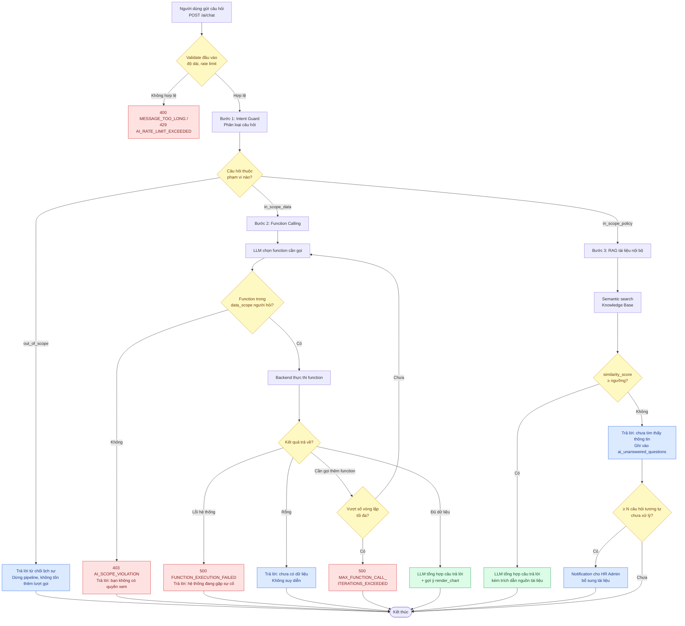

# HRM - Nghiệp vụ chi tiết các chức năng AI

> File này mô tả 3 chức năng AI đã thống nhất triển khai: **(1) Chatbot trợ lý** (hỏi đáp báo cáo + hỏi đáp chính sách công ty), **(2) AI sàng lọc CV/ứng viên**, **(3) AI OCR Onboarding**. Mỗi chức năng gồm: mô tả nghiệp vụ, luồng xử lý, ràng buộc nghiệp vụ, và lỗi đầy đủ (validate + business + lỗi đặc thù AI). Quy ước lỗi HTTP kế thừa từ `HRM-API-Validation-Rules.md`, bổ sung thêm mã lỗi riêng cho AI ở Mục 1.

---

## 1. Quy ước chung cho tính năng AI

### 1.1 Nguyên tắc bắt buộc

1. **AI hỗ trợ, không thay quyết định con người** ở mọi nơi có tác động tới quyền lợi người khác (loại hồ sơ ứng viên, đánh giá hiệu suất, quyết định nhân sự). AI chỉ trả về gợi ý kèm giải thích (`reasoning`); hành động cuối cùng luôn do người có quyền bấm xác nhận.
2. **Không bỏ qua RBAC.** Mọi function AI gọi tới đều phải mang theo `user_id`/token của người đang thao tác và áp dụng đúng `data_scope` như API thường — AI không phải là đường tắt để vượt quyền.
3. **Không tự suy diễn dữ liệu (no hallucination).** Nếu function calling trả về rỗng hoặc RAG không tìm thấy tài liệu liên quan, AI phải trả lời "không có dữ liệu/không tìm thấy thông tin" — tuyệt đối không tự bịa số liệu hay chính sách.
4. **Log toàn bộ tương tác AI** phục vụ audit, cải thiện chất lượng, và giải trình khi có khiếu nại (đặc biệt với sàng lọc CV).
5. **Có cơ chế fallback khi AI lỗi/timeout** — không được chặn luồng nghiệp vụ chính (VD: onboarding vẫn cho nhập tay nếu OCR lỗi).
6. **Theo dõi chi phí (token usage) của mọi lượt gọi AI** — vì chi phí tính theo token, không kiểm soát sẽ khó dự trù ngân sách khi hệ thống mở rộng.
7. **Có chính sách lưu trữ & xóa dữ liệu rõ ràng** cho dữ liệu AI xử lý — đặc biệt ảnh giấy tờ tùy thân (OCR) và nội dung hội thoại (chatbot) đều là dữ liệu cá nhân nhạy cảm, không được giữ vô thời hạn (xem Mục 6).
8. **Có sự đồng ý (consent) của ứng viên/nhân viên** trước khi dữ liệu của họ được đưa vào xử lý AI có ảnh hưởng tới quyết định nhân sự (sàng lọc CV) — đây là yêu cầu tuân thủ, không phải tùy chọn.

### 1.2 Mã lỗi bổ sung riêng cho AI

| HTTP Status | Mã lỗi | Khi nào dùng |
|---|---|---|
| 400 | `MESSAGE_TOO_LONG` | Câu hỏi/nội dung gửi vượt giới hạn ký tự cho phép |
| 400 | `INVALID_FILE_FOR_AI` | File gửi cho OCR/CV parsing sai định dạng hoặc hỏng |
| 403 | `AI_SCOPE_VIOLATION` | Câu hỏi cố truy vấn dữ liệu ngoài `data_scope` của người hỏi (VD nhân viên hỏi lương người khác) |
| 422 | `LOW_CONFIDENCE_RESULT` | Kết quả AI (OCR/matching) có độ tin cậy dưới ngưỡng, cần con người xử lý thủ công |
| 429 | `AI_RATE_LIMIT_EXCEEDED` | Vượt số lượt gọi AI cho phép trong khoảng thời gian (chống lạm dụng/chi phí) |
| 503 | `AI_SERVICE_UNAVAILABLE` | Model/AI provider timeout hoặc lỗi tạm thời |
| 500 | `AI_RESPONSE_PARSE_ERROR` | Kết quả trả về từ AI không đúng định dạng mong đợi (schema mismatch), không parse được |
| 422 | `CONTEXT_LENGTH_EXCEEDED` | Lịch sử hội thoại/dữ liệu đầu vào vượt giới hạn context window của model |
| 422 | `CONSENT_REQUIRED` | Chưa có sự đồng ý của ứng viên/nhân viên để xử lý dữ liệu bằng AI |
| 403 | `AI_FEATURE_NOT_LICENSED` | Công ty (tenant) chưa bật/mua tính năng AI này (nếu triển khai theo gói) |

### 1.3 Bảng dữ liệu dùng chung cho mọi tính năng AI

`ai_interaction_logs`
| Trường | Kiểu | Ghi chú |
|---|---|---|
| feature | ENUM `ai_feature_enum`: chatbot, cv_screening, onboarding_ocr | |
| user_id | UUID (FK, nullable) | Null nếu là hệ thống tự chạy (batch) |
| input_summary | TEXT | Tóm tắt đầu vào (không lưu toàn bộ nếu chứa PII nhạy cảm không cần thiết) |
| output_summary | TEXT | Tóm tắt kết quả trả về |
| model_name | VARCHAR | Tên model đã dùng, phục vụ so sánh khi đổi model |
| latency_ms | INT | Thời gian xử lý |
| token_usage | INT (nullable) | Tổng số token đã dùng (input+output), phục vụ theo dõi chi phí |
| status | ENUM `ai_call_status`: success, low_confidence, failed, timeout | |
| error_code | VARCHAR (nullable) | |

### 1.4 Permission áp dụng cho từng tính năng AI

| Permission code | Áp dụng cho endpoint | Role tối thiểu |
|---|---|---|
| `ai.chat.use` | `POST /ai/chat` | Mọi role đã đăng nhập (Employee trở lên) |
| `ai.chat.query_team_data` | Function calling truy vấn dữ liệu team/department | Team Leader, Dept Manager |
| `ai.chat.query_company_data` | Function calling truy vấn dữ liệu toàn công ty | HR Admin, Executive, Auditor |
| `application.ai_screen` | `POST /applications/{id}/ai-screen`, `bulk-ai-screen` | Recruiter, HR Admin |
| `onboarding.ocr_extract` | `POST /onboarding/{id}/documents/ocr-extract` | HR Admin, HR Specialist, Employee (chỉ hồ sơ của chính mình) |
| `ai.knowledge_base.manage` | CRUD `knowledge_base_documents` | HR Admin, Super Admin |

---

## 2. Chức năng 1 — Chatbot trợ lý (Hỏi đáp báo cáo + Chính sách công ty)

### 2.1 Mô tả nghiệp vụ

Chatbot cho phép người dùng (HR/Manager/Employee) đặt câu hỏi bằng ngôn ngữ tự nhiên, hệ thống tự động phân loại loại câu hỏi để xử lý đúng hướng: dữ liệu động của hệ thống (qua function calling), tài liệu/chính sách nội bộ (qua RAG), hoặc từ chối nếu câu hỏi nằm ngoài phạm vi hệ thống/doanh nghiệp.

### 2.2 Luồng xử lý — Pipeline phân loại Intent (3 bước bắt buộc theo thứ tự)

**Bước 1 — Intent Guard (kiểm tra trong/ngoài phạm vi hệ thống):**
1. Câu hỏi được đưa qua bước phân loại nhanh (classification pass) xác định 1 trong 3 nhãn: `in_scope_data` (cần dữ liệu động), `in_scope_policy` (hỏi chính sách/tài liệu), `out_of_scope` (không liên quan tới HRM/doanh nghiệp — VD hỏi thời tiết, kiến thức chung).
2. Nếu `out_of_scope`: trả lời từ chối lịch sự kèm gợi ý phạm vi hỗ trợ, **dừng pipeline tại đây**, không tốn thêm lượt gọi LLM chính hay truy vấn RAG/API.
3. Ghi log `ai_intent_logs` với nhãn phân loại được, để định kỳ rà soát độ chính xác classifier.

**Bước 2 — Phân loại nhu cầu Function Calling:**
1. Nếu nhãn ở Bước 1 là `in_scope_data`: hệ thống đưa danh sách function (Mục function registry) cho LLM, để LLM tự quyết định có cần gọi function hay không và gọi function nào.
2. LLM gọi 1 hoặc nhiều function → Backend API thực thi **với đúng quyền hạn (`data_scope`) của người hỏi** → trả kết quả về LLM.
3. Nếu LLM cố gọi function nằm ngoài quyền của người hỏi (VD Employee gọi `get_payroll_cost` toàn công ty), Backend **chặn ở tầng API như bình thường**, trả lỗi `403 AI_SCOPE_VIOLATION` về cho Orchestrator — Orchestrator không lộ chi tiết kỹ thuật, chỉ trả lời người dùng dạng "Bạn không có quyền xem thông tin này."
4. Nếu cần gọi nhiều bước (multi-turn tool use), lặp lại cho tới khi đủ dữ liệu trả lời, có giới hạn tối đa số vòng lặp (chống loop vô hạn).

**Bước 3 — Trả lời theo tài liệu hệ thống/doanh nghiệp (RAG):**
1. Nếu nhãn ở Bước 1 là `in_scope_policy` (hoặc Bước 2 xác định không cần gọi function nào): hệ thống truy vấn **Knowledge Base** (chính sách công ty, sổ tay nhân viên, tài liệu hướng dẫn sử dụng hệ thống) bằng semantic search.
2. Nếu tìm được đoạn tài liệu liên quan (similarity score ≥ ngưỡng cấu hình): LLM tổng hợp câu trả lời **kèm trích dẫn nguồn** (tên tài liệu, mục).
3. Nếu **không tìm được tài liệu nào đủ liên quan**: trả lời "Hiện tôi chưa tìm thấy thông tin trong tài liệu công ty về vấn đề này, bạn nên liên hệ HR trực tiếp" — **không được tự suy diễn câu trả lời**.
4. **Escalation tự động:** job nền quét `ai_unanswered_questions` theo chu kỳ (VD hàng tuần); nếu có ≥ N câu hỏi tương tự nhau (gom nhóm bằng similarity) chưa được xử lý, hệ thống tự gửi Notification (Module 19) cho HR Admin để bổ sung tài liệu vào Knowledge Base — biến lỗ hổng tài liệu thành việc cần làm cụ thể, không chỉ nằm im trong log.

### 2.2.1 Sơ đồ luồng xử lý (Mermaid)

### 2.3 Ràng buộc nghiệp vụ & Lỗi

#### `POST /api/v1/ai/chat` — Gửi câu hỏi tới chatbot

**Validate định dạng (400):**
| Trường | Quy tắc |
|---|---|
| message | Bắt buộc, 1-2000 ký tự |
| conversation_id | UUID, không bắt buộc (tạo hội thoại mới nếu không có) |

**Validate nghiệp vụ:**
| Kiểm tra | Lỗi trả về |
|---|---|
| `message` vượt 2000 ký tự | 400 `MESSAGE_TOO_LONG` |
| Người dùng vượt quá số lượt hỏi cho phép/giờ (cấu hình theo role, VD Employee 30 lượt/giờ) | 429 `AI_RATE_LIMIT_EXCEEDED` |
| `conversation_id` (nếu có) không tồn tại hoặc không thuộc sở hữu người gọi | 404 `CONVERSATION_NOT_FOUND` / 403 `FORBIDDEN` |
| **Bước 1 — Intent Guard:** phân loại `out_of_scope` | *(không phải lỗi HTTP — trả `200` kèm `response_type: "out_of_scope"` và câu trả lời từ chối chuẩn)* |
| **Bước 2 — Function calling:** function được LLM chọn gọi nằm ngoài `data_scope` người hỏi | 403 `AI_SCOPE_VIOLATION` (ở tầng API nội bộ) → Orchestrator convert thành câu trả lời từ chối lịch sự cho người dùng, **không trả lỗi kỹ thuật ra ngoài** |
| **Bước 2:** function trả về lỗi hệ thống (DB lỗi, timeout) | 500 `FUNCTION_EXECUTION_FAILED` → Orchestrator trả lời "Hệ thống đang gặp sự cố khi lấy dữ liệu, vui lòng thử lại" |
| **Bước 2:** function trả về kết quả rỗng (VD hỏi báo cáo tháng chưa có dữ liệu) | *(không phải lỗi)* — AI phải trả lời "chưa có dữ liệu cho khoảng thời gian này", không suy diễn |
| **Bước 2:** vượt quá số vòng lặp gọi function tối đa (chống loop) | 500 `MAX_FUNCTION_CALL_ITERATIONS_EXCEEDED` → trả lời "Câu hỏi quá phức tạp, vui lòng chia nhỏ câu hỏi" |
| **Bước 3 — RAG:** không tìm thấy tài liệu liên quan đủ ngưỡng similarity | *(không phải lỗi)* — trả lời mẫu "chưa tìm thấy thông tin", đồng thời ghi vào `ai_unanswered_questions` để HR bổ sung tài liệu |
| **Bước 3:** Knowledge Base rỗng/chưa được index cho company hiện tại | 503 `KNOWLEDGE_BASE_NOT_READY` |
| AI provider (LLM) timeout/lỗi ở bất kỳ bước nào | 503 `AI_SERVICE_UNAVAILABLE` (có retry tự động 1 lần trước khi trả lỗi) |
| Response từ LLM không đúng schema mong đợi (VD tool call sai format tham số) | 500 `AI_RESPONSE_PARSE_ERROR` |
| Hội thoại đã quá dài (nhiều lượt trao đổi), tổng token vượt giới hạn context window của model | 422 `CONTEXT_LENGTH_EXCEEDED` → hệ thống tự động tóm tắt lịch sử cũ (summarize) và thử lại 1 lần trước khi trả lỗi cho người dùng |

#### `POST /api/v1/ai/chat/{message_id}/feedback` — Đánh giá câu trả lời (hữu ích/không)

**Validate nghiệp vụ:**
| Kiểm tra | Lỗi trả về |
|---|---|
| `message_id` phải tồn tại và thuộc conversation của người gọi | 404 `MESSAGE_NOT_FOUND` / 403 `FORBIDDEN` |
| Mỗi message chỉ được feedback 1 lần (ghi đè nếu gửi lại) | *(không lỗi — upsert)* |

### 2.4 Database bổ sung

`ai_conversations`
| Trường | Kiểu | Ghi chú |
|---|---|---|
| user_id | UUID (FK) | |
| title | VARCHAR | Tự sinh từ câu hỏi đầu tiên |
| status | ENUM `conversation_status`: active, archived | |

`ai_messages`
| Trường | Kiểu | Ghi chú |
|---|---|---|
| conversation_id | UUID (FK) | |
| role | ENUM `message_role_enum`: user, assistant | |
| content | TEXT | |
| response_type | ENUM `ai_response_type`: out_of_scope, function_calling, rag_policy, fallback_no_data | Nhãn Bước 1/2/3 để phân tích chất lượng sau này |
| function_calls | JSON (nullable) | Danh sách function đã gọi + tham số, phục vụ audit |
| source_documents | JSON (nullable) | Danh sách tài liệu đã trích dẫn (nếu response_type = rag_policy) |
| token_usage | INT (nullable) | Token dùng cho riêng message này |
| feedback | ENUM `message_feedback`: helpful, not_helpful (nullable) | |

`ai_intent_logs`
| Trường | Kiểu | Ghi chú |
|---|---|---|
| message_id | UUID (FK) | |
| classified_intent | ENUM `chat_intent_enum`: in_scope_data, in_scope_policy, out_of_scope | |
| confidence_score | DECIMAL | Phục vụ rà soát/tinh chỉnh classifier |

`knowledge_base_documents`
| Trường | Kiểu | Ghi chú |
|---|---|---|
| title | VARCHAR | |
| category | ENUM `kb_category_enum`: hr_policy, employee_handbook, system_guide, legal_compliance | |
| file_url | VARCHAR | |
| version | VARCHAR | Để phát hiện tài liệu lỗi thời |
| status | ENUM `kb_status_enum`: active, archived | |

`knowledge_base_chunks`
| Trường | Kiểu | Ghi chú |
|---|---|---|
| document_id | UUID (FK) | |
| content | TEXT | Đoạn văn bản đã cắt nhỏ |
| embedding | VECTOR | Dùng cho semantic search (pgvector nếu PostgreSQL) |
| chunk_order | INT | |

`ai_unanswered_questions`
| Trường | Kiểu | Ghi chú |
|---|---|---|
| message_id | UUID (FK) | |
| question_text | TEXT | |
| status | ENUM `unanswered_status`: pending_review, document_added, dismissed | HR rà soát định kỳ để bổ sung Knowledge Base |

### 2.5 Function Registry (Bước 2) — danh sách function chuẩn

| Function | Ánh xạ API | Data scope áp dụng | Permission code |
|---|---|---|---|
| `get_headcount_report` | `GET /reports/headcount` | company/department theo role người hỏi | `ai.chat.query_company_data` / `ai.chat.query_team_data` |
| `get_turnover_rate` | `GET /reports/turnover-rate` | company/department | `ai.chat.query_company_data` |
| `get_payroll_cost` | `GET /reports/payroll-cost` | company/department — **chặn Employee** | `ai.chat.query_company_data` |
| `get_my_leave_balance` | `GET /ess/leave-balances` | own — chỉ chạy được với chính người hỏi | `ai.chat.use` |
| `get_my_payslip` | `GET /ess/payslips` | own | `ai.chat.use` |
| `get_attendance_summary` | `GET /reports/attendance-summary` | company/department/team tùy role | `ai.chat.query_team_data` |
| `get_recruitment_funnel` | `GET /reports/recruitment-funnel` | company — chỉ HR/Recruiter | `ai.chat.query_company_data` |
| `render_chart` | *(nội bộ, không phải API)* | Không truy vấn dữ liệu, chỉ vẽ lại kết quả đã có | `ai.chat.use` |

> Mỗi function khi đăng ký với LLM phải khai báo rõ **role tối thiểu được phép gọi** — Orchestrator lọc bỏ function không phù hợp với role người hỏi **trước khi** đưa danh sách function cho LLM, thay vì để LLM tự chọn rồi mới chặn ở API (giảm rủi ro và tiết kiệm 1 lượt gọi lỗi).

---

## 3. Chức năng 2 — AI sàng lọc CV/ứng viên

### 3.1 Mô tả nghiệp vụ

Khi có Application mới hoặc theo yêu cầu của Recruiter, AI phân tích CV, so khớp với Job Position, trả về điểm phù hợp kèm giải thích chi tiết. **AI không tự động chuyển trạng thái hồ sơ (loại/nhận)** — chỉ hỗ trợ xếp hạng để Recruiter ra quyết định nhanh hơn.

### 3.2 Luồng xử lý

1. Application mới được tạo (hoặc Recruiter bấm "Chấm điểm AI" thủ công).
2. Hệ thống trích xuất text từ file CV (`resume_url`).
3. AI phân tích, trích xuất `parsed_profile` có cấu trúc: kỹ năng, số năm kinh nghiệm, học vấn, các dự án/thành tích nổi bật.
4. AI so khớp `parsed_profile` với `job_positions.requirements`, tính `ai_match_score` (0-100) và sinh `ai_match_reasoning` (điểm mạnh/điểm thiếu so với yêu cầu, **bằng ngôn ngữ tự nhiên**, không chỉ là con số).
5. Kết quả hiển thị trên Pipeline Kanban (Mục Frontend đã thiết kế) dưới dạng badge điểm + tooltip giải thích — Recruiter/HR xem và tự quyết định chuyển giai đoạn.
6. Toàn bộ input/output được ghi log phục vụ audit thiên vị định kỳ.

### 3.3 Ràng buộc nghiệp vụ & Lỗi

#### `POST /api/v1/applications/{id}/ai-screen` — Chấm điểm AI cho 1 hồ sơ

**Validate nghiệp vụ:**
| Kiểm tra | Lỗi trả về |
|---|---|
| `application_id` phải tồn tại | 404 `APPLICATION_NOT_FOUND` |
| `resume_url` phải tồn tại và đọc được (không rỗng/hỏng) | 400 `INVALID_FILE_FOR_AI` |
| File CV vượt quá dung lượng cho phép để xử lý AI (VD 10MB) | 400 `FILE_TOO_LARGE_FOR_AI` |
| Application đã ở trạng thái `hired`/`rejected` — không cho chấm điểm lại (đã có quyết định cuối) | 422 `APPLICATION_ALREADY_FINALIZED` |
| `job_positions.requirements` của vị trí đang trống (chưa nhập mô tả yêu cầu) — không đủ dữ liệu để so khớp | 422 `JOB_REQUIREMENTS_NOT_DEFINED` |
| Ứng viên **chưa đồng ý** cho hồ sơ được xử lý bởi AI (`candidates.ai_screening_consent = false`, thường xin ngay tại form ứng tuyển) | 422 `CONSENT_REQUIRED` — Recruiter vẫn có thể xem/xử lý hồ sơ thủ công bình thường, chỉ riêng bước AI bị chặn |
| **Input đưa vào AI phải loại bỏ các trường nhạy cảm** (ảnh, giới tính, ngày sinh, tình trạng hôn nhân — nếu có trong CV) trước khi gửi cho model chấm điểm | *(kiểm tra nội bộ, không phải lỗi trả về client — nhưng bắt buộc ở tầng xử lý, ghi log nếu redaction thất bại)* → nếu redaction lỗi thì **dừng chấm điểm**, trả 500 `PII_REDACTION_FAILED` thay vì gửi dữ liệu chưa lọc cho AI |
| AI trả về điểm nhưng độ tin cậy (`confidence`) dưới ngưỡng (VD CV quá ít thông tin) | 200 kèm cờ `LOW_CONFIDENCE_RESULT` trong response — vẫn hiển thị nhưng gắn nhãn "Cần xem xét thủ công", không hiển thị như kết quả chắc chắn |
| AI provider timeout | 503 `AI_SERVICE_UNAVAILABLE` — Application vẫn ở trạng thái bình thường, Recruiter có thể xử lý thủ công không cần chờ AI |
| Đã có `ai_match_score` được tính **và** `applications.ai_screened_requirements_version` khớp với `job_positions.requirements_version` hiện tại (JD chưa đổi kể từ lần chấm gần nhất) | *(không lỗi)* — trả kết quả cache thay vì gọi AI lại, tiết kiệm chi phí. Nếu `requirements_version` đã tăng (JD vừa sửa) thì **bắt buộc chấm lại**, không dùng cache cũ |

#### `POST /api/v1/applications/bulk-ai-screen` — Chấm điểm hàng loạt cho 1 vị trí

**Validate nghiệp vụ:**
| Kiểm tra | Lỗi trả về |
|---|---|
| Số lượng application vượt giới hạn xử lý 1 lần (VD 200) | 422 `BULK_SCREEN_LIMIT_EXCEEDED` |
| Một số application trong danh sách lỗi (file hỏng, chưa có consent...) | *(không chặn toàn bộ batch)* — trả về `partial_success` kèm danh sách application lỗi và lý do cụ thể từng cái, job vẫn chạy tiếp với các hồ sơ hợp lệ |
| Đã có 1 bulk job khác đang `processing` cho cùng `job_position_id` | 409 `BULK_SCREEN_ALREADY_RUNNING` |

> API trả về ngay `job_id` (202 Accepted) thay vì chờ xử lý xong — tiến độ theo dõi qua bảng `ai_bulk_screening_jobs` bên dưới, tương tự cơ chế `data_import_jobs` ở Module 21.

### 3.4 Ràng buộc chống thiên vị (bắt buộc, không phải tùy chọn)

| Ràng buộc | Cách thực thi |
|---|---|
| Không dùng đặc điểm nhân khẩu học làm input chấm điểm | Bước redaction bắt buộc trước khi gửi AI (xem bảng lỗi trên) |
| Luôn có `ai_match_reasoning` giải thích, không hiển thị điểm số trần trụi | Validate response từ AI phải có trường `reasoning` không rỗng, nếu thiếu → coi là `AI_RESPONSE_PARSE_ERROR`, không lưu điểm |
| Log đầy đủ để giải trình khi bị khiếu nại | Bảng `ai_screening_logs` (dưới) lưu input đã redact + output đầy đủ |
| Audit định kỳ phát hiện bias gián tiếp | Job nền hàng tháng so sánh phân bố điểm AI theo các nhóm nhân khẩu học đã biết từ `candidates` (chỉ dùng để audit, không đưa vào lúc chấm điểm) — nếu phát hiện lệch bất thường, cảnh báo HR Admin xem xét |

### 3.5 Database bổ sung

`applications` — bổ sung trường
| Trường | Kiểu | Ghi chú |
|---|---|---|
| ai_match_score | DECIMAL (nullable) | |
| ai_match_reasoning | TEXT (nullable) | |
| ai_confidence_level | ENUM `ai_confidence_enum`: high, medium, low (nullable) | |
| ai_screened_at | DATETIME (nullable) | |

`candidates` — bổ sung trường
| Trường | Kiểu | Ghi chú |
|---|---|---|
| parsed_profile | JSON (nullable) | Dữ liệu có cấu trúc AI trích xuất từ CV |
| ai_screening_consent | BOOLEAN | Ứng viên đồng ý cho hồ sơ được xử lý bởi AI (xin ngay ở form ứng tuyển) |

`applications` — bổ sung thêm trường (ngoài `ai_match_score`, `ai_match_reasoning`, `ai_confidence_level`, `ai_screened_at` đã có)
| Trường | Kiểu | Ghi chú |
|---|---|---|
| ai_screened_requirements_version | INT (nullable) | Snapshot `job_positions.requirements_version` tại lúc chấm điểm, dùng để phát hiện JD đã đổi kể từ đó |

`job_positions` — bổ sung trường
| Trường | Kiểu | Ghi chú |
|---|---|---|
| requirements_version | INT (default 1) | Tăng lên mỗi khi `requirements` được sửa — dùng để vô hiệu hóa cache điểm AI cũ |

`ai_bulk_screening_jobs`
| Trường | Kiểu | Ghi chú |
|---|---|---|
| job_position_id | UUID (FK) | |
| requested_by_employee_id | UUID (FK) | |
| total_applications | INT | |
| succeeded_count | INT | |
| failed_count | INT | |
| status | ENUM `bulk_job_status`: processing, completed, completed_with_errors | |
| failed_items | JSON (nullable) | Danh sách `{application_id, error_code}` các hồ sơ lỗi |

`ai_screening_logs`
| Trường | Kiểu | Ghi chú |
|---|---|---|
| application_id | UUID (FK) | |
| redacted_input | JSON | Dữ liệu đã loại PII gửi cho AI |
| ai_output | JSON | Kết quả đầy đủ AI trả về |
| triggered_by_employee_id | UUID (FK, nullable) | Null nếu hệ thống tự chạy khi có application mới |
| model_name | VARCHAR | |

---

## 4. Chức năng 3 — AI OCR Onboarding

### 4.1 Mô tả nghiệp vụ

Khi thu thập giấy tờ trong quy trình Onboarding (hoặc cập nhật hồ sơ), hệ thống dùng AI đọc ảnh CMND/CCCD/bằng cấp để tự điền form, giảm thao tác nhập tay. **Dữ liệu OCR bắt buộc phải qua bước xác nhận của con người** trước khi ghi chính thức.

### 4.2 Luồng xử lý

1. Nhân viên/HR upload ảnh giấy tờ trong bước checklist "Documents".
2. Hệ thống gọi AI OCR trích xuất thông tin theo loại giấy tờ (`document_type`): CMND/CCCD → họ tên, số, ngày sinh, ngày cấp, nơi cấp; Bằng cấp → tên trường, ngành, năm tốt nghiệp.
3. Kết quả trả về FE dưới dạng **form pre-fill**, đánh dấu `verification_status = pending_review`.
4. Người dùng xem lại, sửa nếu sai, bấm xác nhận → `verification_status = confirmed`, dữ liệu mới được ghi chính thức vào `employee_personal_info`/`employee_documents`.
5. Nếu người dùng phát hiện sai nghiêm trọng (ảnh không đọc được, sai hoàn toàn) → có thể bỏ qua OCR, nhập tay như bình thường (fallback không chặn luồng).

### 4.3 Ràng buộc nghiệp vụ & Lỗi

#### `POST /api/v1/onboarding/{id}/documents/ocr-extract` — Trích xuất OCR

**Validate định dạng (400):**
| Trường | Quy tắc |
|---|---|
| file | Bắt buộc, định dạng JPG/PNG/PDF, dung lượng ≤ 10MB |
| document_type | Bắt buộc, thuộc `employee_document_type` |

**Validate nghiệp vụ:**
| Kiểm tra | Lỗi trả về |
|---|---|
| `onboarding_process_id` tồn tại và đang `in_progress` | 404 `PROCESS_NOT_FOUND` / 422 `ONBOARDING_PROCESS_CLOSED` |
| File ảnh mờ/thiếu sáng, AI không đọc được nội dung | 422 `OCR_EXTRACTION_FAILED` → FE fallback hiển thị form trống để nhập tay |
| AI đọc được nhưng độ tin cậy từng trường dưới ngưỡng (VD số CCCD bị mờ 1-2 số) | 200 kèm `LOW_CONFIDENCE_RESULT`, đánh dấu **riêng từng trường** nghi ngờ để FE tô vàng cảnh báo, không chặn toàn bộ kết quả |
| Loại giấy tờ AI nhận diện được **khác** với `document_type` người dùng chọn (VD chọn "CMND" nhưng ảnh là bằng đại học) | 422 `DOCUMENT_TYPE_MISMATCH` (kèm `details.detected_type`) |
| Dữ liệu trích xuất từ CMND/CCCD có `national_id_number` **trùng với nhân viên khác** đang `active` trong hệ thống | 409 `DUPLICATE_NATIONAL_ID` — chặn ngay ở bước preview, không chờ tới lúc submit form |
| AI provider timeout/lỗi | 503 `AI_SERVICE_UNAVAILABLE` → FE tự động chuyển sang nhập tay, không chặn tiến độ onboarding |
| `ocr_retry_count` đã đạt ngưỡng tối đa (VD 3 lần) cho cùng 1 file | 422 `OCR_RETRY_LIMIT_EXCEEDED` → bắt buộc chuyển sang nhập tay hoặc yêu cầu chụp lại ảnh mới |

#### `PUT /api/v1/onboarding/{id}/documents/{doc_id}/confirm` — Xác nhận dữ liệu OCR

**Validate nghiệp vụ:**
| Kiểm tra | Lỗi trả về |
|---|---|
| `document_id` phải đang `verification_status = pending_review` | 422 `DOCUMENT_ALREADY_CONFIRMED` |
| Dữ liệu form gửi lên khi xác nhận phải qua **lại toàn bộ validate nghiệp vụ như tạo nhân viên thủ công** (Mục 5, `HRM-API-Validation-Rules.md`) — VD `national_id_number` đúng định dạng, không trùng | Tái sử dụng các mã lỗi đã định nghĩa ở đó (`DUPLICATE_NATIONAL_ID`, `INVALID_DATE`...) |
| Người xác nhận phải có quyền sửa hồ sơ nhân viên đó (HR Admin hoặc chính nhân viên với thông tin được phép tự sửa) | 403 `FORBIDDEN` |

### 4.4 Database bổ sung

`employee_documents` — bổ sung trường
| Trường | Kiểu | Ghi chú |
|---|---|---|
| ocr_extracted_data | JSON (nullable) | Dữ liệu thô AI trích xuất, giữ lại đối chiếu |
| ocr_field_confidence | JSON (nullable) | Độ tin cậy từng trường, VD `{"national_id_number": 0.62}` |
| ai_detected_document_type | ENUM(`employee_document_type`, nullable) | Loại giấy tờ AI **tự nhận diện** từ ảnh — có thể khác `document_type` người dùng chọn, dùng để check `DOCUMENT_TYPE_MISMATCH` |
| ocr_provider | VARCHAR (nullable) | Tên dịch vụ OCR đã dùng (VD claude-vision, aws-textract) — cần biết khi so sánh chất lượng lúc đổi provider |
| ocr_processed_at | DATETIME (nullable) | Thời điểm AI xử lý xong — khác `confirmed_at`, dùng đo khoảng thời gian hồ sơ bị treo chưa xác nhận |
| ocr_retry_count | INT (default 0) | Số lần đã thử lại OCR trên cùng file (ảnh mờ, timeout...) — quá ngưỡng thì gợi ý người dùng chụp lại thay vì thử tiếp |
| rejected_reason | ENUM `ocr_rejected_reason`: blurry_image, wrong_document, low_confidence, other (nullable) | Lý do người dùng bỏ qua OCR và nhập tay — dữ liệu để cải thiện UX/model sau này |
| verification_status | ENUM `document_verification_status`: not_applicable, pending_review, confirmed | `not_applicable` cho tài liệu không qua OCR |
| confirmed_by_employee_id | UUID (FK, nullable) | |
| confirmed_at | DATETIME (nullable) | |

---

## 5. Ghi chú triển khai chung cho cả 3 chức năng

- **Timeout mặc định cho mọi lời gọi AI:** 15s cho tác vụ tương tác (chatbot, OCR), có thể tới 60s cho tác vụ batch (chấm điểm CV hàng loạt) — quá thời gian này trả `AI_SERVICE_UNAVAILABLE` và không giữ request treo.
- **Retry:** tối đa 1 lần tự động khi gặp lỗi tạm thời (503/timeout) trước khi trả lỗi cho người dùng, tránh gọi lại vô hạn gây tốn chi phí.
- **Idempotency:** với các API tính điểm/OCR có tốn chi phí gọi model, nên cache kết quả theo `input_hash` trong khoảng thời gian hợp lý (VD 24h) để tránh tính phí trùng khi người dùng bấm lại nhiều lần.
- **Không log nguyên văn dữ liệu nhạy cảm** (ảnh CMND gốc, nội dung CV đầy đủ) vào `ai_interaction_logs` dùng chung — chỉ log tóm tắt; dữ liệu chi tiết đầy đủ lưu ở bảng log riêng của từng tính năng (`ai_screening_logs`...) với quyền truy cập giới hạn chặt hơn (chỉ Auditor/Super Admin).
- **Cấu hình ngưỡng tin cậy** (`face_match_threshold`, `ocr_confidence_threshold`, `rag_similarity_threshold`...) đặt ở `system_settings`, không hard-code trong code — cho phép điều chỉnh theo thực tế vận hành mà không cần deploy lại.

---

## 6. Chính sách lưu trữ & xóa dữ liệu (Data Retention)

Dữ liệu AI xử lý phần lớn là thông tin cá nhân nhạy cảm (ảnh giấy tờ tùy thân, nội dung hội thoại, hồ sơ ứng viên) — cần chính sách lưu trữ rõ ràng, không giữ vô thời hạn.

| Loại dữ liệu | Thời gian lưu | Ghi chú |
|---|---|---|
| `ai_conversations` / `ai_messages` (chatbot) | 12 tháng kể từ lần trao đổi cuối, sau đó archive hoặc xóa | Người dùng có thể tự xóa hội thoại sớm hơn qua ESS |
| Ảnh gốc dùng cho OCR (CMND/CCCD, bằng cấp) | Giữ trong suốt thời gian nhân viên `active` + thời hạn lưu trữ hồ sơ lao động theo luật (thường 3-5 năm sau khi `terminated`) | Không xóa sớm hơn luật định dù nhân viên yêu cầu, do đây là hồ sơ lao động bắt buộc lưu |
| `ai_screening_logs` (input đã redact + output) | 24 tháng kể từ ngày chấm điểm | Đủ dài để giải trình khiếu nại thiên vị trong thời hạn khởi kiện lao động thông thường |
| `ai_interaction_logs` (log tổng hợp, không chứa PII chi tiết) | 12 tháng | Phục vụ theo dõi chi phí/chất lượng, không cần giữ lâu như log chi tiết |
| `knowledge_base_documents`/`chunks` đã `archived` | 6 tháng sau khi archive rồi xóa hẳn | Tránh RAG vô tình trích dẫn tài liệu đã lỗi thời nếu chưa xóa index |

**Quy tắc bổ sung:**
- Batch job dọn dữ liệu quá hạn chạy định kỳ (VD hàng đêm), không xóa thủ công để tránh sót.
- Khi ứng viên bị từ chối và không trúng tuyển, `parsed_profile`/CV gốc áp dụng chính sách lưu trữ riêng của Module 02 (thường ngắn hơn nhân viên chính thức, VD 6-12 tháng) trừ khi ứng viên đồng ý lưu vào Talent Pool lâu hơn.
- Yêu cầu xóa dữ liệu cá nhân từ người dùng (quyền được quên) phải xóa được cả bản ghi ở `ai_*` liên quan, không chỉ bảng nghiệp vụ gốc — cần rà soát khi build tính năng "xóa tài khoản/hồ sơ".
