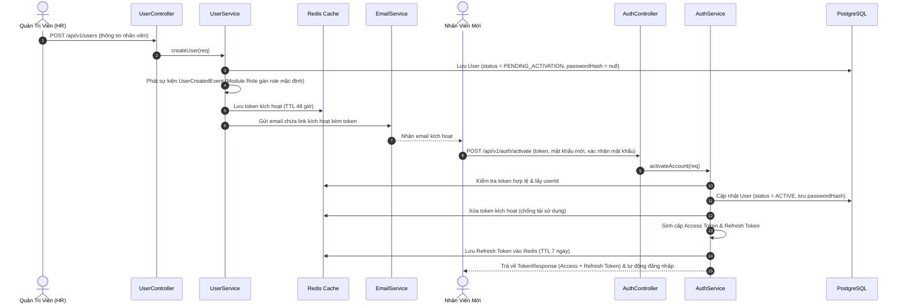
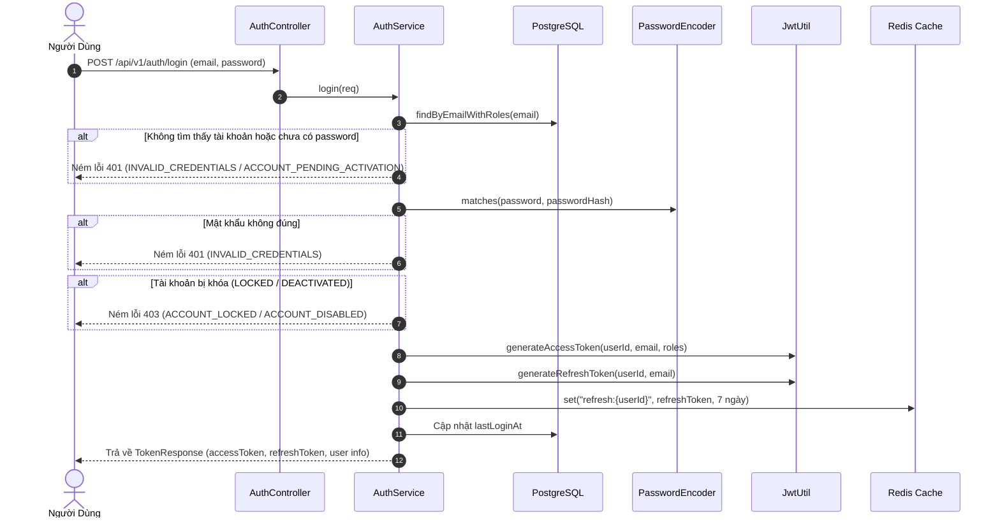
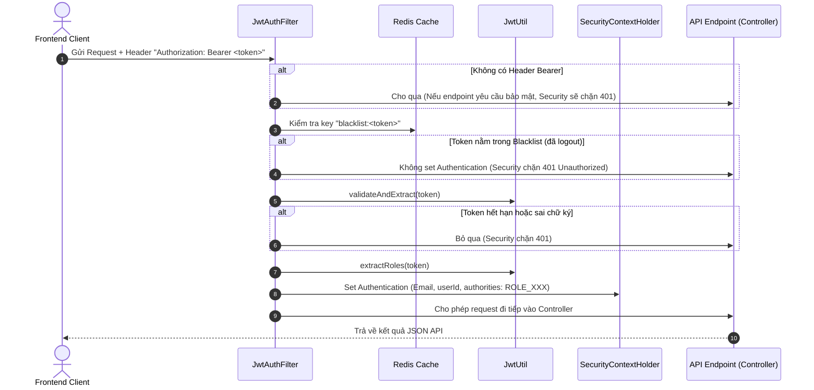
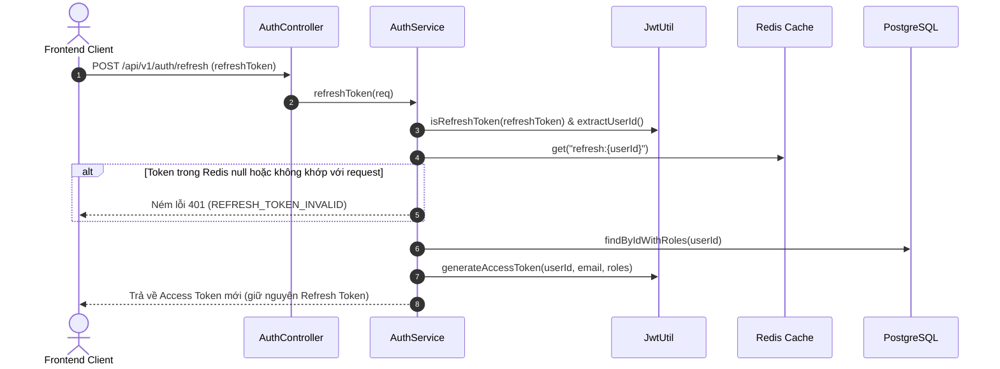
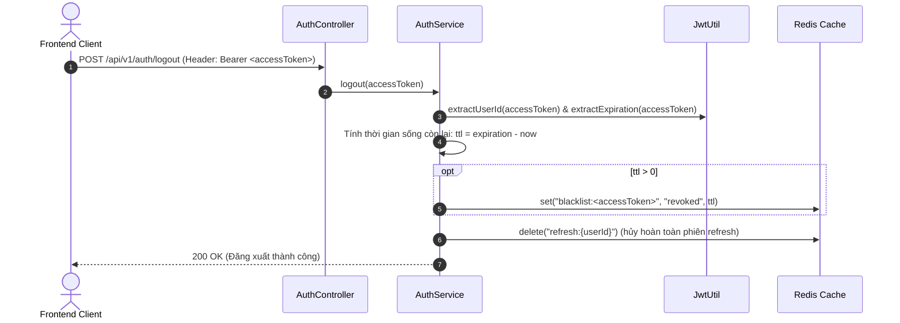
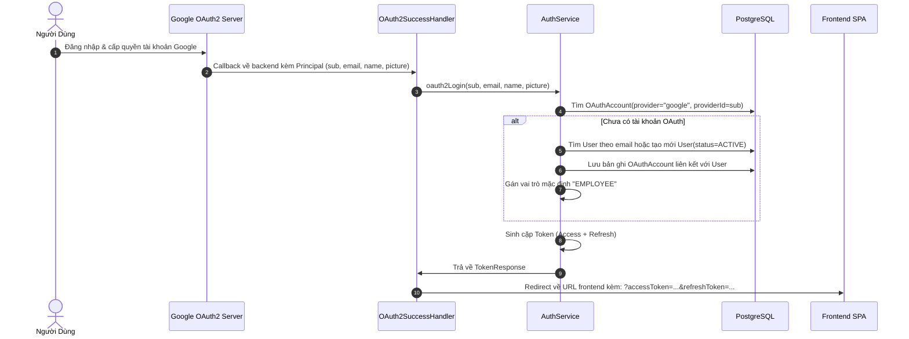

# CYCLOSA — Kiến Trúc & Luồng Xác Thực (Auth Module Flow)

Tài liệu này mô tả chi tiết cơ chế bảo mật, quy trình xác thực (Authentication), ủy quyền (Authorization) và vai trò của từng thành phần trong module `com.cyclosa.auth`.

---

## 1. Tổng Quan Kiến Trúc Auth

Module `auth` trong CYCLOSA được thiết kế theo mô hình **Stateless JWT kết hợp Redis Cache & Blacklist**:
- **Access Token:** JWT ngắn hạn (mặc định 24h), mang theo `userId`, `email`, danh sách `roles`.
- **Refresh Token:** JWT dài hạn (7 ngày), được lưu trong Redis theo key `refresh:{userId}` để đối soát phiên.
- **Token Revocation (Blacklist):** Khi đăng xuất (`logout`), Access Token được đưa vào Redis `blacklist:{token}` với thời gian sống (TTL) bằng thời gian hết hạn còn lại của token.
- **Kích hoạt tài khoản dạng lời mời (Invite-based Activation):** Nhân viên không tự đăng ký tự do; Quản trị viên tạo tài khoản -> Hệ thống sinh mã kích hoạt lưu vào Redis (48h) -> Gửi email -> Nhân viên bấm link đặt mật khẩu lần đầu để kích hoạt.
- **Decoupled RBAC:** Khi tạo tài khoản, module `auth` phát sự kiện `UserCreatedEvent` để module `role` tự gán vai trò mà không gây phụ thuộc chéo mã nguồn.

---

## 2. Chi Tiết Các Luồng Nghiệp Vụ (Flows)

### 2.1. Luồng Tạo & Kích Hoạt Tài Khoản Nhân Viên

Quy trình kích hoạt tài khoản theo cơ chế "Mời & Đặt mật khẩu lần đầu":

---

### 2.2. Luồng Đăng Nhập Chuẩn (Email & Mật Khẩu)

---

### 2.3. Luồng Xác Thực Mỗi Request (Filter Chain & Blacklist)

Mọi HTTP request gửi đến hệ thống đều đi qua `JwtAuthFilter`:

---

### 2.4. Luồng Làm Mới Token (Refresh Token)

---

### 2.5. Luồng Đăng Xuất (Logout)

---

### 2.6. Luồng Đăng Nhập Google OAuth2

---

## 3. Vai Trò Từng File Trong Module `auth`

| Thư mục / Gói | Tên File | Vai trò & Trách nhiệm chính |
| :--- | :--- | :--- |
| **`controller/`** | [`AuthController.java`](file:///f:/Project/CYCLOSA/cyclosa_be/src/main/java/com/cyclosa/auth/controller/AuthController.java) | Endpoint REST cho vòng đời xác thực: `/login`, `/activate`, `/refresh`, `/logout`, `/me`, `/me/permissions`. |
| | [`UserController.java`](file:///f:/Project/CYCLOSA/cyclosa_be/src/main/java/com/cyclosa/auth/controller/UserController.java) | Endpoint REST quản trị tài khoản nhân viên: phân trang `/users`, tạo tài khoản, gửi lại mã kích hoạt, khóa/mở khóa. |
| **`service/`** | [`AuthService.java`](file:///f:/Project/CYCLOSA/cyclosa_be/src/main/java/com/cyclosa/auth/service/AuthService.java) | Xử lý logic đăng nhập, xác thực token, kích hoạt mật khẩu, làm mới token, blacklist Redis khi logout và OAuth2. |
| | [`UserService.java`](file:///f:/Project/CYCLOSA/cyclosa_be/src/main/java/com/cyclosa/auth/service/UserService.java) | Xử lý CRUD tài khoản người dùng, tìm kiếm phân trang, phát sự kiện `UserCreatedEvent`, quản lý trạng thái khóa tài khoản. |
| | [`EmailService.java`](file:///f:/Project/CYCLOSA/cyclosa_be/src/main/java/com/cyclosa/auth/service/EmailService.java) | Soạn và gửi email chứa mã/link kích hoạt tài khoản qua giao thức SMTP (`JavaMailSender`). |
| **`security/`** | [`JwtUtil.java`](file:///f:/Project/CYCLOSA/cyclosa_be/src/main/java/com/cyclosa/auth/security/JwtUtil.java) | Tiện ích mật mã: ký, sinh và giải mã Access Token, Refresh Token (HMAC-SHA256), bóc tách claims, userId, roles. |
| | [`JwtAuthFilter.java`](file:///f:/Project/CYCLOSA/cyclosa_be/src/main/java/com/cyclosa/auth/security/JwtAuthFilter.java) | Filter chặn mọi HTTP request: kiểm tra Bearer token, đối chiếu Redis Blacklist, thiết lập Spring Security Authentication. |
| | [`OAuth2SuccessHandler.java`](file:///f:/Project/CYCLOSA/cyclosa_be/src/main/java/com/cyclosa/auth/security/OAuth2SuccessHandler.java) | Xử lý khi đăng nhập mạng xã hội (Google) thành công, ủy quyền cho `AuthService` sinh token và redirect về giao diện Frontend. |
| | [`OAuth2FailureHandler.java`](file:///f:/Project/CYCLOSA/cyclosa_be/src/main/java/com/cyclosa/auth/security/OAuth2FailureHandler.java) | Xử lý khi đăng nhập OAuth2 thất bại, chuyển hướng kèm mã lỗi về giao diện Frontend. |
| **`entity/`** | [`User.java`](file:///f:/Project/CYCLOSA/cyclosa_be/src/main/java/com/cyclosa/auth/entity/User.java) | JPA Entity bảng `users`: chứa email, passwordHash, trạng thái `UserStatus`, audit fields, liên kết `userRoles` và `oauthAccounts`. |
| | [`OAuthAccount.java`](file:///f:/Project/CYCLOSA/cyclosa_be/src/main/java/com/cyclosa/auth/entity/OAuthAccount.java) | JPA Entity bảng `oauth_accounts`: lưu liên kết tài khoản mạng xã hội với User (provider, providerId, email). |
| **`repository/`** | [`UserRepository.java`](file:///f:/Project/CYCLOSA/cyclosa_be/src/main/java/com/cyclosa/auth/repository/UserRepository.java) | Tầng truy cập CSDL bảng `users`: truy vấn kèm roles eager (`findByIdWithRoles`, `findByEmailWithRoles`), tìm kiếm phân trang `searchUsers`. |
| | [`OAuthAccountRepository.java`](file:///f:/Project/CYCLOSA/cyclosa_be/src/main/java/com/cyclosa/auth/repository/OAuthAccountRepository.java) | Tầng truy cập CSDL bảng `oauth_accounts`: tìm tài khoản theo provider và providerId. |
| **`dto/request/`** | `LoginRequest.java` | DTO payload đăng nhập (email, password) có validate `@NotBlank`, `@Email`. |
| | `ActivateAccountRequest.java` | DTO payload kích hoạt tài khoản (token, password, confirmPassword). |
| | `RefreshTokenRequest.java` | DTO payload làm mới token (refreshToken). |
| | `CreateUserRequest.java` | DTO payload quản trị viên tạo nhân viên (email, fullName, phone, roleCodes, companyId). |
| | `UserFilter.java` | DTO tham số tìm kiếm & phân trang danh sách tài khoản (kế thừa `BaseFilterRequest`). |
| **`dto/response/`** | `TokenResponse.java` | DTO trả về khi xác thực thành công (accessToken, refreshToken, expiresIn, tokenType, UserInfo). |
| | `UserInfo.java` | DTO thông tin tài khoản cơ bản và danh sách mã vai trò (`roles`). |
| | `UserResponse.java` | DTO chi tiết người dùng cho màn hình danh sách và quản trị. |
| **`mapper/`** | [`AuthMapper.java`](file:///f:/Project/CYCLOSA/cyclosa_be/src/main/java/com/cyclosa/auth/mapper/AuthMapper.java) | MapStruct Mapper: tự động chuyển đổi an toàn giữa `User` Entity sang `UserInfo` và `UserResponse` (không lộ mật khẩu). |
| **`event/`** | [`UserCreatedEvent.java`](file:///f:/Project/CYCLOSA/cyclosa_be/src/main/java/com/cyclosa/auth/event/UserCreatedEvent.java) | Domain Event thông báo tài khoản mới được tạo để module `role` xử lý phân quyền bất đồng bộ/decoupled. |
| **`exception/`** | [`AuthErrorCode.java`](file:///f:/Project/CYCLOSA/cyclosa_be/src/main/java/com/cyclosa/auth/exception/AuthErrorCode.java) | Enum mã lỗi đặc thù của Auth (4011 - 4041) cài đặt interface `ErrorCode` (USER_NOT_FOUND, INVALID_CREDENTIALS...). |

---

## 4. Các Tiêu Chuẩn Bảo Mật Cốt Lõi Được Áp Dụng

1. **Mật khẩu an toàn:** Sử dụng thuật toán băm **BCrypt** với salt ngẫu nhiên, mật khẩu thuần không bao giờ được lưu vào CSDL hoặc ghi vào file log.
2. **Ngăn chặn Brute Force & Session Hijacking:**
   - Access Token có thời hạn ngắn (24h).
   - Refresh Token được kiểm soát trạng thái trong Redis theo `userId`. Khi đổi mật khẩu, bị khóa hoặc đăng xuất, Redis key bị xóa ngay lập tức.
   - Cơ chế **Token Blacklisting** qua Redis ngăn chặn hoàn toàn việc tái sử dụng Access Token cũ sau khi user đã bấm Logout.
3. **Chống lỗi Lazy Loading (Hibernate N+1):**
   - Mọi thao tác cần trích xuất quyền để sinh token hoặc trả về thông tin user đều dùng method `findByIdWithRoles` hoặc `findByEmailWithRoles` kết hợp `JOIN FETCH`.
4. **Kiến trúc phân tầng Decoupled:**
   - Module `auth` không gọi trực tiếp Repository của các module khác; giao tiếp thông qua Spring Application Events (`UserCreatedEvent`) và Service công khai (`UserRoleService`).
