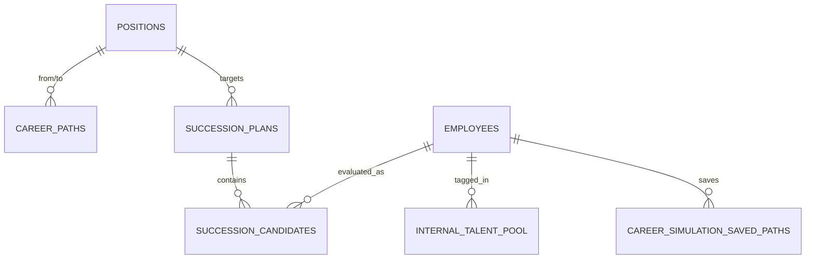

# Phân hệ Phát triển Nhân sự & Quy hoạch Kế nhiệm (Career & Talent)

> **Mã phân hệ:** Module 14 (gồm Module 32 Career Pathing Simulator được hợp nhất)  
> **Package Backend:** `com.cyclosa.talent`  
> **Trạng thái:** [x] ✅ Hoàn thành 100% Backend & Unit Tests

---

## 1. Giới thiệu tổng quan

Phân hệ **Phát triển Nhân sự & Quy hoạch Kế nhiệm (Career & Talent)** đóng vai trò chiến lược trong việc giữ chân và phát triển nguồn nhân lực chất lượng cao của doanh nghiệp. Sau khi nhân viên đã có hồ sơ (Module 04), được đánh giá hiệu suất định kỳ (Module 09) và tham gia các cơ hội nội bộ (Module 02 / 31), phân hệ này cung cấp các công cụ:
- **Lộ trình thăng tiến chuẩn (Career Paths):** Định hình khung thăng tiến rõ ràng giữa các chức danh, số năm kinh nghiệm yêu cầu và tiêu chí năng lực.
- **Kế hoạch kế nhiệm (Succession Planning):** Bảo vệ tổ chức trước rủi ro thiếu hụt lãnh đạo ở các vị trí trọng yếu (Key/Critical Positions).
- **Kho nhân tài nội bộ (Internal Talent Pool):** Gắn thẻ và quản lý nhóm nhân sự tiềm năng cao (HiPo - High Potential, Key Talent).
- **Mô phỏng lộ trình sự nghiệp (Career Pathing Simulator - gộp từ Module 32):** Ứng dụng thống kê và phân tích hồ sơ tương tự để dự báo lộ trình tiềm năng cho nhân viên.
- **Cổng tự phục vụ nhân viên (ESS):** Nhân viên chủ động tra cứu lộ trình, khám phá cơ hội thăng tiến và lưu kế hoạch cá nhân.

---

## 2. Kiến trúc & Nguyên tắc Thiết kế (Architecture & Compliance)

1. **Tuân thủ Modular Monolith (Nguyên tắc 1):**
   - Phân hệ `com.cyclosa.talent` hoàn toàn độc lập, **không inject repository hay entity của module khác**.
   - Giao tiếp với Module 01 (Organization) qua `PositionService` và `OrganizationalUnitService`.
   - Giao tiếp với Module 04 (Employee) qua `EmployeeService`.
2. **Chống N+1 Query (Nguyên tắc 8):**
   - 100% API danh sách và chi tiết áp dụng cơ chế **Batch Enrichment** thông qua các DTO tóm tắt: `PositionSummary`, `EmployeeSummary`, `OrgUnitSummary`.
3. **Phân trang chuẩn (Nguyên tắc 7):**
   - Các Filter DTO (`CareerPathFilter`, `SuccessionPlanFilter`, `TalentPoolFilter`) kế thừa `BaseFilterRequest`, trả về `PageData<T>` bọc trong `ApiResponse<T>`.
4. **Phân quyền RBAC & DataScope (Nguyên tắc 4):**
   - Phân định rõ quyền xem (`view`) và quản trị (`manage`). Đầy đủ cặp `@PreAuthorize("@perm.has('...')")` và `@RequirePermission('...')`.

---

## 3. Các Thực thể Dữ liệu (Database Entities)

1. **`career_paths` (Lộ trình thăng tiến chuẩn):**
   - `id`, `company_id`
   - `from_position_id`: Vị trí xuất phát (FK `positions`)
   - `to_position_id`: Vị trí đích thăng tiến (FK `positions`)
   - `description`: Tiêu chuẩn năng lực, chứng chỉ yêu cầu
   - `min_years_required`: Số năm kinh nghiệm tối thiểu yêu cầu (VD: 2.0 năm)
2. **`succession_plans` (Kế hoạch kế nhiệm):**
   - `id`, `company_id`
   - `position_id`: Vị trí trọng yếu cần kế nhiệm (FK `positions`)
   - `risk_level`: Mức độ rủi ro (`LOW`, `MEDIUM`, `HIGH`, `CRITICAL`)
   - `review_date`: Ngày định kỳ rà soát kế hoạch
3. **`succession_candidates` (Ứng viên kế nhiệm):**
   - `id`, `company_id`, `succession_plan_id` (FK `succession_plans`)
   - `employee_id`: Ứng viên kế nhiệm (FK `employees`)
   - `readiness`: Mức độ sẵn sàng (`READY_NOW`, `READY_1_2_YEARS`, `READY_3_5_YEARS`)
   - `note`: Đánh giá, kế hoạch đào tạo bồi dưỡng
4. **`internal_talent_pool` (Kho nhân tài nội bộ):**
   - `id`, `company_id`
   - `employee_id`: Nhân sự tiềm năng (FK `employees`)
   - `tag`: Thẻ phân loại năng lực (`HiPo`, `Key Talent`, `Leadership Potential`, `Tech Expert`)
   - `note`: Ghi chú lý do đề xuất
   - `added_by_employee_id`: Người đề xuất/thêm vào kho
5. **`career_simulation_saved_paths` (Kịch bản lộ trình đã lưu):**
   - `id`, `company_id`, `employee_id`
   - `target_position_id`: Vị trí mục tiêu mong muốn (nullable)
   - `suggested_path`: Dữ liệu JSON snapshot kịch bản lộ trình
   - `saved_at`: Thời điểm lưu kịch bản

---

## 4. Quy tắc Nghiệp vụ & Ràng buộc (Business Rules)

| Quy tắc | Mã lỗi | HTTP Status | Diễn giải |
|---|---|:---:|---|
| **Vị trí xuất phát trùng vị trí đích** | `SAME_FROM_TO_POSITION` | 400 | Lộ trình thăng tiến không thể có vị trí xuất phát trùng với vị trí đích. |
| **Lộ trình thăng tiến trùng lặp** | `CAREER_PATH_ALREADY_EXISTS` | 409 | Trong cùng một công ty, không được tạo 2 lộ trình trùng cặp `(from_position, to_position)`. |
| **Kế hoạch kế nhiệm trùng vị trí** | `SUCCESSION_PLAN_ALREADY_EXISTS` | 409 | Mỗi vị trí chỉ được thiết lập duy nhất 1 kế hoạch kế nhiệm active trong công ty. |
| **Ứng viên là người đang giữ vị trí** | `CANDIDATE_IS_CURRENT_HOLDER` | 422 | Ứng viên kế nhiệm không được trùng với người đang giữ chính vị trí mục tiêu của kế hoạch đó (theo Quy định Mục 15 Validation Rules). |
| **Ứng viên bị trùng lặp trong kế hoạch** | `CANDIDATE_ALREADY_ADDED` | 409 | Một nhân viên không thể được thêm 2 lần vào cùng 1 kế hoạch kế nhiệm. |
| **Nhân sự trùng lặp trong kho nhân tài** | `EMPLOYEE_ALREADY_IN_TALENT_POOL` | 409 | Một nhân viên không được gắn thẻ trùng lặp với cùng 1 tag trong kho nhân tài. |
| **Truy cập trái phép kịch bản mô phỏng** | `FORBIDDEN_SIMULATION_ACCESS` | 403 | Nhân viên chỉ được phép xem và xóa kịch bản lộ trình do chính mình lưu. |

---

## 5. Danh mục API RESTful

### 5.1. Quản lý Lộ trình thăng tiến chuẩn (`CareerPathController`)
- `POST   /api/v1/career-paths`: Thiết lập lộ trình thăng tiến chuẩn mới giữa 2 vị trí.
- `GET    /api/v1/career-paths`: Lấy danh sách lộ trình (lọc theo vị trí xuất phát, vị trí đích, phân trang).
- `GET    /api/v1/career-paths/{id}`: Xem chi tiết lộ trình thăng tiến.
- `PUT    /api/v1/career-paths/{id}`: Cập nhật mô tả, số năm kinh nghiệm yêu cầu.
- `DELETE /api/v1/career-paths/{id}`: Xóa mềm lộ trình thăng tiến.
- `GET    /api/v1/employees/{id}/career-path`: Tra cứu các lộ trình thăng tiến khả dụng từ vị trí hiện tại của nhân viên.

### 5.2. Quản lý Kế hoạch kế nhiệm & Ứng viên (`SuccessionPlanController`)
- `POST   /api/v1/succession-plans`: Lập kế hoạch kế nhiệm cho vị trí trọng yếu.
- `GET    /api/v1/succession-plans`: Danh sách kế hoạch kế nhiệm (lọc theo vị trí, mức độ rủi ro, phân trang).
- `GET    /api/v1/succession-plans/{id}`: Chi tiết kế hoạch kèm danh sách ứng viên (đã enrich thông tin nhân sự).
- `PUT    /api/v1/succession-plans/{id}`: Cập nhật mức độ rủi ro, ngày định kỳ rà soát.
- `DELETE /api/v1/succession-plans/{id}`: Xóa mềm kế hoạch kế nhiệm.
- `POST   /api/v1/succession-plans/{id}/candidates`: Thêm ứng viên kế nhiệm (kiểm tra Điều 15 Validation Rules).
- `PUT    /api/v1/succession-plans/{id}/candidates/{candidateId}`: Cập nhật mức độ sẵn sàng (`readiness`) và ghi chú.
- `DELETE /api/v1/succession-plans/{id}/candidates/{candidateId}`: Xóa ứng viên khỏi kế hoạch kế nhiệm.

### 5.3. Quản lý Kho nhân tài nội bộ (`InternalTalentPoolController`)
- `POST   /api/v1/internal-talent-pool`: Thêm nhân sự vào kho nhân tài (gắn tag HiPo, Key Talent...).
- `GET    /api/v1/internal-talent-pool`: Danh sách kho nhân tài (lọc theo nhân viên, thẻ tag, phân trang).
- `GET    /api/v1/internal-talent-pool/{id}`: Chi tiết hồ sơ nhân tài.
- `PUT    /api/v1/internal-talent-pool/{id}`: Cập nhật thẻ tag, ghi chú đánh giá.
- `DELETE /api/v1/internal-talent-pool/{id}`: Xóa nhân sự khỏi kho nhân tài.

### 5.4. Mô phỏng & Phân tích xu hướng thăng tiến (`CareerSimulatorController` - gộp từ Module 32)
- `GET    /api/v1/career-simulator/employee/{id}/suggested-paths`: Phân tích và gợi ý các lộ trình thăng tiến tiềm năng kèm tỷ lệ tương đồng (match %).
- `GET    /api/v1/career-simulator/employee/{id}/similar-profiles`: Tìm danh sách nhân sự có đặc điểm thâm niên và vị trí tương đồng.
- `POST   /api/v1/career-simulator/employee/{id}/save-path`: Lưu snapshot kịch bản lộ trình mô phỏng cho nhân viên.
- `GET    /api/v1/career-simulator/department/{id}/trends`: Thống kê xu hướng thăng tiến và luân chuyển theo phòng ban.

### 5.5. Cổng tự phục vụ nhân viên (`MyCareerController` - ESS)
- `GET    /api/v1/my-career-path`: Xem lộ trình thăng tiến chuẩn từ vị trí hiện tại của bản thân.
- `GET    /api/v1/career-simulator/suggested-paths`: Tự xem gợi ý mô phỏng lộ trình thăng tiến của bản thân.
- `GET    /api/v1/career-simulator/similar-profiles`: Xem danh sách hồ sơ tương đồng với bản thân.
- `POST   /api/v1/career-simulator/save-path`: Lưu kịch bản lộ trình yêu thích của bản thân.
- `GET    /api/v1/career-simulator/saved-paths`: Xem lại danh sách các kịch bản lộ trình bản thân đã lưu.
- `DELETE /api/v1/career-simulator/saved-paths/{id}`: Xóa kịch bản lộ trình đã lưu của bản thân.

---

## 6. Danh mục Quyền (RBAC Permissions)

| Mã quyền | Phân hệ | Hành động | Mô tả | Vai trò mặc định |
|---|---|---|---|---|
| `career_path.view` | `talent` | `view` | Xem danh sách và chi tiết lộ trình thăng tiến chuẩn | Super Admin, HR Admin, Dept Manager, Employee |
| `career_path.manage` | `talent` | `manage` | Tạo, cập nhật, xóa lộ trình thăng tiến chuẩn | Super Admin, HR Admin |
| `succession.view` | `talent` | `view` | Xem danh sách và chi tiết kế hoạch kế nhiệm | Super Admin, HR Admin, Dept Manager |
| `succession.manage` | `talent` | `manage` | Lập kế hoạch, thêm/sửa/xóa ứng viên kế nhiệm | Super Admin, HR Admin, Dept Manager |
| `talent_pool.view` | `talent` | `view` | Xem danh sách kho nhân tài nội bộ | Super Admin, HR Admin, Dept Manager |
| `talent_pool.manage` | `talent` | `manage` | Đưa nhân sự vào/ra kho nhân tài và cập nhật | Super Admin, HR Admin |
| `career_simulation.view` | `talent` | `view` | Xem gợi ý mô phỏng và xu hướng thăng tiến | Super Admin, HR Admin, Dept Manager, Employee |
| `career_simulation.manage` | `talent` | `manage` | Lưu và quản lý kịch bản mô phỏng lộ trình | Super Admin, HR Admin, Employee |
