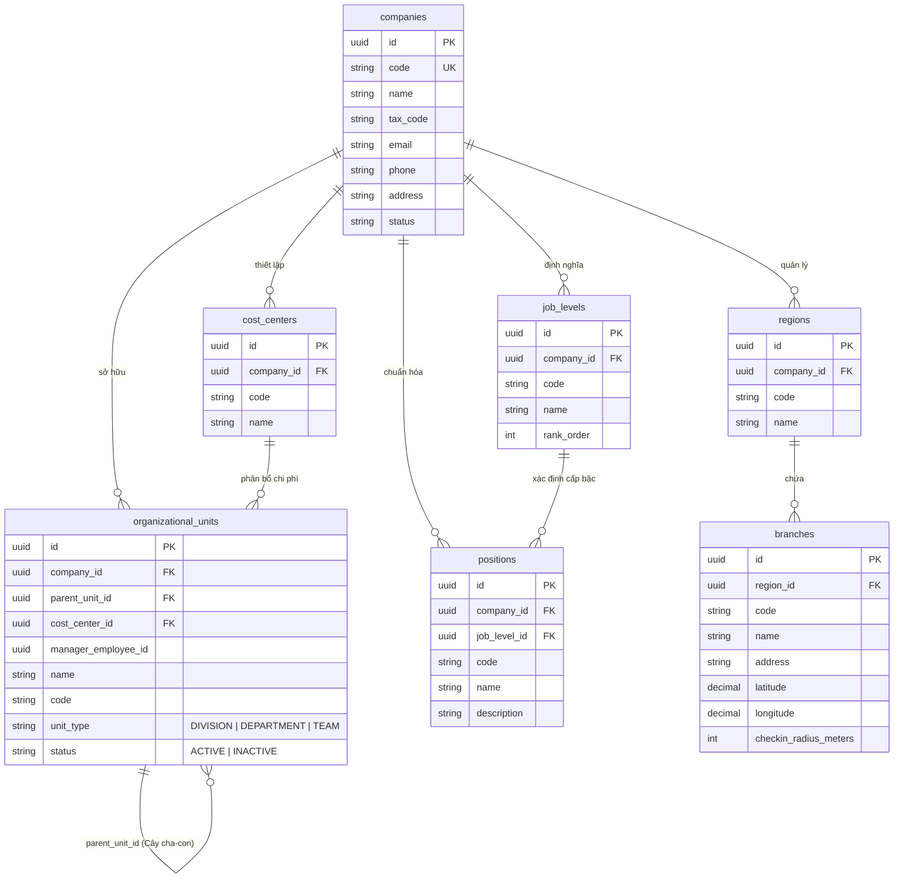

# Tài liệu Nghiệp vụ Module 01: Cơ cấu Tổ chức (Organization Management)

> **Module Code:** `organization`  
> **Package:** `com.cyclosa.organization`  
> **Phiên bản:** 1.0  
> **Căn cứ nghiệp vụ:** [ba/HRM-Mo-Ta-Nghiep-Vu-Chi-Tiet.md](file:///f:/Project/CYCLOSA/ba/HRM-Mo-Ta-Nghiep-Vu-Chi-Tiet.md) & [ba/HRM-Database.md](file:///f:/Project/CYCLOSA/ba/HRM-Database.md)

---

## 1. Tổng quan & Triết lý Thiết kế: "Mô hình 3 chiều Độc lập"

Trong các hệ thống quản trị nhân sự truyền thống, phòng ban thường bị gộp chung với chi nhánh hoặc chức danh (ví dụ: gộp cứng "Phòng Kinh doanh Hà Nội"). 
Trong hệ sinh thái **CYCLOSA HRM**, hệ thống áp dụng **Mô hình 3 chiều hoàn toàn độc lập**:

$$\text{Nhân sự} = \text{Đơn vị tổ chức (Phòng ban)} + \text{Địa lý (Chi nhánh)} + \text{Vị trí việc làm (Chức danh)}$$

```
                        [COMPANIES (Công ty / Pháp nhân)]
                                       │
        ┌──────────────────────────────┼──────────────────────────────┐
        ▼                              ▼                              ▼
【Chiều 1: Đơn vị tổ chức】       【Chiều 2: Địa lý】          【Chiều 3: Vị trí việc làm】
  organizational_units           regions (Vùng miền)           job_levels (Cấp bậc)
  (Cây cha-con đa cấp:           branches (Chi nhánh)          positions (Chức danh phẳng)
   Khối -> Ban -> Phòng -> Nhóm)           │                             │
        │                                 │                             │
        └─────────────────────────┬───────┴─────────────────────────────┘
                                  ▼
                     [EMPLOYEE (Hồ sơ Nhân sự)]
         (Lưu 3 FK độc lập: unit_id + branch_id + position_id)
```

### Tại sao phải tách 3 chiều?
- **Thực tế:** Một nhân viên có thể thuộc **Phòng Marketing** (Đơn vị tổ chức), làm việc tại **Văn phòng TP.HCM** (Chi nhánh địa lý), giữ chức danh **Chuyên viên Nội dung** (Vị trí việc làm).
- 3 thông tin này hoàn toàn không thể suy diễn được từ nhau. Việc phân tách độc lập giúp doanh nghiệp linh hoạt điều chuyển nhân sự giữa các chi nhánh mà không làm xáo trộn sơ đồ phòng ban.

---

## 2. Chi tiết Nghiệp vụ Từng Chiều

### 2.1. Chiều 1: Đơn vị Tổ chức (`organizational_units`)
- **Cấu trúc Cây tự tham chiếu:** Mỗi đơn vị trỏ tới đơn vị cha qua `parent_unit_id`. Không giới hạn số tầng phân cấp (Khối $\rightarrow$ Ban $\rightarrow$ Phòng $\rightarrow$ Tổ/Nhóm...).
- **Phiên bản theo thời gian (Temporal Hierarchy & Effective Dating):**
  - Mọi sự thay đổi cấu trúc cây (tạo mới, điều chuyển cha-con `/move`, đổi tên) đều được lưu phiên bản vào bảng `organizational_unit_history` với dải thời gian `effective_from` và `effective_to`.
  - Hỗ trợ tái dựng toàn bộ cây tổ chức tại bất kỳ thời điểm nào trong quá khứ thông qua tham số `atDate` trong API `GET /api/v1/organizational-units/tree?atDate=...`. Điều này phục vụ kiểm toán (Audit): Một quyết định phê duyệt/phân quyền trong quá khứ luôn giải thích được bằng cơ cấu tổ chức tại đúng thời điểm đó.
  - Cung cấp API `GET /api/v1/organizational-units/{id}/history` để tra cứu lịch sử điều chuyển, tái cơ cấu của phòng ban.
- **Kế thừa quyền xuống đơn vị con (Permission & Data Scope Inheritance):**
  - Cung cấp API `GET /api/v1/organizational-units/{id}/descendant-ids` và service method `getSelfAndDescendantUnitIds(companyId, unitId)` gom đệ quy toàn bộ danh sách ID của phòng ban và các con/cháu.
  - Phục vụ cơ chế DataScope `DEPARTMENT`: Người dùng có quyền tại một phòng ban sẽ tự động kế thừa quyền kiểm soát dữ liệu trên toàn bộ các đơn vị con trực thuộc.
- **Người đứng đầu đơn vị:** `manager_employee_id` (chỉ định Trưởng phòng/Trưởng bộ phận).
- **Trung tâm chi phí:** Gán `cost_center_id` để phân bổ ngân sách và chi phí lương.

#### Nghiệp vụ Tái cơ cấu Tổ chức (Move Unit & Impact Preview):
1. **Kiểm tra chống lặp vòng cha-con (Circular Hierarchy Prevention):**
   - Tuyệt đối không cho phép chuyển một đơn vị vào làm con của chính nó hoặc con của một đơn vị cấp dưới trực thuộc nó (ví dụ: Không thể chuyển "Khối Công nghệ" vào làm con của "Phòng Backend").
2. **Xem trước tác động (Impact Preview):**
   - API `GET /api/v1/organizational-units/{id}/impact-preview` tính toán trước:
     - Số lượng nhân viên trực tiếp và gián tiếp bị đổi cây quản lý.
     - Số lượng đơn vị con sẽ bị di chuyển cùng.
     - Cảnh báo người quản lý trước khi thực hiện di chuyển chính thức.
3. **Ràng buộc khi Xóa:**
   - Không được xóa đơn vị nếu đang có đơn vị con (`CANNOT_DELETE_UNIT_WITH_CHILDREN`).
   - Không được xóa đơn vị nếu đang có nhân sự đang hoạt động trực thuộc (`CANNOT_DELETE_UNIT_WITH_EMPLOYEES`).

### 2.2. Chiều 2: Địa lý (`regions`, `branches`)
- **Vùng miền (`regions`):** Miền Bắc, Miền Trung, Miền Nam, Quốc tế...
- **Chi nhánh (`branches`):** Địa điểm làm việc vật lý, địa chỉ văn phòng, tọa độ GPS (kinh độ, vĩ độ) và bán kính cho phép chấm công di động (Geofencing check-in).

### 2.3. Chiều 3: Vị trí việc làm (`job_levels`, `positions`)
- **Cấp bậc (`job_levels`):** Thang bậc nhân sự từ thấp đến cao (Ví dụ: Level 1 - Thực tập sinh, Level 2 - Nhân viên, Level 3 - Chuyên viên, Level 4 - Trưởng nhóm, Level 5 - Trưởng phòng, Level 6 - Giám đốc). Có trường `rank_order` để so sánh cấp bậc thẩm quyền.
- **Chức danh (`positions`):** Tên công việc chuẩn hóa (Ví dụ: "Kỹ sư Cầu nối", "Lập trình viên Backend", "Kế toán Tổng hợp"). Một chức danh có thể được dùng chung cho nhiều phòng ban.

### 2.4. Trung tâm Chi phí (`cost_centers`)
- Định nghĩa mã chi phí phục vụ hạch toán tài chính (Ví dụ: `CC-IT-01`, `CC-MKT-02`). Mỗi phòng ban có thể liên kết với một Cost Center mặc định.

---

## 3. Sơ đồ Thực thể Cơ sở Dữ liệu (ERD)



---

## 4. Danh mục API Chuẩn RESTful của Module

Mọi endpoint đều được bảo vệ bằng `@PreAuthorize("@perm.has('organization.*')")` và trả về `ApiResponse<T>`:

| Method | Endpoint URI | Chức năng nghiệp vụ | Mã Quyền (Permission) |
| :---: | :--- | :--- | :--- |
| `POST` | `/api/v1/companies` | Khởi tạo công ty / pháp nhân mới | `organization.manage` |
| `GET` | `/api/v1/companies` | Danh sách công ty có phân trang | `organization.view` |
| `GET` | `/api/v1/companies/{id}` | Xem chi tiết thông tin công ty | `organization.view` |
| `PUT` | `/api/v1/companies/{id}` | Cập nhật thông tin công ty | `organization.manage` |
| `GET` | `/api/v1/organizational-units/tree` | Lấy cây sơ đồ phòng ban phân cấp (hỗ trợ `?atDate=...` truy vấn lịch sử) | `organization.view` |
| `GET` | `/api/v1/organizational-units/{id}` | Lấy chi tiết thông tin một đơn vị | `organization.view` |
| `POST` | `/api/v1/organizational-units` | Tạo mới phòng ban / đơn vị | `organization.create` |
| `PUT` | `/api/v1/organizational-units/{id}` | Cập nhật thông tin phòng ban | `organization.update` |
| `DELETE`| `/api/v1/organizational-units/{id}` | Xóa phòng ban (ràng buộc an toàn) | `organization.delete` |
| `GET` | `/api/v1/organizational-units/{id}/impact-preview` | Xem trước tác động khi tái cơ cấu | `organization.manage` |
| `PUT` | `/api/v1/organizational-units/{id}/move` | Điều chuyển đơn vị sang nhánh cha mới (kèm lý do) | `organization.manage` |
| `GET` | `/api/v1/organizational-units/{id}/history` | Xem lịch sử phiên bản / tái cơ cấu của phòng ban | `organization.view` |
| `GET` | `/api/v1/organizational-units/{id}/descendant-ids` | Lấy toàn bộ ID đơn vị và con cháu (kế thừa phân quyền dữ liệu) | `organization.view` |
| `GET` | `/api/v1/geography/tree` | Lấy danh sách vùng miền kèm các chi nhánh | `organization.view` |
| `POST` | `/api/v1/regions` | Tạo mới vùng miền | `organization.manage` |
| `POST` | `/api/v1/branches` | Tạo mới chi nhánh (tọa độ GPS, bán kính) | `organization.manage` |
| `PUT` | `/api/v1/branches/{id}` | Cập nhật chi nhánh | `organization.manage` |
| `GET` | `/api/v1/job-levels` | Danh sách thang cấp bậc nhân sự | `organization.view` |
| `POST` | `/api/v1/job-levels` | Tạo mới cấp bậc | `organization.manage` |
| `GET` | `/api/v1/positions` | Danh sách chức danh việc làm (phân trang) | `organization.view` |
| `POST` | `/api/v1/positions` | Tạo mới chức danh việc làm | `organization.create` |
| `GET` | `/api/v1/cost-centers` | Danh sách trung tâm chi phí | `organization.view` |
| `POST` | `/api/v1/cost-centers` | Tạo mới trung tâm chi phí | `organization.manage` |

---

## 5. Bảng Mã Lỗi Nghiệp vụ (`OrganizationErrorCode`)

| Mã Code | HTTP Status | Thông báo Lỗi (Tiếng Việt) | Kịch bản phát sinh |
| :---: | :---: | :--- | :--- |
| `4101` | 404 NOT_FOUND | `Không tìm thấy thông tin công ty` | Tìm kiếm ID công ty không tồn tại hoặc đã bị xóa |
| `4102` | 409 CONFLICT | `Mã công ty đã tồn tại trong hệ thống` | Trùng lặp `company.code` |
| `4103` | 404 NOT_FOUND | `Không tìm thấy đơn vị tổ chức` | ID phòng ban không tồn tại |
| `4104` | 409 CONFLICT | `Mã đơn vị đã tồn tại trong công ty` | Trùng `code` của đơn vị trong cùng một công ty |
| `4105` | 400 BAD_REQUEST| `Không thể di chuyển đơn vị vào chính nó hoặc cấp dưới của nó` | Phát hiện vòng lặp cha-con khi thực hiện `/move` |
| `4106` | 400 BAD_REQUEST| `Không thể xóa đơn vị đang có đơn vị con trực thuộc` | Cố gắng xóa nút cha khi chưa di chuyển/xóa nút con |
| `4107` | 400 BAD_REQUEST| `Không thể xóa đơn vị đang có nhân sự trực thuộc` | Vẫn còn nhân viên đang gắn với phòng ban này |
| `4108` | 404 NOT_FOUND | `Không tìm thấy vùng miền hoặc chi nhánh` | Không tìm thấy `region_id` hoặc `branch_id` |
| `4109` | 404 NOT_FOUND | `Không tìm thấy chức danh hoặc cấp bậc` | Không tìm thấy `position_id` hoặc `job_level_id` |
| `4110` | 404 NOT_FOUND | `Không tìm thấy trung tâm chi phí` | Không tìm thấy `cost_center_id` |
