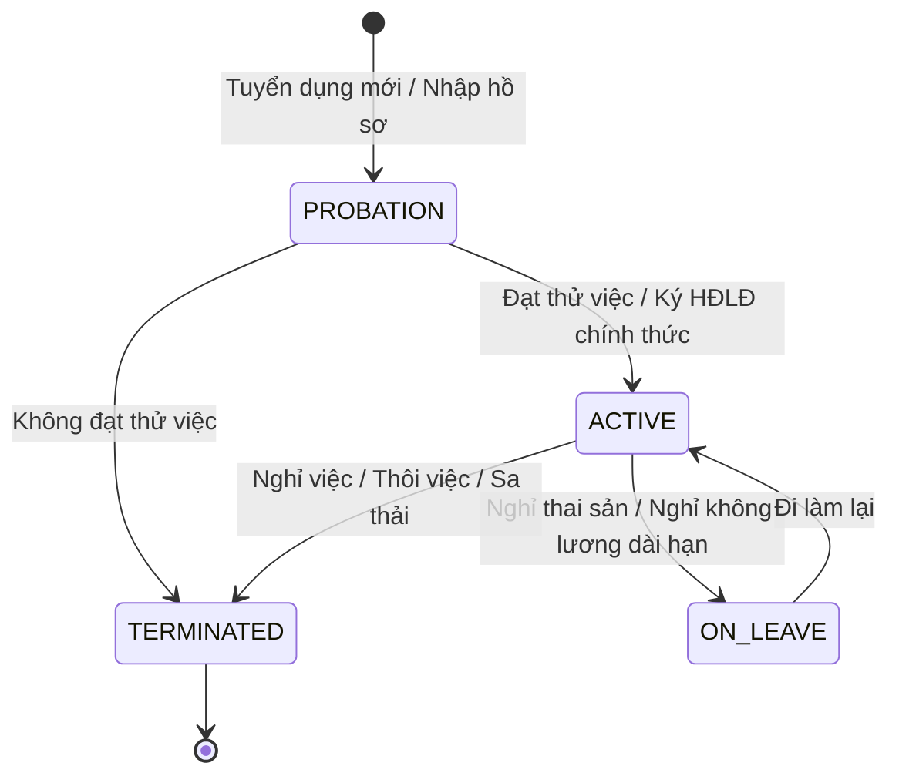

# Tài liệu Nghiệp vụ Module 04: Hồ sơ Nhân sự (Employee Profile & Lifecycle)

> **Module Code:** `employee`  
> **Package:** `com.cyclosa.employee`  
> **Phiên bản:** 1.0  
> **Căn cứ nghiệp vụ:** [ba/HRM-Mo-Ta-Nghiep-Vu-Chi-Tiet.md](file:///f:/Project/CYCLOSA/ba/HRM-Mo-Ta-Nghiep-Vu-Chi-Tiet.md) & [ba/HRM-Database.md](file:///f:/Project/CYCLOSA/ba/HRM-Database.md)

---

## 1. Tổng quan & Vai trò Trung tâm trong Hệ thống HRM

Trong hệ thống CYCLOSA HRM, **Hồ sơ Nhân sự (Employee Master Data)** là mắt xích hội tụ trung tâm của toàn bộ hệ sinh thái:

1. **Điểm giao thoa của Mô hình 3 chiều Độc lập:**
   - Mỗi nhân viên gắn với **Phòng ban** (`organizational_unit_id`), **Chi nhánh làm việc** (`branch_id`) và **Chức danh** (`position_id` / `job_level_id`).
   - 3 thông tin này hoàn toàn độc lập, cho phép điều chuyển địa bàn hoặc chức vụ mà không làm vỡ sơ đồ tổ chức.
2. **Nền tảng của các Module Nghiệp vụ phái sinh:**
   - **Hợp đồng (`contract`):** Ký kết HĐLĐ gắn với một nhân sự cụ thể.
   - **Chấm công (`attendance`):** Điểm danh GPS theo Chi nhánh, phân ca theo Phòng ban, nhận diện khuôn mặt qua `photo_url`.
   - **Nghỉ phép (`leave`):** Cấp quỹ phép năm theo thâm niên làm việc và duyệt đơn theo phân cấp quản lý.
   - **Bảng lương (`payroll`):** Tính toán lương dựa trên chức danh, chấm công, mức giảm trừ gia cảnh (người phụ thuộc), và chuyển khoản qua số tài khoản ngân hàng.

---

## 2. Các Phân Hệ Dữ Liệu Hồ Sơ Chuẩn Doanh Nghiệp Việt Nam

### 2.1. Định danh & Pháp lý Cá nhân (`employee_personal_info`)
- **CCCD / Hộ chiếu:** Số CCCD 12 chữ số, ngày cấp, nơi cấp (Cục CSQLHC về TTXH).
- **Thuế Thu nhập Cá nhân (TNCN):** Mã số thuế cá nhân (`tax_code`).
- **Bảo hiểm Xã hội (BHXH):** Mã số BHXH 10 chữ số (`social_insurance_number`).
- **Tài khoản Chi trả Lương:** Số tài khoản (`bank_account_number`), Tên ngân hàng (`bank_name`), Chi nhánh ngân hàng (`bank_branch`).
- **Ảnh chân dung đối chiếu (`photo_url`):** Vừa làm ảnh đại diện hồ sơ, vừa làm vector chuẩn đối chiếu nhận diện khuôn mặt khi chấm công di động.

### 2.2. Vị trí Công việc & Quản lý (`employee_employment_info`)
- `organizational_unit_id`: Đơn vị phòng ban trực thuộc (quy định quyền hạn theo DataScope).
- `branch_id`: Chi nhánh làm việc vật lý (quy định vị trí GPS và mức lương tối thiểu vùng I, II, III, IV).
- `position_id` & `job_level_id`: Chức danh công việc chuẩn hóa và cấp bậc thẩm quyền.
- `manager_employee_id`: Quản lý trực tiếp (Direct Manager - người duyệt đơn phép/công đầu tiên).
- `employment_type`: `FULL_TIME`, `PART_TIME`, `INTERNSHIP`, `CONTRACTOR`.
- `probation_end_date`: Ngày kết thúc thời gian thử việc theo luật lao động.

### 2.3. Người phụ thuộc & Giảm trừ gia cảnh (`employee_dependents`)
- Danh sách người phụ thuộc: Con dưới 18 tuổi, cha mẹ già ngoài độ tuổi lao động không có thu nhập.
- Cờ `tax_deduction_registered`: Xác nhận đã đăng ký mã số thuế người phụ thuộc thành công với cơ quan Thuế để được giảm trừ 4.4 triệu đồng/người/tháng.

### 2.4. Người liên hệ khẩn cấp (`employee_emergency_contacts`)
- Họ tên, mối quan hệ (Bố, Mẹ, Vợ, Chồng...), số điện thoại, địa chỉ khi có sự cố khẩn cấp hoặc tai nạn lao động.

### 2.5. Lịch sử biến động công tác (`employee_history`)
- Tuyệt đối không xóa/sửa đè khi nhân viên có biến động công tác.
- Lưu vết lịch sử:
  - `change_type`: `POSITION_CHANGE`, `DEPARTMENT_CHANGE`, `STATUS_CHANGE`, `MANAGER_CHANGE`.
  - `old_value` $\rightarrow$ `new_value`, `effective_date`, `changed_by_employee_id`.

---

## 3. Máy Trạng Thái Vòng Đời Nhân Sự (State Machine)

### Ràng buộc an toàn:
- Khi chuyển sang `TERMINATED`:
  - Khóa tài khoản `User` liên kết (`status = UserStatus.LOCKED`).
  - Hủy các phiên đăng nhập (Token/Session) đang hoạt động.
  - Chuyển `employment_status` thành `TERMINATED`.

---

## 4. Phân Quyền Dữ Liệu (DataScope Filtering)

Áp dụng quy chuẩn DataScope chặt chẽ:
1. **`OWN`:** Nhân viên chỉ có quyền xem thông tin hồ sơ của chính bản thân mình.
2. **`TEAM`:** Quản lý xem được nhân sự mà mình là `manager_employee_id` trực tiếp.
3. **`DEPARTMENT`:** Trưởng phòng xem được toàn bộ nhân viên trong đơn vị mình và **kế thừa đệ quy xuống các đơn vị con cháu** (thông qua `getSelfAndDescendantUnitIds`).
4. **`COMPANY`:** Nhân sự HR / Ban Giám đốc xem toàn bộ nhân viên của Công ty/Pháp nhân.
5. **`ALL`:** Super Admin xem xuyên suốt các công ty con.

---

## 5. Danh Mục API Chuẩn RESTful (`/api/v1/employees`)

| Method | Endpoint URI | Chức năng nghiệp vụ | Mã Quyền | DataScope áp dụng |
| :---: | :--- | :--- | :--- | :---: |
| `GET` | `/api/v1/employees` | Danh sách nhân sự có tìm kiếm & phân trang | `employee.view` | Tự động lọc theo Scope của User |
| `GET` | `/api/v1/employees/{id}` | Xem chi tiết hồ sơ toàn diện của nhân viên | `employee.view` | Kiểm tra ID thuộc Scope |
| `POST` | `/api/v1/employees` | Tiếp nhận nhân sự mới (hồ sơ + tùy chọn tạo User) | `employee.create` | `COMPANY` trở lên |
| `PUT` | `/api/v1/employees/{id}/personal-info` | Cập nhật thông tin cá nhân, CCCD, ngân hàng | `employee.update` | `OWN` hoặc `COMPANY` |
| `PUT` | `/api/v1/employees/{id}/employment-info` | Điều chuyển công tác, đổi phòng ban, bổ nhiệm chức danh | `employee.manage_job` | `DEPARTMENT` trở lên |
| `PUT` | `/api/v1/employees/{id}/status` | Chuyển đổi trạng thái vòng đời (kèm khóa User khi thôi việc) | `employee.manage_status` | `COMPANY` trở lên |
| `GET` | `/api/v1/employees/{id}/dependents` | Lấy danh sách người phụ thuộc | `employee.view` | Kiểm tra ID thuộc Scope |
| `POST` | `/api/v1/employees/{id}/dependents` | Đăng ký người phụ thuộc mới | `employee.update` | `OWN` hoặc `COMPANY` |
| `DELETE`| `/api/v1/employees/{id}/dependents/{depId}` | Xóa người phụ thuộc | `employee.update` | `OWN` hoặc `COMPANY` |
| `GET` | `/api/v1/employees/{id}/history` | Xem toàn bộ lịch sử biến động công tác | `employee.view` | `DEPARTMENT` trở lên |

---

## 6. Bảng Mã Lỗi Nghiệp Vụ (`EmployeeErrorCode`)

| Mã Lỗi | HTTP Status | Thông báo Lỗi (Tiếng Việt) | Kịch bản phát sinh |
| :---: | :---: | :--- | :--- |
| `4201` | 404 NOT_FOUND | `Không tìm thấy hồ sơ nhân viên` | Tra cứu `employee_id` không tồn tại hoặc đã bị xóa |
| `4202` | 409 CONFLICT | `Mã nhân viên đã tồn tại trong công ty` | Trùng lặp `employee_code` |
| `4203` | 409 CONFLICT | `Số CCCD/Hộ chiếu đã được đăng ký cho nhân viên khác` | Trùng lặp `national_id_number` |
| `4204` | 400 BAD_REQUEST | `Trạng thái nhân viên không hợp lệ cho thao tác này` | Chuyển trạng thái sai quy trình (ví dụ từ Terminated sang Probation) |
| `4205` | 404 NOT_FOUND | `Không tìm thấy thông tin người phụ thuộc` | ID người phụ thuộc không tồn tại |
| `4206` | 400 BAD_REQUEST | `Quản lý trực tiếp không thể là chính nhân viên đó` | Chọn chính mình làm `manager_employee_id` |
| `4207` | 403 FORBIDDEN | `Bạn không có quyền truy cập hồ sơ nhân viên này` | Vi phạm DataScope khi truy vấn hồ sơ |
