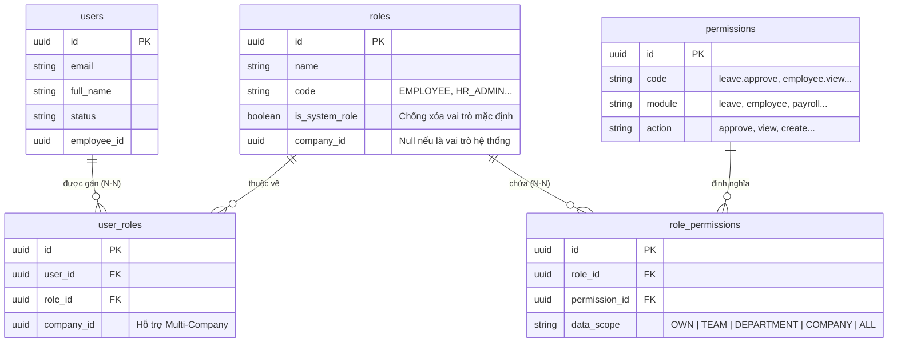
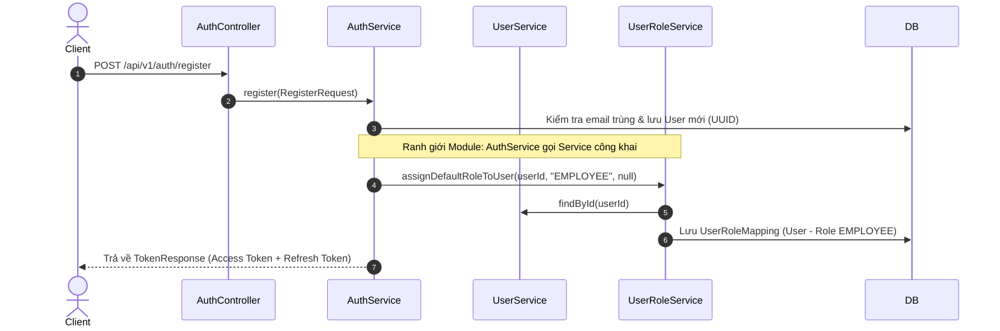
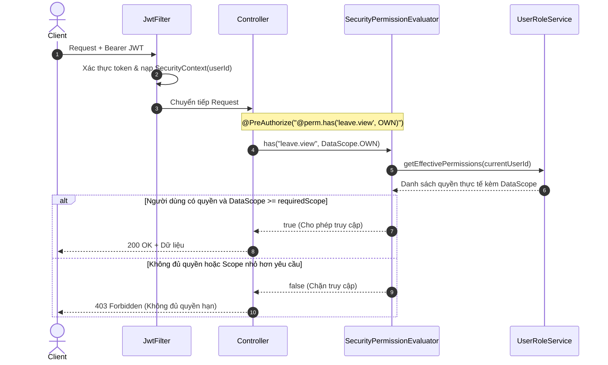

# Tài liệu Nghiệp vụ Phân quyền & Luồng thực thi Mã nguồn (RBAC + Data Scope)

Tài liệu này giải thích chi tiết nghiệp vụ phân quyền trong hệ sinh thái **CYCLOSA HRM**, làm rõ tại sao hệ thống không chỉ dùng RBAC thông thường mà phải kết hợp **Data Scope**, đồng thời phân tích luồng chạy thực tế qua từng lớp code (Controller, Service, Filter, Security Evaluator).

---

## 1. Bài toán Nghiệp vụ: Tại sao RBAC thông thường là chưa đủ?

### 1.1. Hạn chế của RBAC truyền thống
Trong các ứng dụng web thông thường, hệ thống chỉ dùng **Role-Based Access Control (RBAC)**:
- Người dùng có vai trò `ROLE_ADMIN` hoặc `ROLE_USER`.
- Nếu có `ROLE_ADMIN` thì được vào trang duyệt nghỉ phép; có `ROLE_USER` thì chỉ được tạo yêu cầu.

Tuy nhiên, trong một **hệ thống Quản trị Nhân sự (HRM) Doanh nghiệp**:
- **Trưởng nhóm A** và **Trưởng phòng B** đều có quyền duyệt đơn nghỉ phép (`leave.approve`).
- Nhưng **Trưởng nhóm A** chỉ được duyệt đơn của thành viên trong **Nhóm của mình** (`TEAM`).
- **Trưởng phòng B** được duyệt đơn của toàn bộ nhân viên trong **Phòng ban của mình** (`DEPARTMENT`).
- **Giám đốc Nhân sự (HR Admin)** được duyệt đơn của **Toàn công ty** (`COMPANY`).
- **Nhân viên (Employee)** chỉ được xem đơn của **Chính bản thân mình** (`OWN`).

> [!IMPORTANT]
> Nếu chỉ kiểm tra: *"Người này có quyền duyệt nghỉ phép hay không?"* thì hệ quả là Trưởng nhóm A có thể duyệt nhầm đơn của nhân sự phòng ban khác.
> Vì vậy, CYCLOSA áp dụng mô hình **RBAC kết hợp Data Scope (Phạm vi dữ liệu)**:
> $$\text{Quyền thực thi} = \text{Hành động (Permission)} + \text{Phạm vi dữ liệu (Data Scope)}$$

---

## 2. Các Khái niệm Cốt lõi trong CYCLOSA

| Khái niệm | Giải thích | Ví dụ trong CYCLOSA |
| :--- | :--- | :--- |
| **User** | Thực thể tài khoản đăng nhập hệ thống. | `admin@cyclosa.com`, `user_id = UUID` |
| **Role** | Chức danh / Vai trò đảm nhiệm trong tổ chức. Có 2 loại: <br>1. *Vai trò hệ thống (`is_system_role = true`)*: Cố định, không được xóa.<br>2. *Vai trò tùy biến (`company_id != null`)*: Do từng công ty tự định nghĩa. | `SUPER_ADMIN`, `HR_ADMIN`, `DEPARTMENT_MANAGER`, `EMPLOYEE`... |
| **Permission** | Hành động nguyên tử trên một module chức năng cụ thể, chuẩn hóa theo cú pháp `{module}.{action}`. | `leave.view`, `leave.approve`, `payroll.calculate`, `contract.sign` |
| **Data Scope** | Cấp bậc giới hạn tầm nhìn và phạm vi xử lý dữ liệu của quyền đó. | `OWN` (1) < `TEAM` (2) < `DEPARTMENT` (3) < `COMPANY` (4) < `ALL` (5) |
| **RolePermission** | Bảng liên kết N-N gán Permission cho Role kèm theo một Data Scope cụ thể. | Role `DEPARTMENT_MANAGER` sở hữu permission `leave.approve` với scope `DEPARTMENT`. |
| **UserRoleMapping** | Bảng liên kết N-N gán Role cho User kèm theo `company_id` (hỗ trợ Multi-Company). | Nhân viên X có vai trò `EMPLOYEE` ở công ty con A, nhưng giữ vai trò `LINE_MANAGER` ở chi nhánh B. |

---

## 3. Sơ đồ Thực thể Cơ sở dữ liệu (ERD)



---

## 4. Cơ chế Gộp Quyền & Lấy DataScope cao nhất (Scope Merging)

Một nhân sự có thể được gán **nhiều vai trò cùng lúc** (kiêm nhiệm). Ví dụ:
- Nhân viên Nguyễn Văn A vừa giữ vai trò **`EMPLOYEE`**, vừa là **`TEAM_LEADER`** của Nhóm Thiết kế.

Khi cả 2 vai trò này đều cấp quyền xem đơn nghỉ phép (`leave.view`):
- Vai trò `EMPLOYEE` cấp quyền `leave.view` với scope **`OWN`** (cấp độ 1).
- Vai trò `TEAM_LEADER` cấp quyền `leave.view` với scope **`TEAM`** (cấp độ 2).

### Thuật toán giải quyết trong `UserRoleService.java`:
```java
// Nếu quyền đã tồn tại trong danh sách, chỉ cập nhật nếu scope mới có level cao hơn
if (rp.getDataScope().getLevel() > existing.getDataScope().getLevel()) {
    effectiveMap.put(code, rp);
}
```
$\rightarrow$ Kết quả: Người dùng nhận quyền `leave.view` với phạm vi mở rộng cao nhất là **`TEAM`**.

```
[Vai trò 1: EMPLOYEE]    ──> leave.view [OWN: Level 1]
                                                    ───► Gộp quyền: leave.view [TEAM: Level 2]
[Vai trò 2: TEAM_LEADER] ──> leave.view [TEAM: Level 2]
```

---

## 5. Luồng Code Thực Thi Chi Tiết (Step-by-Step Code Flow)

### 5.1. Luồng 1: Khởi tạo dữ liệu hệ thống (Bootstrap Initializer)
File: [RolePermissionDataInitializer.java](file:///f:/Project/CYCLOSA/cyclosa_be/src/main/java/com/cyclosa/common/config/RolePermissionDataInitializer.java)
1. Ứng dụng khởi động, `RolePermissionDataInitializer` thực thi interface `ApplicationRunner`.
2. Phương thức `seedPermissions()` quét danh mục 22 module theo thiết kế BA và lưu vào bảng `permissions` nếu chưa tồn tại.
3. Phương thức `seedRoles()` tạo 15 vai trò mặc định (`SUPER_ADMIN`, `HR_ADMIN`, `EMPLOYEE`...) với cờ `is_system_role = true`.
4. Phương thức `seedRolePermissions()` gán ma trận quyền chuẩn kèm `DataScope` tương ứng cho từng vai trò.
5. Tạo tài khoản Super Admin ban đầu: `admin@cyclosa.com` / `Admin@123456`.

---

### 5.2. Luồng 2: Đăng ký tài khoản & Gán vai trò tự động
File: [AuthService.java](file:///f:/Project/CYCLOSA/cyclosa_be/src/main/java/com/cyclosa/auth/service/AuthService.java) $\rightarrow$ [UserRoleService.java](file:///f:/Project/CYCLOSA/cyclosa_be/src/main/java/com/cyclosa/role/service/UserRoleService.java)



1. Người dùng gửi thông tin đăng ký (`email`, `password`, `fullName`).
2. `AuthService` băm mật khẩu bằng BCrypt, lưu `User` với khóa `UUID`.
3. Để đảm bảo tính phân tách module, `AuthService` **không tự tiện insert bảng user_roles**, mà gọi sang [UserRoleService.assignDefaultRoleToUser(...)](file:///f:/Project/CYCLOSA/cyclosa_be/src/main/java/com/cyclosa/role/service/UserRoleService.java#L67).
4. `UserRoleService` truy vấn role `EMPLOYEE` và gán vào bảng `user_roles`.

---

### 5.3. Luồng 3: Đăng nhập & Mã hóa quyền vào Token JWT
File: [AuthService.java](file:///f:/Project/CYCLOSA/cyclosa_be/src/main/java/com/cyclosa/auth/service/AuthService.java) & [JwtUtil.java](file:///f:/Project/CYCLOSA/cyclosa_be/src/main/java/com/cyclosa/auth/security/JwtUtil.java)

1. Client gọi `POST /api/v1/auth/login`.
2. `AuthService` kiểm tra mật khẩu, lấy danh sách mã vai trò (Roles) của người dùng:
   ```java
   List<String> roles = user.getRolesList(); // Ví dụ: ["EMPLOYEE", "TEAM_LEADER"]
   ```
3. `JwtUtil.generateAccessToken(userId, email, roles)` nhúng danh sách roles vào Claims của JWT token:
   ```json
   {
     "sub": "b6a7c8d9-1234-5678-90ab-cdef12345678",
     "email": "user@cyclosa.com",
     "roles": ["ROLE_EMPLOYEE", "ROLE_TEAM_LEADER"],
     "iat": 1726300000,
     "exp": 1726386400
   }
   ```

---

### 5.4. Luồng 4: Xác thực Request đến (JWT Authentication Filter)
File: [JwtAuthFilter.java](file:///f:/Project/CYCLOSA/cyclosa_be/src/main/java/com/cyclosa/auth/security/JwtAuthFilter.java)

Mỗi HTTP request gửi kèm header `Authorization: Bearer <token>`:
1. `JwtAuthFilter` trích xuất JWT Token và kiểm tra chữ ký bí mật + thời hạn.
2. Kiểm tra Redis xem token có nằm trong Blacklist (đã logout) hay không.
3. Trích xuất `userId` và danh sách `roles` từ Claims.
4. Chuyển đổi roles thành `GrantedAuthority` và thiết lập vào `SecurityContextHolder`:
   ```java
   UsernamePasswordAuthenticationToken authentication =
       new UsernamePasswordAuthenticationToken(userId, null, authorities);
   SecurityContextHolder.getContext().setAuthentication(authentication);
   ```

---

### 5.5. Luồng 5: Chặn và Kiểm tra Quyền tại Controller qua `@perm`
File: [SecurityPermissionEvaluator.java](file:///f:/Project/CYCLOSA/cyclosa_be/src/main/java/com/cyclosa/common/security/SecurityPermissionEvaluator.java)

Tại Controller, lập trình viên sử dụng Spring Security SpEL kết hợp bean `@perm`:
```java
@GetMapping("/{id}")
@PreAuthorize("@perm.has('leave.view', T(com.cyclosa.common.enums.DataScope).OWN)")
public ResponseEntity<?> getLeaveRequest(@PathVariable UUID id) { ... }
```



Chi tiết hàm kiểm tra trong [SecurityPermissionEvaluator.java](file:///f:/Project/CYCLOSA/cyclosa_be/src/main/java/com/cyclosa/common/security/SecurityPermissionEvaluator.java#L26):
1. Trích xuất `currentUserId` từ `SecurityContextHolder`.
2. Gọi `userRoleService.getEffectivePermissions(userId)`: Trả về danh sách quyền đã được gộp.
3. Tìm quyền tương ứng với mã `permissionCode` (ví dụ `leave.view`).
4. So sánh phạm vi dữ liệu:
   ```java
   return userScope.isBroaderOrEqualTo(requiredScope);
   ```
   Nếu user có scope là `DEPARTMENT` mà endpoint yêu cầu tối thiểu `OWN`, phép so sánh trả về `true` (Hợp lệ).

---

### 5.6. Luồng 6: Tầng Nghiệp vụ Lọc Dữ liệu dựa trên DataScope
Sau khi vượt qua tầng Controller, Service nghiệp vụ sẽ lấy `DataScope` thực tế của user để xây dựng câu truy vấn dữ liệu chính xác:

```java
@Service
@RequiredArgsConstructor
public class LeaveService {

    private final SecurityPermissionEvaluator perm;
    private final LeaveRepository leaveRepository;

    public Page<LeaveResponse> getLeaves(Pageable pageable) {
        UUID currentUserId = SecurityUtils.getCurrentUserId();
        DataScope scope = perm.getDataScope("leave.view");

        return switch (scope) {
            case OWN -> leaveRepository.findByUserId(currentUserId, pageable);
            case TEAM -> {
                UUID teamId = getCurrentUserTeamId(currentUserId);
                yield leaveRepository.findByTeamId(teamId, pageable);
            }
            case DEPARTMENT -> {
                UUID deptId = getCurrentUserDepartmentId(currentUserId);
                yield leaveRepository.findByDepartmentId(deptId, pageable);
            }
            case COMPANY -> {
                UUID companyId = getCurrentUserCompanyId(currentUserId);
                yield leaveRepository.findByCompanyId(companyId, pageable);
            }
            case ALL -> leaveRepository.findAll(pageable);
        };
    }
}
```

---

## 6. Hướng dẫn Lập trình viên khi Triển khai Module Mới

Khi bạn xây dựng một Module nghiệp vụ mới (ví dụ: `attendance`, `leave`, `payroll`):

### Bước 1: Khai báo Permission trong Initializer
Trong danh mục quyền, tuân thủ định dạng `{module}.{action}`:
```java
Permission.builder()
    .code("attendance.checkin")
    .module("attendance")
    .action("checkin")
    .description("Chấm công vào/ra hàng ngày")
    .build();
```

### Bước 2: Bảo vệ Controller
Thêm `@PreAuthorize` với bean `@perm`:
```java
// Kiểm tra quyền cơ bản (mặc định yêu cầu scope tối thiểu là OWN)
@PreAuthorize("@perm.has('attendance.checkin')")

// Kiểm tra quyền yêu cầu phạm vi cao hơn (ví dụ: cấp duyệt quản lý)
@PreAuthorize("@perm.has('attendance.approve', T(com.cyclosa.common.enums.DataScope).DEPARTMENT)")
```

### Bước 3: Lọc dữ liệu trong Service
Sử dụng `perm.getDataScope("{permissionCode}")` để giới hạn câu query SQL/JPA theo đúng phòng ban, nhóm hoặc cá nhân của người dùng đang đăng nhập.
