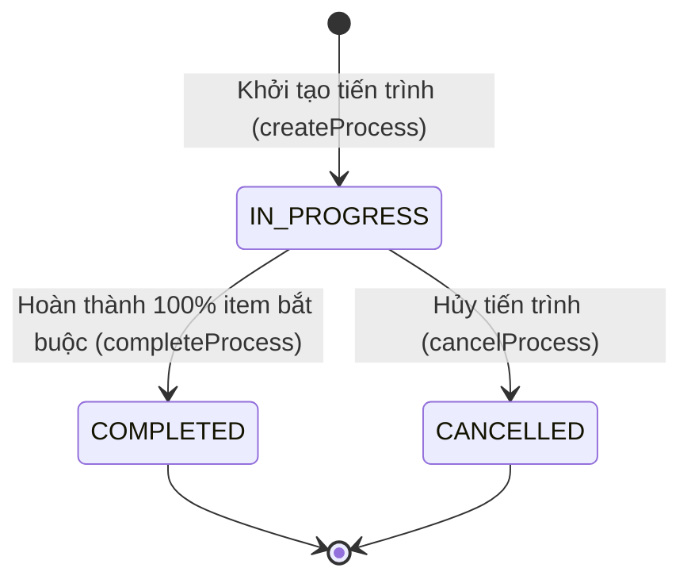
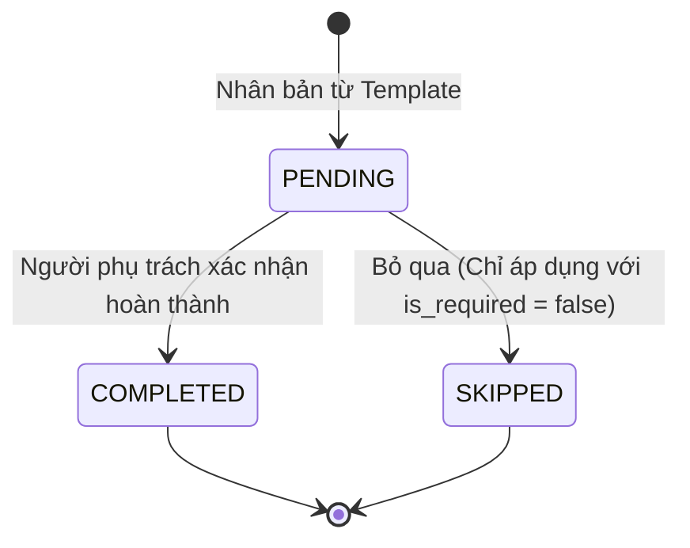
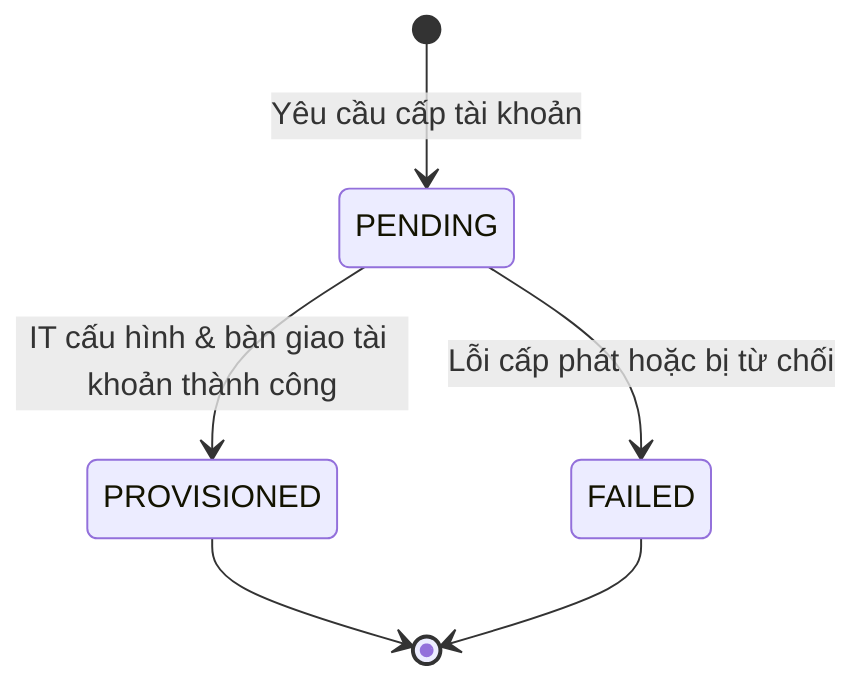

# Tài liệu Nghiệp vụ Module 03: Hội nhập Nhân sự (Onboarding Management)

> **Module Code:** `onboarding`  
> **Package:** `com.cyclosa.onboarding`  
> **Phiên bản:** 1.0  
> **Tuân thủ quy chuẩn:** [docs/BACKEND_STANDARDS.md](file:///f:/Project/CYCLOSA/cyclosa_be/docs/BACKEND_STANDARDS.md)  
> **Tài liệu liên quan:** [docs/ba/tuyen-dung-recruitment.md](file:///f:/Project/CYCLOSA/cyclosa_be/docs/ba/tuyen-dung-recruitment.md), [docs/ba/ho-so-nhan-su.md](file:///f:/Project/CYCLOSA/cyclosa_be/docs/ba/ho-so-nhan-su.md)

---

## 1. Tổng quan & Vai trò Nghiệp vụ

Trong hệ sinh thái CYCLOSA HRM, **Hội nhập Nhân sự (Onboarding)** đóng vai trò mắt xích chuyển tiếp chiến lược giữa khâu Tuyển dụng trúng tuyển và Giai đoạn làm việc chính thức của nhân sự:

```
[ Tuyển dụng (Recruitment) ]
         │ (Ứng viên trúng tuyển / Convert to Employee)
         ▼
[ Hồ sơ nhân sự: PROBATION ]
         │ (Khởi tạo Onboarding Process)
         ▼
[ ONBOARDING WORKFLOW ] ◄── Cấp phát thiết bị (Asset Module)
  ├─ 1. Thu thập & Thẩm định giấy tờ hồ sơ
  ├─ 2. Đề nghị IT cấp tài khoản & hòm thư
  ├─ 3. Đào tạo định hướng văn hóa & quy định
  └─ 4. Bàn giao trang thiết bị & tiếp nhận vị trí
         │ (100% việc bắt buộc hoàn tất)
         ▼
[ Kích hoạt tự động: ACTIVE ] ──► Chấm công, HĐLĐ & Tính lương
```

### Mục tiêu cốt lõi:
1. **Chuẩn hóa quy trình tiếp nhận:** Tránh tình trạng nhân viên mới ngày đầu đi làm thiếu máy tính, chưa có email nội bộ, hoặc chưa nộp đủ giấy tờ tùy thân.
2. **Template hóa theo phòng ban & vị trí:** Cho phép cấu hình mẫu danh mục việc cần làm (Checklist Template) đặc thù cho từng khối (Kỹ thuật phần mềm, Kinh doanh, Khối văn phòng...).
3. **Tự động hóa vòng đời nhân sự:** Khi hoàn tất 100% các hạng mục Onboarding bắt buộc, hệ thống tự động kích hoạt trạng thái nhân viên từ `PROBATION` sang `ACTIVE`.

---

## 2. Quy trình Nghiệp vụ Chi tiết (Business Flows)

### 2.1. Quản lý Mẫu Checklist Hội nhập (`Checklist Template`)
- HR thiết lập các mẫu Checklist tương ứng với từng chức danh (`applicable_position_id`) hoặc phòng ban (`applicable_department_id`).
- Mỗi Template chứa danh sách các mục (`OnboardingChecklistTemplateItem`) được đánh chỉ số sắp xếp (`order_index`) và cờ bắt buộc (`is_required`).
- Các hạng mục được chia thành 5 danh mục nghiệp vụ:
  * `DOCUMENT`: Nộp CCCD/Hộ chiếu, Bằng tốt nghiệp, Giấy khám sức khỏe, Bản cam kết bảo mật...
  * `ACCOUNT`: Cấp tài khoản Google Workspace, Slack, Jira, VPN, CYCLOSA ERP...
  * `ASSET`: Cấp phát Laptop, Màn hình rời, Chuột, Bàn phím, Thẻ nhân viên...
  * `ORIENTATION`: Tham gia lớp đào tạo hội nhập nhân viên mới, Giới thiệu văn hóa công ty...
  * `OTHER`: Bàn giao nội bộ, Gặp mặt Leader & Buddy định hướng...

### 2.2. Khởi tạo Tiến trình Hội nhập (`Onboarding Process`)
- Khi nhân viên mới được tiếp nhận, HR tạo một tiến trình `OnboardingProcess` bằng cách chọn Template tương ứng.
- **Ràng buộc nghiệp vụ:**
  - Mỗi nhân viên chỉ được phép có **tối đa một** tiến trình Onboarding đang ở trạng thái `IN_PROGRESS`.
  - Hệ thống tự động nhân bản (clone) toàn bộ các item từ Template sang `OnboardingProcessItem` của nhân viên đó.

### 2.3. Theo dõi & Thực thi các hạng mục (Item Execution)
- Khi hoàn thành từng hạng mục, người phụ trách (hoặc HR) gọi API `completeProcessItem`.
- **Ràng buộc kiểm tra chéo (Cross-Validation Rules):**
  - **Hạng mục `ACCOUNT`:** Không thể đánh dấu hoàn thành nếu trên hệ thống chưa có ít nhất một tài khoản nào được ghi nhận ở trạng thái `PROVISIONED`.
  - **Hạng mục `DOCUMENT`:** Kiểm tra và liên kết với giấy tờ đã được nhân sự upload và xác thực.
- Cho phép bỏ qua (`SKIPPED`) đối với những hạng mục không bắt buộc (`is_required = false`).

### 2.4. Nghiệm thu & Hoàn tất Tiến trình (Process Completion)
- HR nhấn hoàn tất tiến trình Onboarding.
- Hệ thống kiểm tra: **Tất cả các item có `is_required = true` bắt buộc phải ở trạng thái `COMPLETED`**. Nếu còn sót mục nào, hệ thống từ chối hoàn tất (`ONBOARDING_REQUIRED_ITEMS_INCOMPLETE`).
- Khi thỏa mãn:
  - Cập nhật tiến trình sang `COMPLETED`, ghi nhận `completed_at`.
  - **Tự động gọi `EmployeeService.updateEmploymentStatus(employeeId, ACTIVE)`** để kích hoạt nhân sự chính thức hoạt động trên toàn hệ thống CYCLOSA.

---

## 3. Máy trạng thái (State Machines)

### 3.1. Trạng thái Tiến trình Onboarding (`OnboardingStatus`)



### 3.2. Trạng thái Hạng mục (`OnboardingItemStatus`)



### 3.3. Trạng thái Cấp phát Tài khoản IT (`ProvisioningStatus`)



---

## 4. Chi tiết các Thực thể Dữ liệu (Entities & Database Design)

Module Onboarding gồm 7 Entity kế thừa `BaseEntity` (đầy đủ `id` (UUID), `created_at`, `updated_at`, `deleted_at`, Soft-Delete và Audit):

### 4.1. `OnboardingChecklistTemplate` (Bảng `onboarding_checklist_templates`)
*Mẫu danh mục hội nhập chuẩn của doanh nghiệp.*

| Thuộc tính | Kiểu dữ liệu | Nullable | Mô tả nghiệp vụ |
| :--- | :--- | :---: | :--- |
| `id` | `UUID` | No | Khóa chính |
| `company_id` | `UUID` | Yes | ID công ty (Multi-tenancy; `null` là template mẫu dùng chung toàn tập đoàn) |
| `name` | `VARCHAR(200)` | No | Tên mẫu template (ví dụ: *Quy trình đón tiếp Kỹ sư phần mềm*) |
| `applicable_position_id` | `UUID` | Yes | ID chức danh áp dụng (nếu cấu hình riêng theo vị trí) |
| `applicable_department_id` | `UUID` | Yes | ID phòng ban áp dụng (nếu cấu hình riêng theo đơn vị) |
| `description` | `TEXT` | Yes | Mô tả mục tiêu, hướng dẫn của template |
| `is_active` | `BOOLEAN` | No | Trạng thái hiệu lực (mặc định: `true`) |
| `items` | `List<...Item>` | - | Quan hệ `@OneToMany` tới các hạng mục chi tiết |

### 4.2. `OnboardingChecklistTemplateItem` (Bảng `onboarding_checklist_template_items`)
*Các đầu việc cấu thành nên một Template.*

| Thuộc tính | Kiểu dữ liệu | Nullable | Mô tả nghiệp vụ |
| :--- | :--- | :---: | :--- |
| `template_id` | `UUID` | No | Khóa ngoại `@ManyToOne` tham chiếu `OnboardingChecklistTemplate` |
| `title` | `VARCHAR(250)` | No | Tiêu đề công việc (ví dụ: *Nộp bản sao CCCD công chứng*) |
| `description` | `TEXT` | Yes | Hướng dẫn chi tiết cách thức thực hiện |
| `category` | `VARCHAR(30)` | No | Enum: `DOCUMENT`, `ACCOUNT`, `ASSET`, `ORIENTATION`, `OTHER` |
| `order_index` | `INT` | No | Thứ tự hiển thị và thực hiện (tăng dần) |
| `is_required` | `BOOLEAN` | No | Bắt buộc phải hoàn tất trước khi kích hoạt nhân viên |

### 4.3. `OnboardingProcess` (Bảng `onboarding_processes`)
*Tiến trình hội nhập thực tế của một nhân viên cụ thể.*

| Thuộc tính | Kiểu dữ liệu | Nullable | Mô tả nghiệp vụ |
| :--- | :--- | :---: | :--- |
| `company_id` | `UUID` | No | Thuộc công ty/pháp nhân nào |
| `employee_id` | `UUID` | No | Nhân viên đang tham gia Onboarding |
| `checklist_template_id` | `UUID` | No | Template gốc được sử dụng |
| `start_date` | `DATE` | No | Ngày chính thức bắt đầu tiếp nhận |
| `status` | `VARCHAR(30)` | No | Enum: `IN_PROGRESS`, `COMPLETED`, `CANCELLED` |
| `completed_at` | `TIMESTAMP` | Yes | Thời điểm nghiệm thu hoàn thành 100% |
| `notes` | `TEXT` | Yes | Ghi chú đánh giá chung |
| `items` | `List<...Item>` | - | `@OneToMany` danh sách các đầu việc nhân bản của tiến trình này |

### 4.4. `OnboardingProcessItem` (Bảng `onboarding_process_items`)
*Đầu việc cụ thể được giao và theo dõi trong tiến trình của nhân sự.*

| Thuộc tính | Kiểu dữ liệu | Nullable | Mô tả nghiệp vụ |
| :--- | :--- | :---: | :--- |
| `onboarding_process_id` | `UUID` | No | `@ManyToOne` thuộc về tiến trình Onboarding nào |
| `template_item_id` | `UUID` | Yes | ID hạng mục gốc trong Template (để truy vết) |
| `title` | `VARCHAR(250)` | No | Tiêu đề công việc |
| `category` | `VARCHAR(30)` | No | Phân loại hạng mục |
| `order_index` | `INT` | No | Thứ tự ưu tiên |
| `is_required` | `BOOLEAN` | No | Cờ bắt buộc |
| `status` | `VARCHAR(30)` | No | Enum: `PENDING`, `COMPLETED`, `SKIPPED` |
| `completed_by_employee_id` | `UUID` | Yes | ID nhân viên (HR/IT/Manager) xác nhận hoàn tất |
| `completed_at` | `TIMESTAMP` | Yes | Thời điểm hoàn thành |
| `note` | `TEXT` | Yes | Ghi chú khi thực hiện |

### 4.5. `AccountProvisioning` (Bảng `account_provisioning`)
*Theo dõi cấp phát tài khoản công nghệ thông tin cho nhân sự mới.*

| Thuộc tính | Kiểu dữ liệu | Nullable | Mô tả nghiệp vụ |
| :--- | :--- | :---: | :--- |
| `company_id` | `UUID` | No | ID công ty |
| `onboarding_process_id` | `UUID` | Yes | Liên kết với tiến trình Onboarding |
| `employee_id` | `UUID` | No | Nhân sự được cấp tài khoản |
| `system_name` | `VARCHAR(100)` | No | Tên hệ thống (ví dụ: *Google Workspace, VPN, Gitlab*) |
| `account_username` | `VARCHAR(150)` | No | Username / Email được cấp |
| `status` | `VARCHAR(30)` | No | Enum: `PENDING`, `PROVISIONED`, `FAILED` |
| `provisioned_by_employee_id` | `UUID` | Yes | Chuyên viên IT thực hiện cấp phát |
| `provisioned_at` | `TIMESTAMP` | Yes | Thời điểm bàn giao |
| `revoked_at` | `TIMESTAMP` | Yes | Thời điểm thu hồi (khi nghỉ việc) |

### 4.6. `OrientationSession` (Bảng `orientation_sessions`)
*Quản lý các buổi đào tạo định hướng hội nhập.*

| Thuộc tính | Kiểu dữ liệu | Nullable | Mô tả nghiệp vụ |
| :--- | :--- | :---: | :--- |
| `company_id` | `UUID` | No | ID công ty |
| `onboarding_process_id` | `UUID` | Yes | Liên kết tiến trình |
| `session_name` | `VARCHAR(200)` | No | Tên lớp (ví dụ: *Văn hóa doanh nghiệp & Quy định bảo mật*) |
| `description` | `TEXT` | Yes | Nội dung truyền tải |
| `location` | `VARCHAR(255)` | Yes | Địa điểm phòng học hoặc link họp trực tuyến (Google Meet/Teams) |
| `scheduled_at` | `TIMESTAMP` | No | Thời gian diễn ra buổi học |
| `trainer_employee_id` | `UUID` | Yes | Giảng viên nội bộ / Người đào tạo phụ trách |
| `status` | `VARCHAR(30)` | No | Enum: `SCHEDULED`, `COMPLETED`, `CANCELLED` |

### 4.7. `EmployeeDocument` (Bảng `employee_documents`)
*Quản lý kho hồ sơ giấy tờ số hóa của nhân sự.*

| Thuộc tính | Kiểu dữ liệu | Nullable | Mô tả nghiệp vụ |
| :--- | :--- | :---: | :--- |
| `company_id` | `UUID` | No | ID công ty |
| `employee_id` | `UUID` | No | Nhân viên sở hữu tài liệu |
| `document_type` | `VARCHAR(30)` | No | Enum: `ID_CARD`, `DIPLOMA`, `HEALTH_CERT`, `CONTRACT`, `OTHER` |
| `document_name` | `VARCHAR(255)` | No | Tên tài liệu (ví dụ: *CCCD 2 mặt, Bằng Thạc sĩ CNTT*) |
| `file_url` | `VARCHAR(500)` | No | Đường dẫn file trên Object Storage (S3/MinIO) |
| `file_size` | `BIGINT` | Yes | Dung lượng file (bytes) |
| `is_verified` | `BOOLEAN` | No | Đã được HR kiểm tra và xác thực tính pháp lý chưa |
| `verified_by_employee_id` | `UUID` | Yes | Chuyên viên HR thẩm định giấy tờ |
| `verified_at` | `TIMESTAMP` | Yes | Thời điểm xác thực |

---

## 5. Cấu trúc Source Code & Giải thích chi tiết các File

Toàn bộ mã nguồn module được đóng gói độc lập trong package `com.cyclosa.onboarding` theo kiến trúc **Modular Monolith**:

```
com.cyclosa.onboarding/
├── controller/
│   ├── OnboardingChecklistController.java    # API quản lý Mẫu Checklist Template
│   ├── OnboardingProcessController.java      # API quản lý Tiến trình Onboarding & thực thi Task
│   ├── OrientationSessionController.java     # API quản lý Lịch đào tạo hội nhập
│   └── EmployeeDocumentController.java       # API số hóa & Thẩm định tài liệu hồ sơ
├── service/
│   └── OnboardingService.java                # Trọng tâm xử lý logic nghiệp vụ toàn bộ module
├── repository/
│   ├── OnboardingChecklistTemplateRepository.java
│   ├── OnboardingChecklistTemplateItemRepository.java
│   ├── OnboardingProcessRepository.java
│   ├── OnboardingProcessItemRepository.java
│   ├── AccountProvisioningRepository.java
│   ├── OrientationSessionRepository.java
│   └── EmployeeDocumentRepository.java
├── entity/
│   ├── OnboardingChecklistTemplate.java
│   ├── OnboardingChecklistTemplateItem.java
│   ├── OnboardingProcess.java
│   ├── OnboardingProcessItem.java
│   ├── AccountProvisioning.java
│   ├── OrientationSession.java
│   └── EmployeeDocument.java
├── enums/
│   ├── OnboardingStatus.java
│   ├── OnboardingItemStatus.java
│   ├── OnboardingItemCategory.java
│   ├── ProvisioningStatus.java
│   ├── SessionStatus.java
│   └── EmployeeDocumentType.java
├── mapper/
│   └── OnboardingMapper.java                 # MapStruct chuyển đổi giữa Entity và DTO
├── dto/
│   ├── request/                              # Các payload gửi lên từ Client
│   ├── response/                             # Cấu trúc trả về chuẩn RESTful (kèm Summary DTO)
│   └── filter/                               # DTO lọc & tìm kiếm kế thừa BaseFilterRequest
└── exception/
    └── OnboardingErrorCode.java              # Mã lỗi nghiệp vụ đa hình (implement ErrorCode)
```

### 5.1. Tầng Service ([OnboardingService.java](file:///f:/Project/CYCLOSA/cyclosa_be/src/main/java/com/cyclosa/onboarding/service/OnboardingService.java))
Đây là file trung tâm của module, hiện thực các nguyên tắc kỹ thuật nghiêm ngặt:
- **Tuân thủ Modular Monolith (Mục 1.1 & 1.2 BACKEND_STANDARDS):**
  * Không bao giờ inject `EmployeeRepository` hay `PositionRepository`.
  * Giao tiếp với các module khác thông qua Public Service:
    - [EmployeeService](file:///f:/Project/CYCLOSA/cyclosa_be/src/main/java/com/cyclosa/employee/service/EmployeeService.java): Lấy chi tiết nhân sự (`getEmployeeByIdInternal`), cập nhật trạng thái làm việc (`updateEmploymentStatus`), lấy danh sách tóm tắt (`getEmployeeSummaries`).
    - [OrganizationalUnitService](file:///f:/Project/CYCLOSA/cyclosa_be/src/main/java/com/cyclosa/organization/service/OrganizationalUnitService.java): Lấy tóm tắt phòng ban (`getUnitSummaries`).
    - [PositionService](file:///f:/Project/CYCLOSA/cyclosa_be/src/main/java/com/cyclosa/organization/service/PositionService.java): Lấy tóm tắt chức danh (`getPositionSummaries`).
    - [AssetService](file:///f:/Project/CYCLOSA/cyclosa_be/src/main/java/com/cyclosa/asset/service/AssetService.java): Lấy danh sách tài sản/thiết bị đã được cấp phát cho nhân viên mới (`getEmployeeAssets`).
- **Chống N+1 Query triệt để (Mục 7 BACKEND_STANDARDS):**
  * Khi trả về danh sách tiến trình (`PageData<OnboardingProcessResponse>`), gom toàn bộ `Set<UUID>` của nhân viên, phòng ban, chức danh và gọi hàm batch để map vào các `Nested Summary Object` (`EmployeeSummary`, `PositionSummary`, `OrgUnitSummary`).
- **Tính toán tiến độ hội nhập thời gian thực:**
  * Hàm `calculateProgress(...)` đếm tổng số item, số item đã hoàn thành để tính tỷ lệ `%` tiến độ và hiển thị lên UI Dashboard cho HR và Quản lý.

### 5.2. Tầng Controller
- [OnboardingChecklistController.java](file:///f:/Project/CYCLOSA/cyclosa_be/src/main/java/com/cyclosa/onboarding/controller/OnboardingChecklistController.java):
  * Đường dẫn: `/api/v1/onboarding/templates`
  * Quản lý CRUD Mẫu Checklist Template và cấu hình đầu việc con.
- [OnboardingProcessController.java](file:///f:/Project/CYCLOSA/cyclosa_be/src/main/java/com/cyclosa/onboarding/controller/OnboardingProcessController.java):
  * Đường dẫn: `/api/v1/onboarding/processes`
  * Khởi tạo tiến trình, thực hiện từng item, theo dõi tiến độ, cấp phát tài khoản IT và nghiệm thu kích hoạt nhân sự.
- [OrientationSessionController.java](file:///f:/Project/CYCLOSA/cyclosa_be/src/main/java/com/cyclosa/onboarding/controller/OrientationSessionController.java):
  * Đường dẫn: `/api/v1/onboarding/sessions`
  * Quản lý lịch các lớp đào tạo văn hóa hội nhập.
- [EmployeeDocumentController.java](file:///f:/Project/CYCLOSA/cyclosa_be/src/main/java/com/cyclosa/onboarding/controller/EmployeeDocumentController.java):
  * Đường dẫn: `/api/v1/onboarding/documents`
  * Upload hồ sơ số hóa và thẩm định giấy tờ nhân sự.

---

## 6. Danh Mục API RESTful Chuẩn Hóa

| HTTP Method | Endpoint URI | Chức năng nghiệp vụ | Mã Quyền RBAC |
| :---: | :--- | :--- | :--- |
| `POST` | `/api/v1/onboarding/templates` | Tạo mới mẫu Checklist hội nhập | `onboarding.template.create` |
| `GET` | `/api/v1/onboarding/templates` | Danh sách mẫu Checklist (phân trang + lọc) | `onboarding.template.view` |
| `GET` | `/api/v1/onboarding/templates/{id}` | Chi tiết mẫu Checklist kèm danh sách items | `onboarding.template.view` |
| `PUT` | `/api/v1/onboarding/templates/{id}` | Cập nhật thông tin mẫu Checklist | `onboarding.template.manage` |
| `DELETE` | `/api/v1/onboarding/templates/{id}` | Xóa mềm mẫu Checklist | `onboarding.template.manage` |
| `POST` | `/api/v1/onboarding/templates/{id}/items` | Thêm hạng mục đầu việc vào Template | `onboarding.template.manage` |
| `POST` | `/api/v1/onboarding/processes` | Khởi tạo tiến trình Onboarding cho nhân sự mới | `onboarding.process.create` |
| `GET` | `/api/v1/onboarding/processes` | Danh sách tiến trình Onboarding (lọc, phân trang) | `onboarding.process.view` |
| `GET` | `/api/v1/onboarding/processes/{id}` | Xem chi tiết tiến trình (tiến độ, items, tài sản, tài khoản) | `onboarding.process.view` |
| `PUT` | `/api/v1/onboarding/processes/items/{itemId}/complete` | Đánh dấu hoàn thành một hạng mục đầu việc | `onboarding.process.manage` |
| `PUT` | `/api/v1/onboarding/processes/{id}/complete` | Nghiệm thu hoàn tất Onboarding (Kích hoạt `ACTIVE`) | `onboarding.process.manage` |
| `PUT` | `/api/v1/onboarding/processes/{id}/cancel` | Hủy tiến trình Onboarding | `onboarding.process.manage` |
| `POST` | `/api/v1/onboarding/processes/{id}/accounts` | Đăng ký cấp phát tài khoản IT | `onboarding.account.manage` |
| `PUT` | `/api/v1/onboarding/processes/accounts/{id}/status` | Cập nhật trạng thái cấp phát tài khoản IT | `onboarding.account.manage` |
| `POST` | `/api/v1/onboarding/sessions` | Lên lịch buổi đào tạo hội nhập | `onboarding.session.create` |
| `GET` | `/api/v1/onboarding/sessions` | Danh sách các buổi đào tạo định hướng | `onboarding.session.view` |
| `PUT` | `/api/v1/onboarding/sessions/{id}` | Cập nhật trạng thái buổi đào tạo hội nhập | `onboarding.session.manage` |
| `POST` | `/api/v1/onboarding/documents/employees/{employeeId}` | Tải lên tài liệu hồ sơ nhân sự số hóa | `onboarding.document.upload` |
| `GET` | `/api/v1/onboarding/documents/employees/{employeeId}` | Xem danh mục tài liệu của nhân viên | `onboarding.document.view` |
| `PUT` | `/api/v1/onboarding/documents/{id}/verify` | Thẩm định & xác thực tính pháp lý của hồ sơ | `onboarding.document.verify` |
