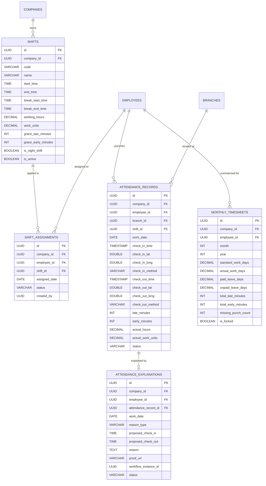
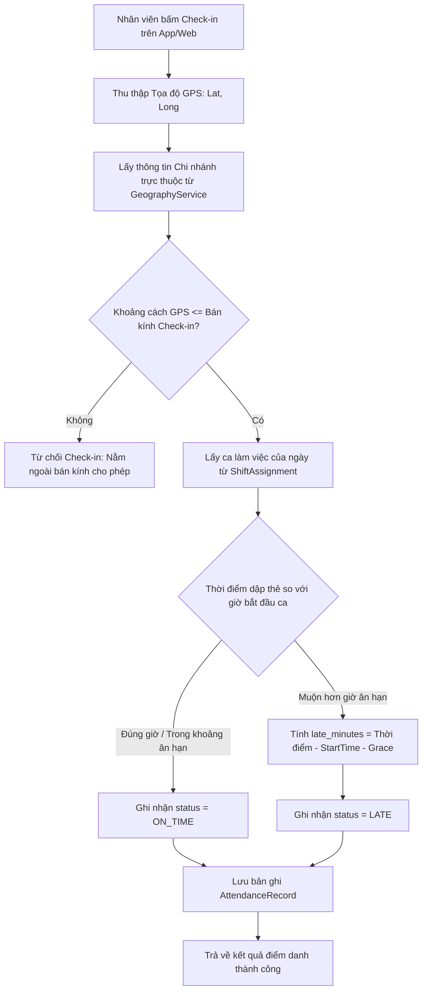
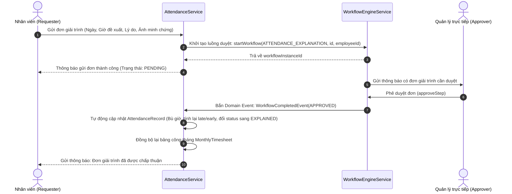

# Tài liệu Nghiệp vụ Module 06: Quản lý Chấm công, Phân ca & Giải trình (Time & Attendance Management Engine)

> **Module Code:** `attendance`  
> **Package:** `com.cyclosa.attendance`  
> **Phiên bản:** 1.0  
> **Căn cứ pháp lý:**  
> - **Bộ luật Lao động 2019** (Luật số 45/2019/QH14) — Chương VII: Thời giờ làm việc, thời giờ nghỉ ngơi (Điều 105 đến Điều 116)  
>   - *Điều 105:* Thời giờ làm việc bình thường (không quá 08 giờ/ngày và 48 giờ/tuần; khuyến khích tuần làm việc 40 giờ).  
>   - *Điều 106:* Giờ làm việc ban đêm (tính từ 22:00 hôm trước đến 06:00 sáng hôm sau).  
>   - *Điều 107:* Làm thêm giờ (không quá 50% số giờ làm việc bình thường/ngày; tối đa 40 giờ/tháng và 200 giờ/năm; trường hợp đặc biệt không quá 300 giờ/năm).  
>   - *Điều 109:* Nghỉ trong giờ làm việc (ít nhất 30 phút liên tục ca ngày, 45 phút liên tục ca đêm).  
>   - *Điều 110:* Nghỉ chuyển ca (ít nhất 12 giờ trước khi chuyển sang ca khác).  
>   - *Điều 111:* Nghỉ hằng tuần (ít nhất 24 giờ liên tục/tuần).  
> - **Nghị định 145/2020/NĐ-CP** (Quy định chi tiết và hướng dẫn thi hành một số điều của BLLĐ về điều kiện lao động, thời giờ làm việc, ca kíp).  

---

## 1. Tôn chỉ Nghiệp vụ & Nguyên tắc Thiết kế (Core Principles)

Module **Time & Attendance** là trạm thu thập dữ liệu thời gian thực tế của nhân sự, đóng vai trò là chiếc cầu nối bản lề giữa **Hồ sơ nhân sự (Employee Profile)** và **Bảng lương (Payroll Management)**. Mọi sai lệch trong việc ghi nhận công sẽ trực tiếp làm sai lệch tiền lương và nghĩa vụ pháp lý của doanh nghiệp.

```
┌─────────────────────────┐       ┌────────────────────────────────┐       ┌─────────────────────────┐
│   Module 04: Employee   │       │  Module 06: Time & Attendance  │       │   Module 08: Payroll    │
│  - Nhân viên, Chi nhánh │ ────> │  - Phân ca, Check-in GPS       │ ────> │  - Tính lương theo công │
│  - Giờ làm việc chuẩn   │       │  - Giải trình bù công (WF)     │       │  - Trừ phạt đi muộn    │
└─────────────────────────┘       └────────────────────────────────┘       └─────────────────────────┘
```

### 1.1. Chuẩn hóa Thiết kế Không dùng Interface + Impl thừa thãi (Concrete Service Pattern)
Theo chuẩn mới cập nhật tại [.agents/rules/backend-standards.md](file:///f:/Project/CYCLOSA/.agents/rules/backend-standards.md):
- Toàn bộ service của module được viết trực tiếp: `ShiftService.java`, `AttendanceRecordService.java`, `AttendanceExplanationService.java`, `TimesheetService.java` đặt thẳng trong `com.cyclosa.attendance.service.*`.
- **Tuyệt đối không tạo thư mục `impl/`** hay interface 1-1 hình thức.

### 1.2. Đóng gói Kiến trúc Modular Monolith & Giao tiếp Liên Module
1. **Lấy dữ liệu hạ tầng qua Public Service của module lân cận:**
   - `com.cyclosa.employee.service.EmployeeService`: Lấy danh sách nhân sự kích hoạt, tìm kiếm theo chi nhánh/phòng ban.
   - `com.cyclosa.organization.service.GeographyService`: Lấy tọa độ GPS (`latitude`, `longitude`) và bán kính cho phép (`checkin_radius_meters`) của từng Chi nhánh làm việc (`Branch`).
   - `com.cyclosa.workflow.service.WorkflowEngineService`: Khởi tạo và quản lý luồng duyệt đa cấp khi nhân viên gửi đơn giải trình chấm công (`LEAVE_OR_ATTENDANCE_EXPLANATION`).
2. **Cung cấp Public Service cho Module 08 (Payroll):**
   - `TimesheetService` cung cấp hàm tổng hợp:  
     `Map<UUID, EmployeeMonthlyAttendanceSummary> getMonthlyAttendanceSummaries(UUID companyId, int month, int year, Set<UUID> employeeIds)`
   - Cung cấp: Số ngày công đi làm thực tế (`actual_work_days`), số phút đi muộn (`late_minutes`), số phút về sớm (`early_minutes`), số lần quên chấm công (`missing_punch_count`).

### 1.3. Bất biến Dữ liệu Điểm danh & Chống Giả mạo (Tamper-proof Audit Trail)
- Mọi lượt dập thẻ Check-in / Check-out là **bất biến (Immutable Log)**. Không ai (kể cả Admin) được quyền trực tiếp chỉnh sửa giờ gốc đã ghi nhận từ thiết bị.
- Nếu có sự cố (quên chấm công, sai lệch thiết bị, đi công tác), nhân sự bắt buộc phải gửi **Đơn giải trình (`AttendanceExplanation`)**. Khi đơn được phê duyệt qua Workflow, hệ thống tạo bản ghi điều chỉnh công (Reconciliation Adjustment) chứ không ghi đè log gốc.

---

## 2. Mô hình Thực thể & CSDL Chi tiết (Database Schema)



---

### 2.1. Bảng `shifts` — Danh mục Ca làm việc
Định nghĩa quy chuẩn thời gian, giờ nghỉ giữa ca, mức công và thời gian ân hạn đi muộn/về sớm:

| Thuộc tính | Kiểu dữ liệu | Ràng buộc | Diễn giải nghiệp vụ |
| :--- | :--- | :--- | :--- |
| `id` | `UUID` | PK | Khóa chính |
| `company_id` | `UUID` | FK, Not Null | Thuộc công ty nào (Multi-tenancy) |
| `code` | `VARCHAR(50)` | Not Null, Unique per Company | Mã ca: `CA_HANH_CHINH`, `CA_SANG`, `CA_CHIEU`, `CA_DEM` |
| `name` | `VARCHAR(150)` | Not Null | Tên ca: "Ca Hành chính Văn phòng", "Ca Sản xuất Đêm" |
| `start_time` | `TIME` | Not Null | Giờ bắt đầu ca (VD: `08:00:00`) |
| `end_time` | `TIME` | Not Null | Giờ kết thúc ca (VD: `17:30:00`) |
| `break_start_time` | `TIME` | Nullable | Giờ bắt đầu nghỉ giữa ca (VD: `12:00:00`) |
| `break_end_time` | `TIME` | Nullable | Giờ kết thúc nghỉ giữa ca (VD: `13:30:00`) |
| `working_hours` | `DECIMAL(4,2)`| Not Null | Tổng giờ làm việc thực tế quy định (VD: `8.00`) |
| `work_units` | `DECIMAL(3,2)`| Not Null, Default `1.00` | Số công quy đổi nếu làm đủ ca (VD: `1.00` công, ca gãy `0.50` công) |
| `grace_late_minutes` | `INT` | Default `0` | Số phút ân hạn đi muộn không bị tính phạt (VD: `15` phút -> vào lúc 08:15 vẫn tính đúng giờ) |
| `grace_early_minutes`| `INT` | Default `0` | Số phút ân hạn về sớm không bị tính phạt |
| `is_night_shift` | `BOOLEAN` | Default False | Ca đêm (theo Điều 106 BLLĐ có thời gian từ 22h - 06h, tính phụ cấp ca đêm) |
| `is_active` | `BOOLEAN` | Default True | Ca làm việc còn áp dụng không |

---

### 2.2. Bảng `shift_assignments` — Phân ca Làm việc (Roster / Scheduling)
Gắn từng nhân viên vào một ca cụ thể trong một ngày:

| Thuộc tính | Kiểu dữ liệu | Ràng buộc | Diễn giải nghiệp vụ |
| :--- | :--- | :--- | :--- |
| `id` | `UUID` | PK | Khóa chính |
| `company_id` | `UUID` | FK, Not Null | Multi-tenancy |
| `employee_id` | `UUID` | FK, Not Null | Nhân viên được phân ca |
| `shift_id` | `UUID` | FK, Not Null | Ca được phân |
| `assigned_date` | `DATE` | Not Null | Ngày làm việc cụ thể |
| `status` | `ENUM` | Not Null | `ASSIGNED` (Đã xếp), `CANCELLED` (Đã hủy), `SWAPPED` (Đã đổi ca) |
| `note` | `VARCHAR(255)` | Nullable | Ghi chú ca đặc biệt |

> [!TIP]
> **Quy tắc xếp ca tự động (Auto Roster Pattern):**
> - Đối với khối văn phòng hành chính: Tự động gắn ca mặc định từ Thứ 2 đến Thứ 6 (hoặc sáng Thứ 7) cho nhân sự.
> - Đối với khối cửa hàng / nhà máy sản xuất: Cung cấp API xếp ca hàng loạt theo Tuần/Tháng cho cả Phòng ban / Tổ đội.

---

### 2.3. Bảng `attendance_records` — Nhật ký Điểm danh Hàng ngày
Ghi nhận mọi lần dập thẻ vào/ra thực tế:

| Thuộc tính | Kiểu dữ liệu | Ràng buộc | Diễn giải nghiệp vụ |
| :--- | :--- | :--- | :--- |
| `id` | `UUID` | PK | Khóa chính |
| `company_id` | `UUID` | FK, Not Null | Multi-tenancy |
| `employee_id` | `UUID` | FK, Not Null | Nhân viên thực hiện chấm công |
| `branch_id` | `UUID` | FK, Nullable | Chi nhánh nơi nhân viên thực hiện check-in |
| `shift_id` | `UUID` | FK, Nullable | Ca làm việc gắn với lượt chấm công |
| `work_date` | `DATE` | Not Null | Ngày làm việc |
| `check_in_time` | `TIMESTAMP` | Nullable | Thời điểm Check-in thực tế |
| `check_in_lat` | `DOUBLE` | Nullable | Vĩ độ GPS lúc Check-in |
| `check_in_long`| `DOUBLE` | Nullable | Kinh độ GPS lúc Check-in |
| `check_in_method`| `ENUM` | Not Null | `GPS`, `WIFI_IP`, `QR_CODE`, `MANUAL_ADMIN` |
| `check_out_time` | `TIMESTAMP` | Nullable | Thời điểm Check-out thực tế |
| `check_out_lat` | `DOUBLE` | Nullable | Vĩ độ GPS lúc Check-out |
| `check_out_long`| `DOUBLE` | Nullable | Kinh độ GPS lúc Check-out |
| `check_out_method`| `ENUM` | Nullable | Hình thức Check-out |
| `late_minutes` | `INT` | Default `0` | Số phút đi muộn (đã trừ thời gian ân hạn) |
| `early_minutes` | `INT` | Default `0` | Số phút về sớm (đã trừ thời gian ân hạn) |
| `actual_hours` | `DECIMAL(4,2)`| Default `0.00` | Tổng số giờ làm việc thực tế trong ngày |
| `actual_work_units`| `DECIMAL(3,2)`| Default `0.00` | Số công được hưởng (VD: `1.0`, `0.5`, `0.0`) |
| `status` | `ENUM` | Not Null | Trạng thái công trong ngày:  <br>• `ON_TIME`: Đúng giờ<br>• `LATE`: Đi muộn<br>• `EARLY`: Về sớm<br>• `LATE_AND_EARLY`: Cả đi muộn và về sớm<br>• `MISSING_CHECK_OUT`: Có vào nhưng quên ra<br>• `ABSENT`: Vắng mặt không lý do<br>• `EXPLAINED`: Đã được duyệt giải trình |

---

### 2.4. Bảng `attendance_explanations` — Đơn Giải trình Chấm công
Khi nhân viên quên dập thẻ hoặc thiết bị lỗi, họ gửi đơn kèm bằng chứng để quản lý xét duyệt:

| Thuộc tính | Kiểu dữ liệu | Ràng buộc | Diễn giải nghiệp vụ |
| :--- | :--- | :--- | :--- |
| `id` | `UUID` | PK | Khóa chính |
| `company_id` | `UUID` | FK, Not Null | Multi-tenancy |
| `employee_id` | `UUID` | FK, Not Null | Nhân viên làm đơn |
| `attendance_record_id`| `UUID`| FK, Nullable | Bản ghi chấm công cần giải trình (nếu có) |
| `work_date` | `DATE` | Not Null | Ngày cần giải trình công |
| `reason_type` | `ENUM` | Not Null | `FORGOT_CHECK_IN` (Quên check-in), `FORGOT_CHECK_OUT` (Quên check-out), `BUSINESS_TRIP` (Đi công tác), `DEVICE_ERROR` (Lỗi thiết bị), `OTHER` (Lý do khác) |
| `proposed_check_in` | `TIME` | Nullable | Giờ đề xuất bổ sung Check-in |
| `proposed_check_out`| `TIME` | Nullable | Giờ đề xuất bổ sung Check-out |
| `reason` | `TEXT` | Not Null | Lý do chi tiết |
| `proof_url` | `VARCHAR(500)`| Nullable | Link ảnh minh chứng (ảnh chụp màn hình công việc, vé tàu xe...) |
| `workflow_instance_id`| `UUID`| Nullable | ID phiên luồng duyệt bên Module Workflow |
| `status` | `ENUM` | Not Null | `PENDING` (Chờ duyệt), `APPROVED` (Đã duyệt), `REJECTED` (Từ chối) |

---

### 2.5. Bảng `monthly_timesheets` — Bảng Tổng hợp Công Tháng (Dữ liệu đầu vào cho Payroll)
Snapshot bảng công chốt theo tháng của từng nhân sự:

| Thuộc tính | Kiểu dữ liệu | Ràng buộc | Diễn giải nghiệp vụ |
| :--- | :--- | :--- | :--- |
| `id` | `UUID` | PK | Khóa chính |
| `company_id` | `UUID` | FK, Not Null | Multi-tenancy |
| `employee_id` | `UUID` | FK, Not Null | Nhân viên |
| `month` | `INT` | 1 - 12 | Tháng tính công |
| `year` | `INT` | YYYY | Năm tính công |
| `standard_work_days` | `DECIMAL(4,2)`| Not Null | Số ngày công chuẩn của tháng (VD: `22.0` hoặc `26.0`) |
| `actual_work_days` | `DECIMAL(4,2)`| Not Null | Tổng số ngày công thực tế đi làm |
| `paid_leave_days` | `DECIMAL(4,2)`| Default `0.0` | Số ngày nghỉ phép hưởng 100% lương (lấy từ Module Leave) |
| `unpaid_leave_days` | `DECIMAL(4,2)`| Default `0.0` | Số ngày nghỉ không lương |
| `total_paid_days` | `DECIMAL(4,2)`| Not Null | Tổng công tính lương = `actual_work_days + paid_leave_days` |
| `total_late_minutes` | `INT` | Default `0` | Tổng số phút đi muộn trong tháng |
| `total_early_minutes`| `INT` | Default `0` | Tổng số phút về sớm trong tháng |
| `missing_punch_count`| `INT` | Default `0` | Số lần quên dập thẻ chưa giải trình |
| `is_locked` | `BOOLEAN` | Default False | Trạng thái chốt công (khóa không cho điều chỉnh để kế toán tính lương) |

---

## 3. Các Luồng Nghiệp vụ Trọng tâm (Business Workflows)

### 3.1. Luồng Check-in / Check-out Geofencing GPS & Bán kính Chi nhánh



#### Công thức tính khoảng cách bề mặt Trái Đất (Haversine Formula):
$$\Delta\sigma = 2 \arcsin\left(\sqrt{\sin^2\left(\frac{\Delta\phi}{2}\right) + \cos(\phi_1)\cos(\phi_2)\sin^2\left(\frac{\Delta\lambda}{2}\right)}\right)$$
$$Distance = R \times \Delta\sigma \quad (\text{với } R = 6.371.000\text{ mét})$$
Nếu $Distance \le \text{branch.checkinRadiusMeters}$ thì cho phép điểm danh.

---

### 3.2. Luồng Giải trình Chấm công qua Workflow Engine



---

### 3.3. Quy tắc Tính Công Chuẩn & Làm tròn (Work Units Calculation Rules)

| Tình huống thực tế | Thời gian làm việc | Số công quy đổi (`actual_work_units`) | Ghi chú nghiệp vụ |
| :--- | :--- | :---: | :--- |
| Làm đủ ca hoặc về sớm $\le 15$ phút | $\ge 7.5$ giờ | **1.00** công | Tính trọn 1 ngày công |
| Làm từ nửa ca đến dưới 7.5 giờ | $4.0 \text{ giờ} \le T < 7.5 \text{ giờ}$ | **0.50** công | Tính nửa ngày công |
| Làm dưới 4 giờ | $< 4.0$ giờ | **0.00** công | Không đủ điều kiện tính nửa công (tính vắng) |
| Có Check-in nhưng quên Check-out | Không xác định giờ ra | **0.00** công (trạng thái `MISSING_CHECK_OUT`) | Bắt buộc phải làm đơn giải trình để được bù công |
| Vắng mặt không phép cả ngày | Không có dữ liệu | **0.00** công (trạng thái `ABSENT`) | Bị trừ vào bảng lương |

---

## 4. Danh mục RESTful API Chi tiết

### 4.1. Nhóm API Quản lý Ca làm việc (`/api/v1/shifts`)

| STT | Method | Endpoint | Mô tả chức năng | Quyền yêu cầu (`@RequirePermission`) |
| :---: | :---: | :--- | :--- | :--- |
| 1 | `GET` | `/api/v1/shifts` | Danh sách ca làm việc của công ty | `attendance.shift.view` |
| 2 | `GET` | `/api/v1/shifts/{id}` | Xem chi tiết ca làm việc | `attendance.shift.view` |
| 3 | `POST` | `/api/v1/shifts` | Tạo mới ca làm việc | `attendance.shift.create` |
| 4 | `PUT` | `/api/v1/shifts/{id}` | Cập nhật ca làm việc | `attendance.shift.update` |
| 5 | `DELETE`| `/api/v1/shifts/{id}` | Xóa ca làm việc | `attendance.shift.delete` |

### 4.2. Nhóm API Phân ca Làm việc (`/api/v1/shift-assignments`)

| STT | Method | Endpoint | Mô tả chức năng | Quyền yêu cầu |
| :---: | :---: | :--- | :--- | :--- |
| 6 | `POST` | `/api/v1/shift-assignments/batch` | Phân ca hàng loạt theo nhân viên/phòng ban/tuần | `attendance.schedule.manage` |
| 7 | `GET` | `/api/v1/shift-assignments/my-schedule` | Xem lịch làm việc cá nhân trong tuần/tháng | `attendance.view_own` |
| 8 | `GET` | `/api/v1/shift-assignments` | Tra cứu lịch phân ca toàn công ty/phòng ban theo DataScope | `attendance.schedule.view` |
| 9 | `DELETE`| `/api/v1/shift-assignments/{id}` | Hủy phân ca | `attendance.schedule.manage` |

### 4.3. Nhóm API Điểm danh Check-in / Check-out (`/api/v1/attendance`)

| STT | Method | Endpoint | Mô tả chức năng | Quyền yêu cầu |
| :---: | :---: | :--- | :--- | :--- |
| 10 | `POST` | `/api/v1/attendance/check-in` | Thực hiện Check-in vào ca (gửi kèm GPS Lat/Long) | `attendance.record` |
| 11 | `POST` | `/api/v1/attendance/check-out` | Thực hiện Check-out ra ca (gửi kèm GPS Lat/Long) | `attendance.record` |
| 12 | `GET` | `/api/v1/attendance/today` | Lấy trạng thái điểm danh hôm nay của cá nhân | `attendance.view_own` |
| 13 | `GET` | `/api/v1/attendance/history` | Tra cứu lịch sử chấm công cá nhân theo tháng | `attendance.view_own` |
| 14 | `GET` | `/api/v1/attendance/records` | Quản lý tra cứu dữ liệu chấm công toàn đơn vị theo DataScope | `attendance.record.view` |

### 4.4. Nhóm API Giải trình Chấm công (`/api/v1/attendance/explanations`)

| STT | Method | Endpoint | Mô tả chức năng | Quyền yêu cầu |
| :---: | :---: | :--- | :--- | :--- |
| 15 | `POST` | `/api/v1/attendance/explanations` | Gửi đơn giải trình quên chấm công / đi muộn | `attendance.explain.apply` |
| 16 | `GET` | `/api/v1/attendance/explanations/my` | Danh sách đơn giải trình của bản thân | `attendance.view_own` |
| 17 | `GET` | `/api/v1/attendance/explanations` | Danh sách đơn giải trình cần xử lý (lọc theo DataScope) | `attendance.explain.view` |
| 18 | `GET` | `/api/v1/attendance/explanations/{id}`| Chi tiết đơn giải trình và tiến trình duyệt | `attendance.explain.view` |

### 4.5. Nhóm API Bảng Tổng hợp Công (`/api/v1/timesheets`)

| STT | Method | Endpoint | Mô tả chức năng | Quyền yêu cầu |
| :---: | :---: | :--- | :--- | :--- |
| 19 | `GET` | `/api/v1/timesheets/my-timesheet` | Xem bảng công tổng hợp cá nhân tháng này | `attendance.view_own` |
| 20 | `GET` | `/api/v1/timesheets/summary` | Bảng tổng hợp công theo phòng ban/công ty (DataScope) | `attendance.timesheet.view` |
| 21 | `POST` | `/api/v1/timesheets/recalculate` | Chạy lệnh tính toán lại công tháng | `attendance.timesheet.manage` |
| 22 | `POST` | `/api/v1/timesheets/lock` | Chốt khóa bảng công tháng (bảo vệ snapshot cho Payroll) | `attendance.timesheet.lock` |

---

## 5. Dữ liệu Đầu ra Cung cấp cho Module 08: Payroll (Public Service Contract)

Khi Module 08 (Payroll) tiến hành tính lương tháng cho toàn bộ nhân sự, `PayrollService` sẽ gọi hàm Public từ `TimesheetService`:

```java
package com.cyclosa.common.dto.summary;

import lombok.Builder;
import lombok.Data;
import java.math.BigDecimal;
import java.util.UUID;

@Data
@Builder
public class EmployeeAttendanceSummary {
    private UUID employeeId;
    private int month;
    private int year;
    private BigDecimal standardWorkDays;   // Số công chuẩn (VD: 22.0)
    private BigDecimal actualWorkDays;     // Số công thực tế đi làm (VD: 20.5)
    private BigDecimal paidLeaveDays;       // Số công nghỉ phép có lương (VD: 1.0)
    private BigDecimal totalPaidWorkDays;   // Tổng công hưởng lương = 21.5
    private int totalLateMinutes;           // Tổng số phút đi muộn
    private int totalEarlyMinutes;          // Tổng số phút về sớm
    private int missingPunchCount;          // Số lần vi phạm không dập thẻ
}
```

```java
// Khai báo trong TimesheetService (Concrete Service)
public Map<UUID, EmployeeAttendanceSummary> getMonthlyAttendanceSummaries(
        UUID companyId, int month, int year, Set<UUID> employeeIds);
```

---

## 6. Kế hoạch Phân quyền & Mã Permission (Seeding Matrix)

Các mã quyền mới sẽ được nạp vào `RolePermissionDataInitializer`:

1. `attendance.shift.view`: Xem danh mục ca làm việc.
2. `attendance.shift.create`: Tạo ca làm việc mới.
3. `attendance.shift.update`: Sửa ca làm việc.
4. `attendance.shift.delete`: Xóa ca làm việc.
5. `attendance.schedule.view`: Xem bảng phân ca làm việc.
6. `attendance.schedule.manage`: Phân ca làm việc cho nhân viên.
7. `attendance.record`: Quyền thực hiện Check-in / Check-out hằng ngày.
8. `attendance.record.view`: Quản lý xem nhật ký chấm công toàn đơn vị.
9. `attendance.explain.apply`: Quyền gửi đơn giải trình chấm công.
10. `attendance.explain.view`: Xem danh sách đơn giải trình.
11. `attendance.timesheet.view`: Xem bảng công tổng hợp toàn đơn vị.
12. `attendance.timesheet.manage`: Tổng hợp, tính toán lại bảng công.
13. `attendance.timesheet.lock`: Khóa chốt bảng công chuyển qua kế toán lương.
