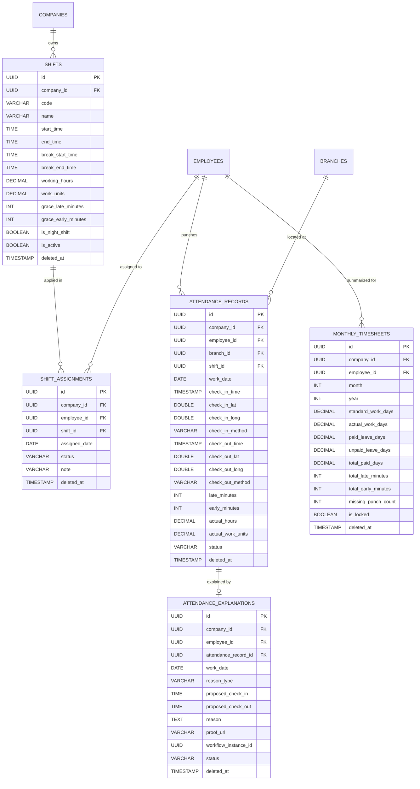
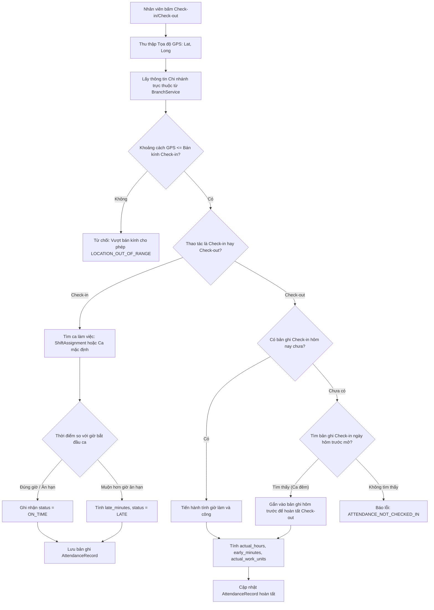
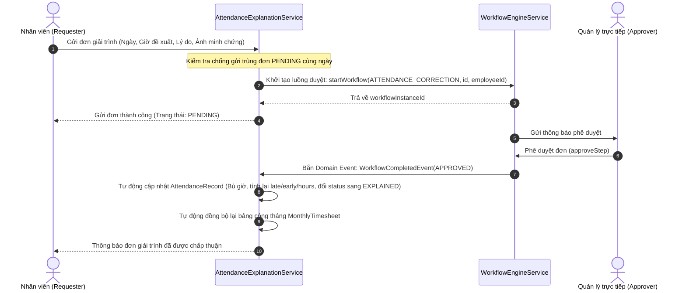

# Tài liệu Nghiệp vụ Module 06: Quản lý Chấm công, Phân ca & Giải trình (Time & Attendance Management Engine)

> **Module Code:** `attendance`  
> **Package:** `com.cyclosa.attendance`  
> **Phiên bản:** 2.0 (Chuẩn hóa Backend Standards & Automation)  
> **Căn cứ pháp lý:**  
> - **Bộ luật Lao động 2019** (Luật số 45/2019/QH14) — Chương VII: Thời giờ làm việc, thời giờ nghỉ ngơi (Điều 105 đến Điều 116)  
>   - *Điều 105:* Thời giờ làm việc bình thường (không quá 08 giờ/ngày và 48 giờ/tuần; khuyến khích tuần làm việc 40 giờ).  
>   - *Điều 106:* Giờ làm việc ban đêm (tính từ 22:00 hôm trước đến 06:00 sáng hôm sau).  
>   - *Điều 107:* Làm thêm giờ (không quá 50% số giờ làm việc bình thường/ngày; tối đa 40 giờ/tháng và 200 giờ/năm; trường hợp đặc biệt không quá 300 giờ/năm).  
>   - *Điều 109:* Nghỉ trong giờ làm việc (ít nhất 30 phút liên tục ca ngày, 45 phút liên tục ca đêm).  
>   - *Điều 110:* Nghỉ chuyển ca (ít nhất 12 giờ trước khi chuyển sang ca khác).  
>   - *Điều 111:* Nghỉ hằng tuần (ít nhất 24 giờ liên tục/tuần).  
> - **Nghị định 145/2020/NĐ-CP** (Quy định chi tiết và hướng dẫn thi hành một số điều của BLLĐ về điều kiện lao động, thời giờ làm việc, ca kíp).  

---

## 1. Tôn chỉ Nghiệp vụ & Nguyên tắc Thiết kế (Core Principles)

Module **Time & Attendance** là trạm thu thập dữ liệu thời gian thực tế của nhân sự, đóng vai trò là chiếc cầu nối bản lề giữa **Hồ sơ nhân sự (Employee Profile)** và **Bảng lương (Payroll Management)**. Mọi sai lệch trong việc ghi nhận công sẽ trực tiếp làm sai lệch tiền lương và nghĩa vụ pháp lý của doanh nghiệp.

```
┌─────────────────────────┐       ┌────────────────────────────────┐       ┌─────────────────────────┐
│   Module 04: Employee   │       │  Module 06: Time & Attendance  │       │   Module 08: Payroll    │
│  - Nhân viên, Chi nhánh │ ────> │  - Phân ca, Check-in GPS       │ ────> │  - Tính lương theo công │
│  - Giờ làm việc chuẩn   │       │  - Giải trình bù công (WF)     │       │  - Trừ phạt đi muộn    │
└─────────────────────────┘       └────────────────────────────────┘       └─────────────────────────┘
```

### 1.1. Chuẩn hóa Thiết kế Không dùng Interface + Impl thừa thãi (Concrete Service Pattern)
Theo chuẩn kiến trúc tại `.agents/rules/backend-standards.md`:
- Toàn bộ service của module được viết trực tiếp dưới dạng **Concrete Services**:
  - `ShiftService.java`: Quản lý cấu hình ca làm việc, giờ ân hạn, định mức công.
  - `ShiftAssignmentService.java`: Phân ca đơn lẻ, phân ca hàng loạt (Batch Roster), tra cứu lịch làm việc theo DataScope.
  - `AttendanceRecordService.java`: Ghi nhận Check-in/Check-out GPS Geofencing, tự động quét chốt công hằng ngày (Sweep).
  - `AttendanceExplanationService.java`: Tiếp nhận giải trình bù công, liên kết Workflow duyệt đa cấp.
  - `TimesheetService.java`: Tổng hợp bảng công tháng, tính toán lại (Recalculate), khóa chốt công (Lock Snapshot) phục vụ kế toán.
- **Tuyệt đối không tạo thư mục `impl/`** hay interface 1-1 hình thức.

### 1.2. Đóng gói Kiến trúc Modular Monolith & Giao tiếp Liên Module
1. **Lấy dữ liệu hạ tầng qua Public Service của module lân cận:**
   - `com.cyclosa.employee.service.EmployeeService`: Lấy danh sách nhân sự kích hoạt, tìm kiếm theo chi nhánh/phòng ban (`getEmployeeIdsByDepartment`, `getSubordinateEmployeeIds`).
   - `com.cyclosa.geography.service.BranchService`: Lấy tọa độ GPS (`latitude`, `longitude`) và bán kính cho phép (`checkinRadiusMeters`) của từng Chi nhánh làm việc (`Branch`).
   - `com.cyclosa.organization.service.CompanyService`: Lấy thông tin tóm tắt công ty (`CompanySummary`).
   - `com.cyclosa.workflow.service.WorkflowEngineService`: Khởi tạo và quản lý luồng duyệt đa cấp khi nhân viên gửi đơn giải trình chấm công (`ATTENDANCE_CORRECTION`).
2. **Giao tiếp Bất đồng bộ qua Domain Events (Event-Driven Decoupling):**
   - Khi Workflow duyệt đơn giải trình thành công, hệ thống phát ra `WorkflowCompletedEvent`.
   - `AttendanceExplanationApprovalListener` lắng nghe sự kiện để kích hoạt tự động cập nhật bản ghi chấm công (bù giờ, tính lại công, đổi trạng thái sang `EXPLAINED`).
   - Triệt tiêu hoàn toàn khớp nối phụ thuộc vòng (Circular Dependency).
3. **Cung cấp Public Service cho Module 08 (Payroll):**
   - `TimesheetService` cung cấp API tổng hợp và tính công chuẩn làm cơ sở đầu vào cho kế toán tiền lương.

### 1.3. Bất biến Dữ liệu Điểm danh & Chống Giả mạo (Tamper-proof Audit Trail)
- Mọi lượt dập thẻ Check-in / Check-out là **bất biến (Immutable Log)**. Không ai (kể cả Admin) được quyền trực tiếp chỉnh sửa giờ gốc đã ghi nhận từ thiết bị.
- Nếu có sự cố (quên chấm công, sai lệch thiết bị, đi công tác), nhân sự bắt buộc phải gửi **Đơn giải trình (`AttendanceExplanation`)**. Khi đơn được phê duyệt qua Workflow, hệ thống tạo bản ghi điều chỉnh công (Reconciliation Adjustment) chứ không ghi đè log gốc.

### 1.4. Tự động hóa Chốt công Hằng ngày (Automated Sweep Schedule)
- Thành phần `AttendanceScheduler` tự động kích hoạt vào lúc **01:00 AM mỗi ngày** để chốt các bản ghi ngày hôm trước:
  - Các bản ghi có Check-in nhưng quên Check-out chuyển sang trạng thái `MISSING_CHECK_OUT` (0.00 công).
  - Các ca làm việc đã phân công (`ShiftAssignment`) nhưng nhân viên không đến làm việc và không có dữ liệu Check-in sẽ tự động được sinh bản ghi `ABSENT` (0.00 công).

---

## 2. Mô hình Thực thể & CSDL Chi tiết (Database Schema)



---

### 2.1. Bảng `shifts` — Danh mục Ca làm việc
Định nghĩa quy chuẩn thời gian, giờ nghỉ giữa ca, mức công và thời gian ân hạn đi muộn/về sớm:

| Thuộc tính | Kiểu dữ liệu | Ràng buộc | Diễn giải nghiệp vụ |
| :--- | :--- | :--- | :--- |
| `id` | `UUID` | PK | Khóa chính |
| `company_id` | `UUID` | FK, Not Null | Thuộc công ty nào (Multi-tenancy) |
| `code` | `VARCHAR(50)` | Not Null, Unique per Company | Mã ca: `CA_HANH_CHINH`, `CA_SANG`, `CA_CHIEU`, `CA_DEM` |
| `name` | `VARCHAR(150)` | Not Null | Tên ca: "Ca Hành chính Văn phòng", "Ca Sản xuất Đêm" |
| `start_time` | `TIME` | Not Null | Giờ bắt đầu ca (VD: `08:00:00`) |
| `end_time` | `TIME` | Not Null | Giờ kết thúc ca (VD: `17:30:00`). Ca ngày bắt buộc `end_time > start_time` |
| `break_start_time` | `TIME` | Nullable | Giờ bắt đầu nghỉ giữa ca (VD: `12:00:00`) |
| `break_end_time` | `TIME` | Nullable | Giờ kết thúc nghỉ giữa ca. Bắt buộc `break_end_time > break_start_time` |
| `working_hours` | `DECIMAL(4,2)`| Not Null | Tổng giờ làm việc thực tế quy định (VD: `8.00`, bắt buộc $> 0$) |
| `work_units` | `DECIMAL(3,2)`| Not Null, Default `1.00` | Số công quy đổi nếu làm đủ ca (VD: `1.00` công, ca gãy `0.50` công, bắt buộc $> 0$) |
| `grace_late_minutes` | `INT` | Default `0` | Số phút ân hạn đi muộn không bị tính phạt (bắt buộc $\ge 0$) |
| `grace_early_minutes`| `INT` | Default `0` | Số phút ân hạn về sớm không bị tính phạt (bắt buộc $\ge 0$) |
| `is_night_shift` | `BOOLEAN` | Default False | Ca đêm (qua đêm hoặc nằm trong khung 22:00 - 06:00) |
| `is_active` | `BOOLEAN` | Default True | Trạng thái kích hoạt ca làm việc |
| `deleted_at` | `TIMESTAMP` | Nullable | Thời điểm xóa mềm (`BaseEntity`) |

> [!IMPORTANT]
> **Ràng buộc an toàn:** Hệ thống từ chối xóa ca làm việc (`DELETE /api/v1/shifts/{id}`) nếu ca đó đang có dữ liệu phân công nhân sự (`shift_assignments`).

---

### 2.2. Bảng `shift_assignments` — Phân ca Làm việc (Roster / Scheduling)
Gắn từng nhân viên vào một ca cụ thể trong một ngày:

| Thuộc tính | Kiểu dữ liệu | Ràng buộc | Diễn giải nghiệp vụ |
| :--- | :--- | :--- | :--- |
| `id` | `UUID` | PK | Khóa chính |
| `company_id` | `UUID` | FK, Not Null | Multi-tenancy |
| `employee_id` | `UUID` | FK, Not Null | Nhân viên được phân ca |
| `shift_id` | `UUID` | FK, Not Null | Ca được phân |
| `assigned_date` | `DATE` | Not Null | Ngày làm việc cụ thể |
| `status` | `ENUM` | Not Null | `ASSIGNED` (Đã xếp), `CANCELLED` (Đã hủy), `SWAPPED` (Đã đổi ca) |
| `note` | `VARCHAR(255)` | Nullable | Ghi chú ca đặc biệt |
| `deleted_at` | `TIMESTAMP` | Nullable | Thời điểm xóa mềm |

---

### 2.3. Bảng `attendance_records` — Nhật ký Điểm danh Hàng ngày
Ghi nhận mọi lần dập thẻ vào/ra thực tế:

| Thuộc tính | Kiểu dữ liệu | Ràng buộc | Diễn giải nghiệp vụ |
| :--- | :--- | :--- | :--- |
| `id` | `UUID` | PK | Khóa chính |
| `company_id` | `UUID` | FK, Not Null | Multi-tenancy |
| `employee_id` | `UUID` | FK, Not Null | Nhân viên thực hiện chấm công |
| `branch_id` | `UUID` | FK, Nullable | Chi nhánh nơi nhân viên thực hiện check-in |
| `shift_id` | `UUID` | FK, Nullable | Ca làm việc gắn với lượt chấm công |
| `work_date` | `DATE` | Not Null | Ngày làm việc |
| `check_in_time` | `TIMESTAMP` | Nullable | Thời điểm Check-in thực tế |
| `check_in_lat` | `DOUBLE` | Nullable | Vĩ độ GPS lúc Check-in |
| `check_in_long`| `DOUBLE` | Nullable | Kinh độ GPS lúc Check-in |
| `check_in_method`| `ENUM` | Not Null | `GPS`, `WIFI_IP`, `QR_CODE`, `MANUAL_ADMIN` |
| `check_out_time` | `TIMESTAMP` | Nullable | Thời điểm Check-out thực tế |
| `check_out_lat` | `DOUBLE` | Nullable | Vĩ độ GPS lúc Check-out |
| `check_out_long`| `DOUBLE` | Nullable | Kinh độ GPS lúc Check-out |
| `check_out_method`| `ENUM` | Nullable | Hình thức Check-out |
| `late_minutes` | `INT` | Default `0` | Số phút đi muộn (đã trừ thời gian ân hạn) |
| `early_minutes` | `INT` | Default `0` | Số phút về sớm (đã trừ thời gian ân hạn) |
| `actual_hours` | `DECIMAL(4,2)`| Default `0.00` | Tổng số giờ làm việc thực tế trong ngày |
| `actual_work_units`| `DECIMAL(3,2)`| Default `0.00` | Số công được hưởng (VD: `1.0`, `0.5`, `0.0`) |
| `status` | `ENUM` | Not Null | Trạng thái công trong ngày: <br>• `ON_TIME`: Đúng giờ<br>• `LATE`: Đi muộn<br>• `EARLY`: Về sớm<br>• `LATE_AND_EARLY`: Cả đi muộn và về sớm<br>• `MISSING_CHECK_OUT`: Có vào nhưng quên ra (chốt lúc 01:00 AM)<br>• `ABSENT`: Vắng mặt không phép (sinh tự động lúc 01:00 AM)<br>• `EXPLAINED`: Đã được duyệt đơn giải trình |
| `deleted_at` | `TIMESTAMP` | Nullable | Thời điểm xóa mềm |

---

### 2.4. Bảng `attendance_explanations` — Đơn Giải trình Chấm công
Khi nhân viên quên dập thẻ hoặc thiết bị lỗi, họ gửi đơn kèm bằng chứng để quản lý xét duyệt:

| Thuộc tính | Kiểu dữ liệu | Ràng buộc | Diễn giải nghiệp vụ |
| :--- | :--- | :--- | :--- |
| `id` | `UUID` | PK | Khóa chính |
| `company_id` | `UUID` | FK, Not Null | Multi-tenancy |
| `employee_id` | `UUID` | FK, Not Null | Nhân viên làm đơn |
| `attendance_record_id`| `UUID`| FK, Nullable | Bản ghi chấm công cần giải trình (nếu có) |
| `work_date` | `DATE` | Not Null | Ngày cần giải trình công |
| `reason_type` | `ENUM` | Not Null | `FORGOT_CHECK_IN`, `FORGOT_CHECK_OUT`, `BUSINESS_TRIP`, `DEVICE_ERROR`, `OTHER` |
| `proposed_check_in` | `TIME` | Nullable | Giờ đề xuất bổ sung Check-in |
| `proposed_check_out`| `TIME` | Nullable | Giờ đề xuất bổ sung Check-out (Bắt buộc `proposed_check_out > proposed_check_in`) |
| `reason` | `TEXT` | Not Null | Lý do giải trình chi tiết |
| `proof_url` | `VARCHAR(500)`| Nullable | Link ảnh minh chứng |
| `workflow_instance_id`| `UUID`| Nullable | ID phiên luồng duyệt bên Module Workflow |
| `status` | `ENUM` | Not Null | `PENDING` (Chờ duyệt), `APPROVED` (Đã duyệt), `REJECTED` (Từ chối) |
| `deleted_at` | `TIMESTAMP` | Nullable | Thời điểm xóa mềm |

> [!NOTE]
> **Bảo vệ chống gửi trùng:** Hệ thống tự động chặn gửi nhiều đơn giải trình ở trạng thái `PENDING` cho cùng một ngày làm việc của một nhân viên.

---

### 2.5. Bảng `monthly_timesheets` — Bảng Tổng hợp Công Tháng
Snapshot bảng công chốt theo tháng của từng nhân sự (dữ liệu đầu vào cho Payroll):

| Thuộc tính | Kiểu dữ liệu | Ràng buộc | Diễn giải nghiệp vụ |
| :--- | :--- | :--- | :--- |
| `id` | `UUID` | PK | Khóa chính |
| `company_id` | `UUID` | FK, Not Null | Multi-tenancy |
| `employee_id` | `UUID` | FK, Not Null | Nhân viên |
| `month` | `INT` | 1 - 12 | Tháng tính công |
| `year` | `INT` | YYYY | Năm tính công |
| `standard_work_days` | `DECIMAL(4,2)`| Not Null | Số ngày công chuẩn của tháng (VD: `22.00`) |
| `actual_work_days` | `DECIMAL(4,2)`| Not Null | Tổng số ngày công thực tế đi làm |
| `paid_leave_days` | `DECIMAL(4,2)`| Default `0.00` | Số ngày nghỉ phép hưởng lương (từ Module Leave) |
| `unpaid_leave_days` | `DECIMAL(4,2)`| Default `0.00` | Số ngày nghỉ không lương |
| `total_paid_days` | `DECIMAL(4,2)`| Not Null | Tổng công tính lương = `actual_work_days + paid_leave_days` |
| `total_late_minutes` | `INT` | Default `0` | Tổng số phút đi muộn trong tháng |
| `total_early_minutes`| `INT` | Default `0` | Tổng số phút về sớm trong tháng |
| `missing_punch_count`| `INT` | Default `0` | Số lần quên dập thẻ chưa giải trình |
| `is_locked` | `BOOLEAN` | Default False | Trạng thái chốt công (khóa không cho thay đổi để kế toán tính lương) |
| `deleted_at` | `TIMESTAMP` | Nullable | Thời điểm xóa mềm |

---

## 3. Các Luồng Nghiệp vụ Trọng tâm (Business Workflows)

### 3.1. Luồng Check-in / Check-out Geofencing GPS & Fallback Ca Đêm



#### Công thức tính khoảng cách bề mặt Trái Đất (Haversine Formula):
$$\Delta\sigma = 2 \arcsin\left(\sqrt{\sin^2\left(\frac{\Delta\phi}{2}\right) + \cos(\phi_1)\cos(\phi_2)\sin^2\left(\frac{\Delta\lambda}{2}\right)}\right)$$
$$Distance = R \times \Delta\sigma \quad (\text{với } R = 6.371.000\text{ mét})$$
Nếu $Distance \le \text{branch.checkinRadiusMeters}$ thì cho phép điểm danh.

---

### 3.2. Luồng Giải trình Chấm công qua Workflow Engine



---

### 3.3. Quy tắc Tính Công Chuẩn & Làm tròn (Work Units Calculation Rules)

Áp dụng thông qua tiện ích [WorkTimeCalculator.java](file:///f:/Project/CYCLOSA/cyclosa_be/src/main/java/com/cyclosa/attendance/util/WorkTimeCalculator.java):

| Tình huống thực tế | Thời gian làm việc thực tế | Số công quy đổi (`actual_work_units`) | Ghi chú nghiệp vụ |
| :--- | :--- | :---: | :--- |
| Làm đủ ca hoặc về sớm $\le 15$ phút | $\ge 7.5$ giờ | **1.00** công | Tính trọn 1 ngày công |
| Làm từ nửa ca đến dưới 7.5 giờ | $4.0 \text{ giờ} \le T < 7.5 \text{ giờ}$ | **0.50** công | Tính nửa ngày công |
| Làm dưới 4 giờ | $< 4.0$ giờ | **0.00** công | Không đủ điều kiện tính nửa công (tính vắng) |
| Có Check-in nhưng quên Check-out | Không ghi nhận giờ ra | **0.00** công (trạng thái `MISSING_CHECK_OUT`) | Bắt buộc phải gửi đơn giải trình để được bù công |
| Vắng mặt không lý do | Không có dập thẻ | **0.00** công (trạng thái `ABSENT`) | Bị trừ vào bảng lương |

---

### 3.4. Luồng Tự động hóa Chốt công Hằng ngày (Daily Attendance Sweep)

Vào lúc **01:00 AM hằng ngày**, scheduler tự động quét dữ liệu của ngày hôm trước (`yesterday`):
1. **Xử lý quên Check-out:** Truy vấn tất cả bản ghi có `check_in_time IS NOT NULL` nhưng `check_out_time IS NULL`. Hệ thống cập nhật:
   - `status = MISSING_CHECK_OUT`
   - `actual_work_units = 0.00`
   - `actual_hours = 0.00`
2. **Xử lý Vắng mặt không phép:** Truy vấn toàn bộ lịch phân ca trong ngày hôm trước (`shift_assignments`). Với mỗi nhân viên được xếp ca nhưng không có bất kỳ bản ghi chấm công nào, hệ thống tự động sinh bản ghi mới:
   - `status = ABSENT`
   - `actual_work_units = 0.00`
   - `actual_hours = 0.00`

---

### 3.5. Luồng Khóa Chốt Bảng Công Tháng (`lockTimesheet`)

Khi phòng Nhân sự hoàn tất kỳ chấm công tháng:
1. HR Admin gửi yêu cầu `POST /api/v1/timesheets/lock`.
2. Hệ thống kiểm tra tất cả nhân sự có phát sinh dữ liệu chấm công trong tháng để tổng hợp snapshot đầy đủ:
   - Số công thực tế đi làm (`actual_work_days`).
   - Tổng phút đi muộn/về sớm (`total_late_minutes`, `total_early_minutes`).
   - Số lần quên dập thẻ chưa giải trình (`missing_punch_count`).
3. Đánh dấu `is_locked = true` trên toàn bộ bảng công tháng của công ty.
4. Bất kỳ thao tác chỉnh sửa dữ liệu chấm công sau khi khóa đều bị từ chối với mã lỗi `TIMESHEET_LOCKED (6012)`.

---

## 4. Danh mục RESTful API Chi tiết

### 4.1. Nhóm API Quản lý Ca làm việc (`/api/v1/shifts`)

| Method | Endpoint | Mô tả chức năng | Quyền yêu cầu | Response DTO |
| :---: | :--- | :--- | :--- | :--- |
| `GET` | `/api/v1/shifts` | Danh sách ca làm việc của công ty | `attendance.shift.view` | `ApiResponse<PageData<ShiftResponse>>` |
| `GET` | `/api/v1/shifts/{id}` | Xem chi tiết ca làm việc (kèm số nhân viên đang phân ca) | `attendance.shift.view` | `ApiResponse<ShiftDetailResponse>` |
| `POST` | `/api/v1/shifts` | Tạo mới ca làm việc | `attendance.shift.create` | `ApiResponse<ShiftResponse>` (201 Created) |
| `PUT` | `/api/v1/shifts/{id}` | Cập nhật thông tin ca làm việc | `attendance.shift.update` | `ApiResponse<ShiftResponse>` |
| `DELETE`| `/api/v1/shifts/{id}` | Xóa ca làm việc | `attendance.shift.delete` | `ApiResponse<Void>` (No Content) |

### 4.2. Nhóm API Phân ca Làm việc (`/api/v1/shift-assignments`)

| Method | Endpoint | Mô tả chức năng | Quyền yêu cầu | Response DTO |
| :---: | :--- | :--- | :--- | :--- |
| `POST` | `/api/v1/shift-assignments/batch` | Phân ca hàng loạt cho nhân viên theo dải ngày | `attendance.schedule.manage` | `ApiResponse<List<ShiftAssignmentResponse>>` |
| `GET` | `/api/v1/shift-assignments/my-schedule` | Xem lịch làm việc cá nhân theo khoảng thời gian | Xác thực người dùng | `ApiResponse<List<ShiftAssignmentResponse>>` |
| `GET` | `/api/v1/shift-assignments` | Tra cứu lịch phân ca toàn đơn vị theo DataScope | `attendance.schedule.view` | `ApiResponse<PageData<ShiftAssignmentResponse>>` |
| `DELETE`| `/api/v1/shift-assignments/{id}` | Hủy phân ca làm việc | `attendance.schedule.manage` | `ApiResponse<Void>` (No Content) |

### 4.3. Nhóm API Điểm danh Check-in / Check-out (`/api/v1/attendance`)

| Method | Endpoint | Mô tả chức năng | Quyền yêu cầu | Response DTO |
| :---: | :--- | :--- | :--- | :--- |
| `POST` | `/api/v1/attendance/check-in` | Thực hiện Check-in vào ca (gửi kèm GPS) | Xác thực người dùng | `ApiResponse<AttendanceRecordResponse>` |
| `POST` | `/api/v1/attendance/check-out` | Thực hiện Check-out ra ca (hỗ trợ fallback ca đêm) | Xác thực người dùng | `ApiResponse<AttendanceRecordResponse>` |
| `GET` | `/api/v1/attendance/today` | Lấy trạng thái điểm danh hôm nay của cá nhân | Xác thực người dùng | `ApiResponse<AttendanceTodayResponse>` |
| `GET` | `/api/v1/attendance/history` | Tra cứu lịch sử chấm công cá nhân theo tháng | Xác thực người dùng | `ApiResponse<List<AttendanceRecordResponse>>` |
| `GET` | `/api/v1/attendance/records` | Quản lý tra cứu dữ liệu chấm công theo DataScope | `attendance.record.view` | `ApiResponse<PageData<AttendanceRecordResponse>>` |

### 4.4. Nhóm API Giải trình Chấm công (`/api/v1/attendance/explanations`)

| Method | Endpoint | Mô tả chức năng | Quyền yêu cầu | Response DTO |
| :---: | :--- | :--- | :--- | :--- |
| `POST` | `/api/v1/attendance/explanations` | Gửi đơn giải trình quên chấm công / đi muộn | `attendance.explain.apply` | `ApiResponse<AttendanceExplanationResponse>` (201 Created) |
| `GET` | `/api/v1/attendance/explanations/my` | Danh sách đơn giải trình của bản thân | Xác thực người dùng | `ApiResponse<PageData<AttendanceExplanationResponse>>` |
| `GET` | `/api/v1/attendance/explanations` | Danh sách đơn giải trình toàn đơn vị theo DataScope | `attendance.explain.view` | `ApiResponse<PageData<AttendanceExplanationResponse>>` |
| `GET` | `/api/v1/attendance/explanations/{id}`| Chi tiết đơn giải trình và lịch sử luồng duyệt | `attendance.explain.view` | `ApiResponse<AttendanceExplanationDetailResponse>` |

### 4.5. Nhóm API Bảng Tổng hợp Công (`/api/v1/timesheets`)

| Method | Endpoint | Mô tả chức năng | Quyền yêu cầu | Response DTO |
| :---: | :--- | :--- | :--- | :--- |
| `GET` | `/api/v1/timesheets/my-timesheet` | Xem bảng công cá nhân theo tháng | Xác thực người dùng | `ApiResponse<MonthlyTimesheetResponse>` |
| `GET` | `/api/v1/timesheets/summary` | Bảng tổng hợp công theo phòng ban/công ty (DataScope) | `attendance.timesheet.view` | `ApiResponse<PageData<MonthlyTimesheetResponse>>` |
| `POST` | `/api/v1/timesheets/recalculate` | Chạy lệnh tính toán lại bảng công tháng | `attendance.timesheet.manage` | `ApiResponse<List<MonthlyTimesheetResponse>>` |
| `POST` | `/api/v1/timesheets/lock` | Khóa chốt bảng công tháng cho kế toán lương | `attendance.timesheet.lock` | `ApiResponse<Void>` (No Content) |

---

## 5. Danh mục Mã lỗi Module Attendance (`AttendanceErrorCode`)

Hệ thống mã lỗi chuẩn được định nghĩa tại [AttendanceErrorCode.java](file:///f:/Project/CYCLOSA/cyclosa_be/src/main/java/com/cyclosa/attendance/exception/AttendanceErrorCode.java) (dải mã `6001 - 6015`):

| Mã lỗi | Enum Name | HTTP Status | Thông điệp lỗi chuẩn |
| :---: | :--- | :---: | :--- |
| `6001` | `SHIFT_NOT_FOUND` | 404 Not Found | Không tìm thấy ca làm việc |
| `6002` | `SHIFT_CODE_EXISTS` | 409 Conflict | Mã ca làm việc đã tồn tại trong công ty |
| `6003` | `SHIFT_ASSIGNMENT_NOT_FOUND` | 404 Not Found | Không tìm thấy lịch phân ca |
| `6004` | `LOCATION_OUT_OF_RANGE` | 400 Bad Request | Vị trí chấm công nằm ngoài bán kính cho phép của chi nhánh |
| `6005` | `BRANCH_COORDINATES_MISSING` | 400 Bad Request | Chi nhánh chưa được cấu hình tọa độ GPS hoặc bán kính check-in |
| `6006` | `ATTENDANCE_ALREADY_CHECKED_IN` | 400 Bad Request | Hôm nay bạn đã thực hiện check-in ca này rồi |
| `6007` | `ATTENDANCE_NOT_CHECKED_IN` | 400 Bad Request | Chưa ghi nhận lượt check-in hôm nay |
| `6008` | `ATTENDANCE_ALREADY_CHECKED_OUT`| 400 Bad Request | Lượt check-out hôm nay đã được ghi nhận trước đó |
| `6009` | `ATTENDANCE_RECORD_NOT_FOUND` | 404 Not Found | Không tìm thấy bản ghi chấm công |
| `6010` | `EXPLANATION_NOT_FOUND` | 404 Not Found | Không tìm thấy đơn giải trình chấm công |
| `6011` | `EXPLANATION_ALREADY_PROCESSED` | 400 Bad Request | Đơn giải trình đã được xử lý trước đó |
| `6012` | `TIMESHEET_LOCKED` | 400 Bad Request | Bảng công tháng này đã bị khóa, không thể thay đổi dữ liệu |
| `6013` | `EMPLOYEE_HAS_NO_BRANCH` | 400 Bad Request | Nhân viên chưa được phân bổ chi nhánh làm việc |
| `6014` | `SHIFT_HAS_ASSIGNMENTS` | 400 Bad Request | Không thể xóa ca làm việc đang được phân ca cho nhân viên |
| `6015` | `CURRENT_USER_NOT_EMPLOYEE` | 400 Bad Request | Tài khoản hiện tại chưa liên kết với hồ sơ nhân viên |

---

## 6. Phân bổ Quyền Hạn & Ma trận Vai trò (RBAC Matrix)

Được tự động nạp qua [RolePermissionDataInitializer.java](file:///f:/Project/CYCLOSA/cyclosa_be/src/main/java/com/cyclosa/common/config/RolePermissionDataInitializer.java):

| Mã quyền (Permission Code) | Diễn giải quyền | Gán vai trò mặc định & DataScope |
| :--- | :--- | :--- |
| `attendance.shift.view` | Xem danh mục ca làm việc | `DEPARTMENT_MANAGER` (DEPARTMENT), `HR_ADMIN` (COMPANY), `SUPER_ADMIN` (ALL) |
| `attendance.shift.create` | Tạo ca làm việc mới | `HR_ADMIN` (COMPANY), `SUPER_ADMIN` (ALL) |
| `attendance.shift.update` | Cập nhật ca làm việc | `HR_ADMIN` (COMPANY), `SUPER_ADMIN` (ALL) |
| `attendance.shift.delete` | Xóa ca làm việc | `HR_ADMIN` (COMPANY), `SUPER_ADMIN` (ALL) |
| `attendance.schedule.view`| Tra cứu lịch phân ca | `DEPARTMENT_MANAGER` (DEPARTMENT), `HR_ADMIN` (COMPANY), `SUPER_ADMIN` (ALL) |
| `attendance.schedule.manage`| Phân ca và hủy phân ca | `HR_ADMIN` (COMPANY), `SUPER_ADMIN` (ALL) |
| `attendance.record` | Thực hiện chấm công hằng ngày | `EMPLOYEE` (OWN), `DEPARTMENT_MANAGER` (OWN), `HR_ADMIN` (OWN) |
| `attendance.record.view` | Quản lý xem nhật ký chấm công | `DEPARTMENT_MANAGER` (DEPARTMENT), `HR_ADMIN` (COMPANY), `SUPER_ADMIN` (ALL) |
| `attendance.explain.apply`| Gửi đơn giải trình chấm công | `EMPLOYEE` (OWN), `DEPARTMENT_MANAGER` (OWN), `HR_ADMIN` (OWN) |
| `attendance.explain.view` | Xem danh sách đơn giải trình | `DEPARTMENT_MANAGER` (DEPARTMENT), `HR_ADMIN` (COMPANY), `SUPER_ADMIN` (ALL) |
| `attendance.timesheet.view`| Xem bảng công tổng hợp | `DEPARTMENT_MANAGER` (DEPARTMENT), `HR_ADMIN` (COMPANY), `SUPER_ADMIN` (ALL) |
| `attendance.timesheet.manage`| Tính toán lại bảng công tháng | `HR_ADMIN` (COMPANY), `SUPER_ADMIN` (ALL) |
| `attendance.timesheet.lock` | Khóa chốt bảng công tháng | `HR_ADMIN` (COMPANY), `SUPER_ADMIN` (ALL) |
