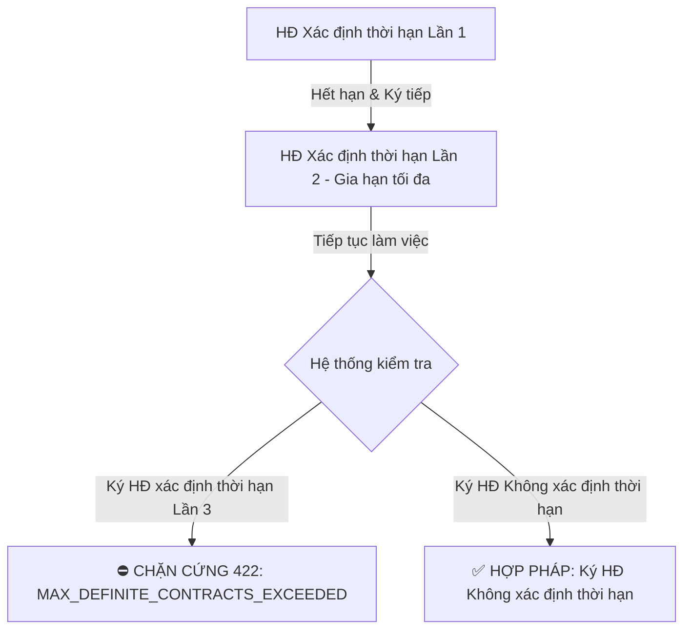
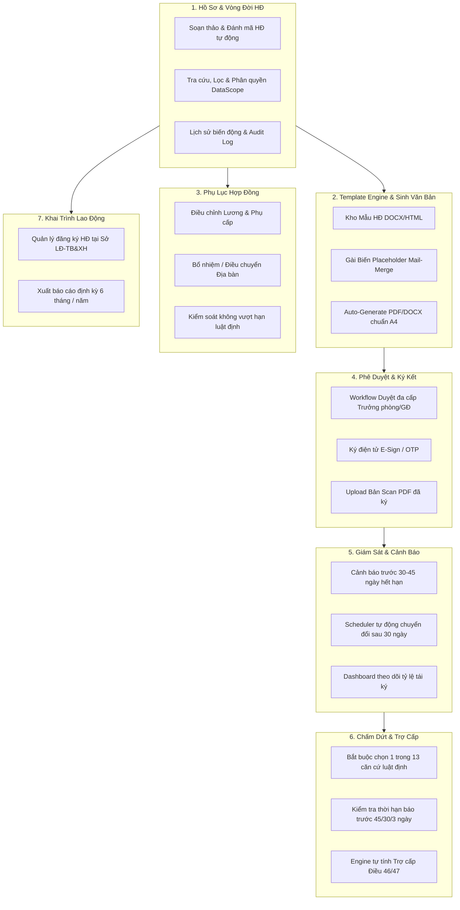
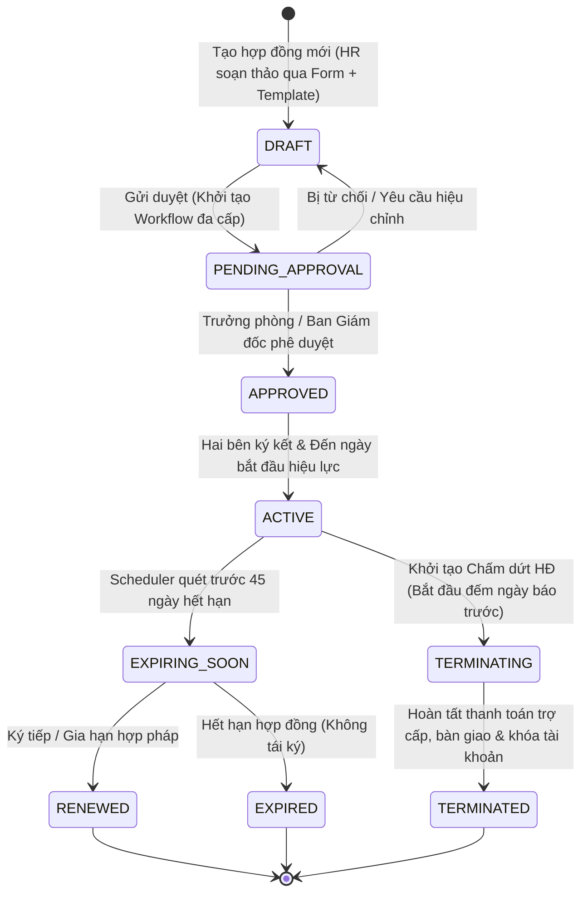

# Tài liệu Nghiệp vụ Module 05: Quản lý Hợp đồng Lao động (Contract Management & Legal Compliance)

> **Module Code:** `contract`  
> **Package:** `com.cyclosa.contract`  
> **Phiên bản:** 1.0  
> **Căn cứ pháp lý:** 
> - **Bộ luật Lao động 2019** (Luật số 45/2019/QH14)
> - **Nghị định 145/2020/NĐ-CP** (Quy định chi tiết và hướng dẫn thi hành một số điều của BLLĐ về điều kiện lao động và quan hệ lao động)
> - **Luật Bảo hiểm Xã hội 2014** (Luật số 58/2014/QH13) & **Luật Việc làm 2013** (Luật số 38/2013/QH13)
> - Tài liệu kiến trúc BA: [ba/HRM-Mo-Ta-Nghiep-Vu-Chi-Tiet.md](file:///f:/Project/CYCLOSA/ba/HRM-Mo-Ta-Nghiep-Vu-Chi-Tiet.md) & [ba/HRM-API-Validation-Rules.md](file:///f:/Project/CYCLOSA/ba/HRM-API-Validation-Rules.md)

---

## 1. Tôn chỉ Nghiệp vụ & Nguyên tắc Thiết kế (Design Principles)

Trong hệ sinh thái CYCLOSA HRM, **Hợp đồng Lao động (HĐLĐ)** là cơ sở pháp lý cao nhất ràng buộc quyền lợi và nghĩa vụ giữa Người sử dụng lao động (NSDLĐ) và Người lao động (NLĐ).

> [!CAUTION]
> **NGUYÊN TẮC BẮT BUỘC: HARD VALIDATION (CHẶN CỨNG)**
> Hệ thống **PHẢI CHẶN CỨNG** mọi thao tác vi phạm quy định của pháp luật lao động Việt Nam, **TUYỆT ĐỐI KHÔNG CHỈ DỪNG Ở MỨC CẢNH BÁO (WARNING)**. Bất kỳ hành vi nhập sai thời hạn, lương dưới chuẩn, gia hạn quá số lần hoặc chấm dứt sai quy định đều phải trả về lỗi `422 Unprocessable Entity` hoặc `409 Conflict` kèm mã lỗi pháp lý cụ thể.

---

## 2. Chi tiết Tuân thủ Bộ Luật Lao Động 2019 & Nghị Định 145/2020/NĐ-CP

### 2.1. Phân loại Loại Hợp đồng Hợp pháp (Điều 20 BLLĐ 2019)
Từ ngày 01/01/2021, Bộ luật Lao động 2019 bãi bỏ hoàn toàn "Hợp đồng mùa vụ". Hệ thống chỉ hỗ trợ **02 loại HĐLĐ chính thức**:

| Loại Hợp đồng | Ký hiệu Enum | Thời hạn hiệu lực | Quy tắc Chặn cứng (Hard Rule) |
| :--- | :--- | :--- | :--- |
| **Không xác định thời hạn** | `INDEFINITE_TERM` | Vô hạn (không ấn định ngày kết thúc) | `end_date` bắt buộc phải là `null`. |
| **Xác định thời hạn** | `DEFINITE_TERM` | Tối đa **không quá 36 tháng** kể từ ngày có hiệu lực | Chặn lỗi `422 CONTRACT_DURATION_EXCEEDS_LIMIT` nếu `end_date - start_date > 36 tháng`. |
| **Hợp đồng Thử việc** *(riêng biệt)* | `PROBATION` | Theo quy định Điều 25 | Không vượt quá 180 / 60 / 30 / 6 ngày tùy chức danh. |

* **Ràng buộc Tính Độc quyền:** Tại một thời điểm, một nhân viên chỉ được phép có **DUY NHẤT 01 hợp đồng lao động đang ở trạng thái hiệu lực (`status = ACTIVE`)**. Chặn lỗi `409 ACTIVE_CONTRACT_ALREADY_EXISTS`.

---

### 2.2. Chế định Thử việc (Điều 24, 25, 26, 27 BLLĐ 2019)

1. **Thời hạn thử việc tối đa theo tính chất vị trí việc làm (Điều 25):**
   * **Tối đa 180 ngày:** Người quản lý doanh nghiệp theo Luật Doanh nghiệp (Tổng Giám đốc, Giám đốc, Thành viên HĐQT).
   * **Tối đa 60 ngày:** Công việc yêu cầu trình độ chuyên môn, kỹ thuật từ cao đẳng trở lên.
   * **Tối đa 30 ngày:** Công việc yêu cầu trình độ trung cấp, công nhân kỹ thuật, nhân viên nghiệp vụ.
   * **Tối đa 06 ngày làm việc:** Các công việc đơn giản khác.
   * ⛔ **Quy tắc chặn:** Hệ thống đối chiếu `job_level` của nhân viên để tự động giới hạn `end_date - start_date`. Vượt quá số ngày quy định $\rightarrow$ Chặn `422 PROBATION_DURATION_EXCEEDS_LIMIT`.

2. **Tiền lương trong thời gian thử việc (Điều 26):**
   * Tiền lương thử việc do hai bên thỏa thuận nhưng **ít nhất phải bằng 85%** mức lương chính thức của công việc đó.
   * ⛔ **Quy tắc chặn:** `probation_salary` $\ge 0.85 \times$ `official_salary`. Nếu nhỏ hơn 85% $\rightarrow$ Chặn `422 PROBATION_SALARY_BELOW_LEGAL_MINIMUM`.

3. **Nguyên tắc thử việc 1 lần (Điều 24.2):**
   * Chỉ được thử việc **01 lần** đối với một công việc.
   * ⛔ **Quy tắc chặn:** Nếu nhân viên đã từng có hợp đồng thử việc hoặc làm việc tại vị trí (`position_id`) đó trong công ty $\rightarrow$ Chặn `422 PROBATION_ALREADY_COMPLETED`.

---

### 2.3. Quy tắc Gia hạn Hợp đồng Xác định Thời hạn (Điều 20.2 BLLĐ 2019)

Đây là điều khoản kiểm soát rủi ro pháp lý quan trọng nhất:

> *"Hợp đồng lao động xác định thời hạn chỉ được ký tiếp 01 lần. Nếu tiếp tục làm việc thì phải ký hợp đồng lao động không xác định thời hạn."*



* **Quy tắc kiểm soát số lần ký:**
  * Hệ thống đếm tổng số HĐLĐ xác định thời hạn đã ký giữa Nhân viên và Công ty (`definite_contract_count`).
  * Nếu `definite_contract_count >= 2` mà HR cố tình tạo thêm HĐ xác định thời hạn $\rightarrow$ Báo lỗi `422 MAX_DEFINITE_CONTRACTS_EXCEEDED`.
  * **Ngoại lệ hợp pháp duy nhất (Điều 149.1, 151.2):** Cho phép ký nhiều lần HĐ xác định thời hạn đối với:
    1. Người lao động cao tuổi (đã đủ tuổi nghỉ hưu theo lộ trình Điều 169).
    2. Người lao động nước ngoài làm việc tại Việt Nam (theo thời hạn Giấy phép lao động).
    3. Thành viên ban lãnh đạo của tổ chức đại diện người lao động tại cơ sở.

* **Quy tắc Tự động chuyển đổi sau 30 ngày (Điều 20.2.b):**
  * Trong thời hạn 30 ngày kể từ ngày HĐLĐ hết hạn, hai bên phải ký HĐLĐ mới.
  * Nếu hết 30 ngày mà không ký HĐ mới, nhưng NLĐ vẫn tiếp tục làm việc (có phát sinh chấm công trong Module 06) $\rightarrow$ **Hệ thống tự động kích hoạt Scheduled Job chuyển đổi Hợp đồng cũ sang loại `INDEFINITE_TERM`** và bắn thông báo khẩn cấp tới HR.

---

### 2.4. Các Trường hợp CẤM Người Sử Dụng Lao Động Đơn Phương Chấm Dứt (Điều 37 BLLĐ 2019)

Hệ thống **CHẶN CỨNG** chức năng Chấm dứt HĐLĐ (`terminateContract`) nếu nhân viên thuộc một trong các diện bảo vệ đặc biệt sau:

1. **Nghỉ ốm đau / Điều trị y tế (Điều 37.1):** Người lao động đang nghỉ điều trị bệnh tật, tai nạn lao động, bệnh nghề nghiệp theo chỉ định của cơ sở khám bệnh, chữa bệnh có thẩm quyền (kiểm tra có `leave_request` loại `SICK` đang `APPROVED` bao trùm ngày chấm dứt).
2. **Nghỉ phép thường niên (Điều 37.2):** Người lao động đang trong thời gian nghỉ hằng năm, nghỉ việc riêng được NSDLĐ đồng ý.
3. **Bảo vệ Thai sản & Con nhỏ (Điều 37.3 & Điều 137.3):**
   * Lao động nữ đang mang thai.
   * Lao động nữ đang nghỉ thai sản (6 tháng theo Luật BHXH).
   * Lao động nam/nữ đang nuôi con nhỏ **dưới 12 tháng tuổi**.
   * ⛔ Lỗi trả về: `422 TERMINATION_RESTRICTED_BY_LAW` kèm chi tiết lý do bảo vệ pháp lý.

---

### 2.5. 13 Căn Cứ Chấm Dứt Hợp Đồng & Thời Hạn Báo Trước (Điều 34, 35, 36 BLLĐ 2019)

Khi thực hiện chấm dứt HĐLĐ, API bắt buộc phải truyền mã căn cứ pháp lý (`termination_ground_code`):

| Mã Căn cứ | Căn cứ Pháp lý | Bên khởi xướng | Thời hạn Báo trước Bắt buộc | Có Trợ cấp Thôi việc? |
| :--- | :--- | :--- | :--- | :---: |
| `EXPIRED` | Hết hạn hợp đồng lao động (Điều 34.1) | Tự động | Không cần báo trước | ✅ Có |
| `TASK_COMPLETED` | Đã hoàn thành công việc theo HĐLĐ (Điều 34.2) | Cả hai | Không cần báo trước | ✅ Có |
| `MUTUAL_AGREEMENT` | Hai bên thỏa thuận chấm dứt (Điều 34.3) | Cả hai | Theo thỏa thuận | ✅ Có |
| `EMPLOYEE_REGULAR` | NLĐ đơn phương chấm dứt hợp pháp (Điều 35.1) | NLĐ | **45 ngày** (HĐ KTH) / **30 ngày** (HĐ 12-36T) / **3 ngày** (<12T) | ✅ Có |
| `EMPLOYEE_SPECIAL` | NLĐ đơn phương không cần báo trước (Điều 35.2) *(bị nợ lương, ngược đãi, quấy rối tình dục, mang thai...)* | NLĐ | **0 ngày** (Không cần báo trước) | ✅ Có |
| `EMPLOYEE_ILLEGAL` | NLĐ đơn phương chấm dứt **trái luật** (Điều 39) | NLĐ | Vi phạm thời hạn báo trước | ❌ **KHÔNG** + Phải bồi thường nửa tháng lương & tiền vi phạm ngày báo |
| `EMPLOYER_REGULAR` | NSDLĐ đơn phương chấm dứt đúng luật (Điều 36.1) *(thường xuyên không hoàn thành KPI, ốm đau kéo dài, thiên tai dịch bệnh...)* | NSDLĐ | **45 ngày** (HĐ KTH) / **30 ngày** (HĐ 12-36T) / **3 ngày** (<12T) | ✅ Có |
| `EMPLOYER_ILLEGAL` | NSDLĐ đơn phương chấm dứt **trái luật** (Điều 41) | NSDLĐ | Sai căn cứ hoặc vi phạm Điều 37 | ✅ Có + Bồi thường ít nhất 2 tháng lương + đóng bù BHXH |
| `DISCIPLINARY` | Sa thải do xử lý kỷ luật lao động (Điều 125) | NSDLĐ | Không cần | ❌ **KHÔNG** |
| `RESTRUCTURING` | Cho thôi việc do thay đổi cơ cấu, công nghệ (Điều 42) | NSDLĐ | Theo phương án (tối thiểu thông báo 15 ngày) | 🌟 **Hưởng Trợ cấp Mất việc làm** (Điều 47) |
| `MERGER_ACQUISITION` | Cho thôi việc do chia tách, sáp nhập, M&A (Điều 43) | NSDLĐ | Theo phương án | 🌟 **Hưởng Trợ cấp Mất việc làm** (Điều 47) |
| `FORCE_MAJEURE_DEATH` | NLĐ chết, mất năng lực hành vi hoặc mất tích (Điều 34.7) | Pháp lý | Không | ✅ Có |
| `COMPANY_DISSOLUTION` | Công ty chấm dứt hoạt động, phá sản (Điều 34.8) | Pháp lý | Theo quy định phá sản | ✅ Có |

---

### 2.6. Thuật toán Phân biệt & Tính toán Trợ cấp Thôi việc vs Mất việc làm

> [!IMPORTANT]
> **Không cho phép HR tự điền số tiền trợ cấp bằng tay.** Hệ thống tự động truy vấn `employee_history` và tính toán theo đúng quy định tại Điều 46, Điều 47 và Nghị định 145/2020/NĐ-CP:

```
Thời gian tính trợ cấp = Tổng thời gian làm việc thực tế - Thời gian đã tham gia BHTN - Thời gian đã được chi trả trợ cấp trước đó
```
*(Số tháng lẻ: từ 01 đến dưới 06 tháng tính bằng 1/2 năm; từ đủ 06 tháng trở lên tính bằng 01 năm).*

* **Tiền lương làm căn cứ tính:** Bình quân tiền lương theo HĐLĐ của **06 tháng liền kề** trước khi chấm dứt.

#### 1. Trợ cấp Thôi việc (Severance Allowance - Điều 46):
$$\text{Tiền trợ cấp} = \text{Thời gian tính trợ cấp (năm)} \times 0.5 \times \text{Mức lương bình quân 6 tháng}$$

#### 2. Trợ cấp Mất việc làm (Job Loss Allowance - Điều 47):
$$\text{Tiền trợ cấp} = \text{Thời gian tính trợ cấp (năm)} \times 1.0 \times \text{Mức lương bình quân 6 tháng}$$
* ⛔ **Quy định sàn bảo vệ:** Mức trợ cấp mất việc làm **thấp nhất không được dưới 02 tháng tiền lương**.

---

### 2.7. Quy tắc Phương án Sử dụng Lao động khi Tái cơ cấu (Điều 42, 44 BLLĐ 2019)
* Khi tái cơ cấu dẫn đến cho thôi việc từ **02 người lao động trở lên**, công ty bắt buộc phải lập **Phương án sử dụng lao động (`WorkforceRestructuringPlan`)**.
* Phương án phải được trao đổi ý kiến với Ban đại diện công đoàn và **thông báo công khai ít nhất 15 ngày** cho người lao động trước khi thực hiện.
* ⛔ **Quy tắc chặn:** Hệ thống không cho phép thực hiện hàng loạt API Chấm dứt HĐ (`executeTerminations`) nếu phương án chưa qua đủ 15 ngày kể từ ngày `published_at`.

---

## 3. Kiến Trúc & Đề Xuất Các Phân Hệ Chức Năng Cốt Lõi (Functional Breakdown)

Hệ thống quản lý hợp đồng được chia làm **7 phân hệ chức năng nghiệp vụ**, giải quyết triệt để bài toán từ khâu soạn thảo, ký kết, quản lý hiệu lực, đến thanh lý:



---

### 3.1. Phân hệ 1: Quản lý Hồ sơ & Thông tin Hợp đồng (Contract Registry)
* **Sinh mã hợp đồng tự động theo quy chuẩn:** Cấu trúc `{Mã Cty}/{Năm}/{Loại HĐ}/{Số nhảy}` (Ví dụ: `CYC/2026/HDLD-CT/00142`).
* **Form nhập liệu chuẩn hóa dữ liệu pháp lý:**
  * Thông tin người sử dụng lao động: Đại diện pháp luật, chức vụ, địa chỉ trụ sở, mã số thuế.
  * Thông tin người lao động: Họ tên, số CCCD, ngày cấp, nơi cấp, địa chỉ thường trú, chức danh tuyển dụng.
  * Chế độ tiền lương: Mức lương cơ bản (đóng BHXH), phụ cấp trách nhiệm, phụ cấp ăn trưa, phụ cấp xăng xe/điện thoại, hình thức trả lương (chuyển khoản), ngày trả lương hàng tháng.
  * Chế độ làm việc: Thời giờ làm việc (giờ/ngày, ca làm việc), trang bị bảo hộ lao động, địa điểm làm việc (`branch_id`).
* **Tra cứu & Tìm kiếm đa tiêu chí:** Lọc theo phòng ban, chi nhánh, loại hợp đồng, tình trạng hiệu lực, dải ngày ký kết, quản lý trực tiếp.

---

### 3.2. Phân hệ 2: Mẫu Hợp đồng Động & Trộn Văn bản (Dynamic Template Engine & Mail-Merge)

> [!NOTE]
> **Định hướng Giải pháp Soạn thảo Văn bản:**
> Hệ thống **không sử dụng trình soạn thảo tự do dạng trang trắng (free-text editor)** cho từng hợp đồng nhằm bảo vệ tính toàn vẹn dữ liệu và đảm bảo tuân thủ pháp lý. Thay vào đó, áp dụng cơ chế **Template Variable Engine + Mail-Merge**.

1. **Kho Mẫu Hợp đồng Chuẩn hóa (`contract_templates`):**
   * Cho phép Admin/HR tải lên các file mẫu chuẩn (`.docx` hoặc template HTML) theo từng nhóm vị trí:
     * *Mẫu HĐLĐ Thử việc*.
     * *Mẫu HĐLĐ Xác định thời hạn (Cán bộ nhân viên văn phòng)*.
     * *Mẫu HĐLĐ Xác định thời hạn (Khối vận hành / Sản xuất)*.
     * *Mẫu HĐLĐ Không xác định thời hạn*.
     * *Mẫu Phụ lục hợp đồng điều chỉnh lương*.
2. **Hệ thống Biến Placeholder (Mail-Merge Variables):**
   * Hệ thống cung cấp danh mục biến chuẩn được bao bởi dấu ngoặc kép `{{...}}`. Khi sinh hợp đồng, backend tự động lấy dữ liệu từ DB để điền vào:
     * **Thông tin cá nhân:** `{{employee_name}}`, `{{cccd_number}}`, `{{cccd_issue_date}}`, `{{permanent_address}}`, `{{phone_number}}`.
     * **Công việc & Tổ chức:** `{{position_title}}`, `{{job_level}}`, `{{department_name}}`, `{{branch_name}}`, `{{work_location_address}}`.
     * **Thời hạn:** `{{start_date}}`, `{{end_date}}`, `{{contract_duration_months}}`.
     * **Tiền lương & Chế độ:** `{{basic_salary}}` (dạng số), `{{basic_salary_words}}` (tự động đọc thành chữ tiếng Việt, ví dụ: *Hai mươi triệu đồng chẵn*), `{{allowance_lunch}}`, `{{insurance_salary}}`.
     * **Đại diện công ty:** `{{company_name}}`, `{{company_representative_name}}`, `{{representative_title}}`.
3. **Cơ chế Xuất Văn bản Linh hoạt:**
   * **Xuất PDF chuẩn in ấn A4:** File PDF được render tự động, khóa chỉnh sửa, có sẵn vị trí ký và đóng dấu giáp lai để in ký trực tiếp hoặc ký số.
   * **Xuất file Word (`.docx`):** Cho phép HR tải về file Word đã điền sẵn dữ liệu trong trường hợp hai bên cần đàm phán thêm các thỏa thuận riêng biệt đặc thù trước khi ký chính thức.
   * **Lưu trữ bản ký Scan:** Cho phép upload bản PDF scan có chữ ký sống và con dấu đỏ (`signed_contract_url`) để lưu kho điện tử lâu dài.

---

### 3.3. Phân hệ 3: Quản lý Phụ lục Hợp đồng Lao động (Contract Addenda)
* **Căn cứ Điều 22 BLLĐ 2019:** Phụ lục HĐLĐ là một bộ phận của HĐLĐ và có hiệu lực như HĐLĐ.
* **Các loại Phụ lục được hỗ trợ:**
  * `SALARY_ADJUSTMENT`: Tăng/giảm lương, điều chỉnh cơ cấu phụ cấp (thay đổi mức đóng BHXH).
  * `POSITION_TRANSFER`: Bổ nhiệm chức danh mới, chuyển đổi phòng ban/chi nhánh làm việc.
  * `TERM_MODIFICATION`: Sửa đổi thời hạn hợp đồng (hệ thống chặn kéo dài quá 36 tháng đối với HĐ xác định thời hạn).
  * `OTHER_TERMS`: Bổ sung điều khoản bảo mật thông tin (NDA), cam kết đào tạo (Training Bond).
* **Ràng buộc nghiệp vụ:**
  * Mỗi phụ lục phải đánh số thứ tự tăng dần (`addendum_number`: 01, 02, 03...).
  * Khi phụ lục có hiệu lực, hệ thống tự động cập nhật mức lương mới vào hồ sơ nhân viên để phục vụ Module Payroll kỳ tiếp theo.

---

### 3.4. Phân hệ 4: Quy trình Phê duyệt & Ký kết Điện tử (Approval Workflow & E-Sign)
* **Tích hợp Workflow Engine Đa cấp:**
  * Soạn thảo HĐ (`DRAFT`) $\rightarrow$ Khởi tạo yêu cầu phê duyệt qua `workflow-engine`.
  * Bước 1: Trưởng phòng Nhân sự thẩm tra điều khoản và chế độ đãi ngộ.
  * Bước 2: Giám đốc Tài chính (CFO) duyệt quỹ lương đối với mức lương vượt khung ngân sách.
  * Bước 3: Tổng Giám đốc / Đại diện pháp luật ký duyệt.
* **Ký kết Điện tử (Digital Signature / E-Sign):**
  * Tích hợp gửi link ký điện tử qua Email / Mobile App cho nhân viên mới (xác thực OTP qua số điện thoại/email).
  * Gắn mã bưu chính điện tử hoặc Timestamp có chữ ký số doanh nghiệp (CA Token) đảm bảo tính toàn vẹn văn bản.

---

### 3.5. Phân hệ 5: Giám sát Hiệu lực & Cảnh báo Tự động (Expiration Monitoring & Scheduler)
* **Cảnh báo trước khi hết hạn:**
  * Hệ thống chạy Scheduled Job hàng ngày lúc 02:00 AM.
  * Quét các hợp đồng sẽ hết hạn trong vòng **45 ngày** và **30 ngày** tới.
  * Bắn thông báo (`Notification`) và gửi Email tự động cho:
    1. Chuyên viên Nhân sự phụ trách (HR Admin).
    2. Người quản lý trực tiếp (Manager) để lấy ý kiến đánh giá tái ký/thôi việc.
* **Quy trình Tái ký / Gia hạn (Contract Renewal):**
  * Manager điền phiếu đánh giá hết hạn hợp đồng: *Đề xuất tái ký* hoặc *Đề xuất chấm dứt*.
  * Nếu tái ký: Hệ thống kiểm tra số lần gia hạn (chặn nếu đã đủ 2 lần HĐ xác định thời hạn).
* **Tự động Chuyển đổi sau 30 ngày (Auto-conversion):**
  * Tự động phát hiện hợp đồng hết hạn quá 30 ngày mà nhân viên vẫn đang làm việc (có bảng chấm công) $\rightarrow$ Tự động chuyển đổi thành HĐ Không xác định thời hạn và lập biên bản ghi nhận tự động.

---

### 3.6. Phân hệ 6: Chấm dứt Hợp đồng & Trợ cấp (Termination & Severance Calculation)
* **Quy trình Chấm dứt Chuẩn hóa:**
  1. Tiếp nhận đề xuất chấm dứt (từ NLĐ hoặc NSDLĐ).
  2. Bắt buộc chọn đúng **01 trong 13 căn cứ pháp lý** (Điều 34).
  3. Hệ thống kiểm tra chốt chặn **Điều 37** (cấm chấm dứt với người ốm đau, thai sản, con < 12 tháng).
  4. Hệ thống kiểm tra thời hạn báo trước (45/30/3 ngày). Nếu vi phạm, tự động tính số tiền bồi thường ngày công báo trước.
* **Engine Tự Động Tính Toán Quyền Lợi:**
  * Lấy lịch sử 06 tháng lương liền kề gần nhất từ Module Payroll.
  * Tính số năm làm việc thực tế trừ đi thời gian đã đóng Bảo hiểm Thất nghiệp (BHTN).
  * Tự động tính:
    * **Trợ cấp thôi việc** (Điều 46): $0.5 \times \text{Lương bình quân 6 tháng} \times \text{Số năm}$.
    * **Trợ cấp mất việc làm** (Điều 47): $1.0 \times \text{Lương bình quân 6 tháng} \times \text{Số năm}$ (sàn $\ge 2$ tháng).
    * Thanh toán tiền ngày phép năm chưa nghỉ hết (Điều 113.3 BLLĐ 2019).
* **Kích hoạt Offboarding Tự động:**
  * Đồng bộ đổi trạng thái Employee sang `RESIGNED` hoặc `TERMINATED`.
  * Tự động khóa User Account trên hệ thống.
  * Sinh checklist thu hồi tài sản công ty (Module 13 Asset) và bàn giao công việc.

---

### 3.7. Phân hệ 7: Đăng ký Hợp đồng & Báo cáo Cơ quan Nhà nước (Labor Authority Compliance)
* **Quản lý Đăng ký HĐLĐ tại Sở Lao động - TB&XH:**
  * Quản lý trạng thái: `NOT_REGISTERED`, `SUBMITTED`, `REGISTERED`, `EXPIRED`.
  * Lưu trữ ngày đăng ký, số công văn tiếp nhận của Sở LĐ-TB&XH, cán bộ thụ lý.
* **Xuất Báo cáo Tình hình Thay đổi Lao động Định kỳ:**
  * Tự động kết xuất báo cáo Khai trình sử dụng lao động theo **Mẫu số 01/PLI** ban hành kèm theo Nghị định 145/2020/NĐ-CP (báo cáo định kỳ 6 tháng và hàng năm gửi Phòng/Sở LĐ-TB&XH).

---

## 4. Máy Trạng Thái Hợp Đồng (Contract Lifecycle State Machine)



---

## 5. Danh mục API & Phân quyền Bảo mật (Security & Permissions)

Vì Hợp đồng lao động chứa thông tin nhạy cảm về mức lương (`basic_salary`, `insurance_salary`), ma trận phân quyền phải được kiểm soát nghiêm ngặt theo **RBAC và Data Scope**:

| STT | Phương thức | Endpoint URI | Mô tả Nghiệp vụ | Quyền yêu cầu (`Permission`) | Kiểm tra Data Scope |
| :---: | :---: | :--- | :--- | :--- | :--- |
| 1 | `GET` | `/api/v1/contracts` | Danh sách hợp đồng phân trang | `contract.view` | `OWN`, `DEPARTMENT`, `COMPANY` |
| 2 | `GET` | `/api/v1/contracts/{id}` | Xem chi tiết hợp đồng, phụ lục & bản ký | `contract.view` | Kiểm tra quyền sở hữu hoặc thẩm quyền phòng ban |
| 3 | `POST` | `/api/v1/contracts` | Soạn thảo HĐLĐ mới từ Form + Template | `contract.create` | `DEPARTMENT` hoặc `COMPANY` |
| 4 | `PUT` | `/api/v1/contracts/{id}` | Cập nhật dự thảo HĐLĐ | `contract.update` | Chỉ cho phép khi `status = DRAFT` |
| 5 | `POST` | `/api/v1/contracts/{id}/submit-approval` | Gửi hợp đồng vào Workflow phê duyệt | `contract.create` | Khởi tạo quy trình `workflow-engine` |
| 6 | `GET` | `/api/v1/contracts/{id}/export/pdf` | Sinh & Tải file PDF hợp đồng chuẩn A4 | `contract.view` | Đổ dữ liệu DB vào Template render PDF |
| 7 | `GET` | `/api/v1/contracts/{id}/export/docx` | Sinh & Tải file Word (.docx) để HR tùy biến | `contract.view` | Mail-merge dữ liệu ra file Word |
| 8 | `POST` | `/api/v1/contracts/{id}/upload-signed` | Upload bản scan PDF có con dấu/chữ ký sống | `contract.manage` | Lưu trữ file ký chính thức |
| 9 | `POST` | `/api/v1/contracts/{id}/addenda` | Ký Phụ lục hợp đồng điều chỉnh lương/chức danh | `contract.manage` | Kiểm tra tính hợp lệ pháp lý của phụ lục |
| 10 | `POST` | `/api/v1/contracts/{id}/renew` | Tái ký / Gia hạn HĐLĐ | `contract.create` | Chặn gia hạn quá 1 lần với HĐ xác định thời hạn |
| 11 | `POST` | `/api/v1/contracts/{id}/terminate` | Quyết định chấm dứt HĐLĐ | `contract.terminate` | Bắt buộc chọn 1 trong 13 căn cứ, chặn Điều 37 |
| 12 | `GET` | `/api/v1/contracts/{id}/severance-estimate` | Tính toán dự báo tiền trợ cấp thôi việc / mất việc | `contract.view` | Tự động tính theo công thức Điều 46, 47 |
| 13 | `GET` | `/api/v1/contracts/expiring` | Danh sách HĐ sắp hết hạn (30 - 45 ngày) | `contract.view` | Phục vụ Dashboard và cảnh báo HR |
| 14 | `GET` | `/api/v1/contract-templates` | Danh sách các mẫu hợp đồng chuẩn trong kho | `contract.config` | Quản lý mẫu hợp đồng doanh nghiệp |
| 15 | `POST` | `/api/v1/contract-templates` | Upload mẫu hợp đồng DOCX/HTML mới kèm biến | `contract.config` | Đăng ký mẫu biểu mới vào hệ thống |

---

## 6. Tác Động Lan Tỏa Sang Các Module Khác (System Integrations)

1. **Module Hồ Sơ Nhân Sự (`employee`):**
   * Khi HĐ chuyển `ACTIVE` $\rightarrow$ Tự động cập nhật `EmploymentStatus` từ `PROBATION` lên `ACTIVE`.
   * Khi HĐ chuyển `TERMINATED` $\rightarrow$ Tự động cập nhật `EmploymentStatus = TERMINATED` hoặc `RESIGNED`, ghi log `EmployeeHistory` (`change_type = STATUS_CHANGE`), và tự động khóa tài khoản `User` liên kết (`status = LOCKED`).
2. **Module Quy Trình Phê Duyệt (`workflow`):**
   * Duyệt hợp đồng lao động mới và phê duyệt đề xuất chấm dứt hợp đồng đều được điều phối bởi **Workflow Approval Engine** đa cấp, kiểm tra điều kiện SpEL và phân quyền duyệt.
3. **Module Bảng Lương (`payroll`):**
   * Cung cấp dữ liệu tiền lương pháp lý gốc: `basic_salary` (lương cơ bản theo hợp đồng) và `insurance_salary` (lương đóng BHXH bắt buộc) làm căn cứ trích đóng bảo hiểm, tính thuế TNCN và tính đơn giá làm thêm giờ (OT).
4. **Module Chấm Công (`attendance`):**
   * Cung cấp thông tin ngày bắt đầu làm việc chính thức để phân ca làm việc (`ShiftAssignment`) và theo dõi phát sinh ngày công thực tế sau ngày hết hạn HĐLĐ.
