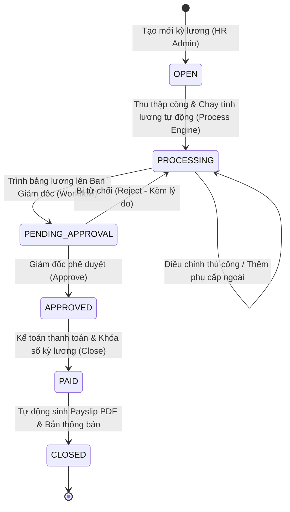

# Tài liệu Nghiệp vụ Module 08: Quản lý Tiền lương & Tính toán Tự động (Payroll Management & Legal Compliance Engine)

> **Module Code:** `payroll`  
> **Package:** `com.cyclosa.payroll`  
> **Phiên bản:** 1.0  
> **Căn cứ pháp lý:**  
> - **Bộ luật Lao động 2019** (Luật số 45/2019/QH14) — Chương VI: Tiền lương (Điều 90 đến Điều 104)  
> - **Nghị định 145/2020/NĐ-CP** (Quy định chi tiết về tiền lương, làm thêm giờ, làm việc ban đêm)  
> - **Luật Thuế Thu nhập Cá nhân** (Luật số 04/2007/QH12 & các luật sửa đổi, bổ sung)  
> - **Nghị quyết số 954/2020/UBTVQH14** (Điều chỉnh mức giảm trừ gia cảnh của thuế TNCN: Bản thân 11 triệu đồng/tháng, Người phụ thuộc 4.4 triệu đồng/người/tháng)  
> - **Luật Bảo hiểm Xã hội 2014**, **Luật Việc làm 2013**, **Luật An toàn, Vệ sinh Lao động 2015**  
> - **Nghị định số 73/2024/NĐ-CP** (Mức lương cơ sở 2.340.000 đồng/tháng áp dụng từ 01/07/2024 làm căn cứ đóng BHXH/BHYT tối đa)  
> - **Nghị định số 74/2024/NĐ-CP** (Mức lương tối thiểu vùng áp dụng từ 01/07/2024 làm căn cứ áp trần BHTN)  
> - **Thông tư 111/2013/TT-BTC** & **Thông tư 92/2015/TT-BTC** (Hướng dẫn thực hiện Luật Thuế TNCN)  

---

## 1. Tôn chỉ Nghiệp vụ & Nguyên tắc Thiết kế (Core Principles)

Module **Payroll** là trái tim tài chính và chế độ đãi ngộ của hệ sinh thái CYCLOSA HRM. Module này biến đổi toàn bộ dữ liệu lao động (Hợp đồng, Ca kíp, Chấm công thực tế, Đơn nghỉ phép, Thành tích/Kỷ luật) thành bảng lương chính xác tuyệt đối, tuân thủ pháp lý và minh bạch.

### 1.1. Nguyên tắc Bất biến Dữ liệu Lịch sử (Legal Snapshot Immutable)
> [!IMPORTANT]
> **DỮ LIỆU LƯƠNG ĐÃ DUYỆT HOẶC ĐÃ CHI TRẢ PHẢI LÀ SNAPSHOT BẤT BIẾN.**  
> Khi kỳ lương đã chốt (`closed`) hoặc bản ghi lương đã duyệt (`approved`/`paid`):
> 1. Mọi biến động sau này của Hợp đồng lao động, mức lương cơ bản hay thay đổi cơ cấu phòng ban **KHÔNG ĐƯỢC PHÉP** làm thay đổi kết quả số liệu kỳ lương quá khứ.
> 2. Các trường: `basic_salary`, `actual_work_days`, `overtime_pay`, `gross_salary`, `social_insurance_employee`, `social_insurance_employer`, `personal_income_tax`, `net_salary` trong bảng `payroll_records` là các snapshot pháp lý độc lập.

### 1.2. Tính Đóng gói theo Chuẩn Modular Monolith (Section 1.2 backend-standards)
1. **Dữ liệu đầu vào lấy qua Public Service:**
   - Module `contract`: Lấy `basic_salary`, `insurance_salary`, danh sách phụ lục còn hiệu lực.
   - Module `attendance`: Lấy số ngày công thực tế (`actual_work_days`), số giờ làm thêm theo từng loại (ngày thường, ngày nghỉ, ngày lễ, ban đêm).
   - Module `leave`: Lấy số ngày nghỉ phép năm hưởng 100% lương, số ngày nghỉ không lương, nghỉ chế độ BHXH.
   - Module `employee`: Lấy số người phụ thuộc giảm trừ gia cảnh, mã số thuế, tài khoản ngân hàng.
2. **Tuyệt đối cấm can thiệp trực tiếp Repository:**
   - `PayrollServiceImpl` **CHỈ INJECT** `ContractService`, `AttendanceService`, `LeaveService`, `EmployeeService`. Không được inject `AttendanceRecordRepository` hay `ContractRepository`.

### 1.3. Cơ chế Khóa Kỳ Lương & Tránh Xử lý Trùng lặp (Idempotency & State Locking)
- Không cho phép tính toán lại (`process`) một kỳ lương đang ở trạng thái `closed`.
- Không thể phê duyệt kỳ lương nếu chưa hoàn tất quá trình tính toán.
- Áp dụng Optimistic Locking (`version`) để chặn tranh chấp khi nhiều kế toán lương cùng thao tác trên một kỳ.

---

## 2. Mô hình Dữ liệu Chi tiết (Entity & Schema Mapping)

### 2.1. `salary_components` — Danh mục Thành phần Lương
Định nghĩa các khoản mục cấu thành thu nhập hoặc khấu trừ:

| Thuộc tính | Kiểu dữ liệu | Ràng buộc | Diễn giải nghiệp vụ |
| :--- | :--- | :--- | :--- |
| `id` | `UUID` | PK | Mã định danh |
| `company_id` | `UUID` | FK, Not Null | Thuộc công ty nào (Multi-tenancy) |
| `code` | `VARCHAR(50)` | Unique per company | Mã thành phần (`LUNCH_ALLOWANCE`, `PHONE_ALLOWANCE`, `KPI_BONUS`, `UNION_FEE`...) |
| `name` | `VARCHAR(200)` | Not Null | Tên hiển thị trên phiếu lương |
| `component_type` | `ENUM` | Not Null | `ALLOWANCE` (Phụ cấp), `BONUS` (Thưởng), `DEDUCTION` (Khấu trừ), `REIMBURSEMENT` (Hoàn trả chi phí) |
| `is_taxable` | `BOOLEAN` | Not Null | Có phải chịu thuế TNCN hay không |
| `is_insurance_base`| `BOOLEAN` | Not Null | Có tính vào căn cứ đóng BHXH bắt buộc hay không |
| `is_recurring` | `BOOLEAN` | Default True | Khoản mục phát sinh hàng tháng hay chỉ 1 lần |
| `default_amount` | `DECIMAL(15,2)` | Nullable | Mức tiền mặc định |

### 2.2. `employee_salary_history` — Lịch sử Biến động Lương
Lưu vết từng quyết định tăng/giảm bậc lương của nhân sự:

| Thuộc tính | Kiểu dữ liệu | Ràng buộc | Diễn giải nghiệp vụ |
| :--- | :--- | :--- | :--- |
| `id` | `UUID` | PK | Mã định danh |
| `employee_id` | `UUID` | FK, Not Null | Nhân viên |
| `basic_salary` | `DECIMAL(15,2)` | $\ge 0$ | Lương cơ bản theo hợp đồng |
| `insurance_salary`| `DECIMAL(15,2)` | $\ge 0$ | Mức lương làm căn cứ trích nộp bảo hiểm bắt buộc |
| `effective_date` | `DATE` | Not Null | Ngày bắt đầu áp dụng |
| `end_date` | `DATE` | Nullable | Ngày kết thúc áp dụng (null nếu đang hiệu lực) |
| `decision_number`| `VARCHAR(100)` | Nullable | Số quyết định nâng lương |
| `note` | `TEXT` | Nullable | Ghi chú lý do thay đổi |

### 2.3. `salary_advances` — Đơn Tạm ứng Tiền lương
Nhân viên xin tạm ứng trong tháng theo Điều 101 BLLĐ 2019:

| Thuộc tính | Kiểu dữ liệu | Ràng buộc | Diễn giải nghiệp vụ |
| :--- | :--- | :--- | :--- |
| `id` | `UUID` | PK | Mã định danh |
| `company_id` | `UUID` | FK, Not Null | Công ty |
| `employee_id` | `UUID` | FK, Not Null | Người xin tạm ứng |
| `request_date` | `DATE` | Not Null | Ngày đề xuất |
| `amount` | `DECIMAL(15,2)` | $> 0$ | Số tiền xin ứng (tối đa theo hạn mức lương hiện tại) |
| `reason` | `TEXT` | Not Null | Lý do tạm ứng |
| `workflow_instance_id` | `UUID` | FK, Nullable | Liên kết quy trình phê duyệt đa cấp |
| `status` | `ENUM` | Not Null | `DRAFT`, `PENDING_APPROVAL`, `APPROVED`, `REJECTED`, `DISBURSED`, `DEDUCTED` |
| `disbursed_at` | `DATETIME` | Nullable | Thời điểm kế toán thực chi tiền |
| `deducted_payroll_period_id` | `UUID` | FK, Nullable | Kỳ lương được khấu trừ thu hồi khoản tạm ứng này |

### 2.4. `payroll_periods` — Kỳ Tính lương
Quản lý chu kỳ trả lương của doanh nghiệp (thường theo tháng dương lịch):

| Thuộc tính | Kiểu dữ liệu | Ràng buộc | Diễn giải nghiệp vụ |
| :--- | :--- | :--- | :--- |
| `id` | `UUID` | PK | Mã định danh |
| `company_id` | `UUID` | FK, Not Null | Công ty quản lý kỳ lương |
| `name` | `VARCHAR(150)` | Not Null | Tên kỳ lương (Ví dụ: "Bảng lương Tháng 09/2026") |
| `code` | `VARCHAR(50)` | Unique per company | Mã kỳ lương (`PR-2026-09`) |
| `start_date` | `DATE` | Not Null | Ngày bắt đầu tính công/lương (VD: 01/09/2026) |
| `end_date` | `DATE` | Not Null | Ngày kết thúc kỳ (VD: 30/09/2026) |
| `pay_date` | `DATE` | Not Null | Ngày chi trả dự kiến (VD: 05/10/2026) |
| `standard_work_days` | `DECIMAL(4,2)` | Default 22.0 | Số ngày công chuẩn của tháng (dùng chia đơn giá ngày) |
| `status` | `ENUM` | Not Null | `OPEN` (Mở/Sẵn sàng), `PROCESSING` (Đã tính nháp), `APPROVED` (Đã duyệt), `CLOSED` (Đã chốt & khóa sổ) |
| `total_gross` | `DECIMAL(18,2)` | Default 0 | Tổng quỹ lương Gross cả kỳ |
| `total_net` | `DECIMAL(18,2)` | Default 0 | Tổng thực chi Net cả kỳ |
| `workflow_instance_id` | `UUID` | Nullable | Quy trình duyệt bảng lương cấp công ty |

### 2.5. `payroll_records` — Bảng Lương Tổng hợp Từng Nhân viên (Core Snapshot)
Bản ghi trung tâm chứa tất cả các chỉ số tài chính của 1 cá nhân trong kỳ:

| Thuộc tính | Kiểu dữ liệu | Diễn giải pháp lý & kỹ thuật |
| :--- | :--- | :--- |
| `id` | `UUID` | PK |
| `payroll_period_id` | `UUID` | FK tới `payroll_periods` |
| `employee_id` | `UUID` | FK tới `employees` |
| `basic_salary` | `DECIMAL(15,2)` | Mức lương cơ bản theo HĐLĐ snapshot tại thời điểm tính |
| `insurance_salary` | `DECIMAL(15,2)` | Mức lương làm căn cứ đóng BHXH/BHYT snapshot |
| `standard_work_days`| `DECIMAL(4,2)` | Công chuẩn tháng (22 hoặc 26 ngày) |
| `actual_work_days` | `DECIMAL(4,2)` | Số ngày làm việc thực tế (tính từ module Attendance) |
| `paid_leave_days` | `DECIMAL(4,2)` | Số ngày nghỉ phép hưởng nguyên lương (tính từ module Leave) |
| `unpaid_leave_days` | `DECIMAL(4,2)` | Số ngày nghỉ không hưởng lương |
| `time_based_salary` | `DECIMAL(15,2)` | Lương thời gian thực tế = `(basic_salary / standard_work_days) * (actual + paid_leave)` |
| `overtime_pay` | `DECIMAL(15,2)` | Tổng tiền lương làm thêm giờ (đã tính theo hệ số 150%, 200%, 300%) |
| `allowances_total` | `DECIMAL(15,2)` | Tổng các khoản phụ cấp (ăn trưa, điện thoại, xăng xe...) |
| `bonus_total` | `DECIMAL(15,2)` | Tổng thưởng hiệu suất, thưởng chuyên cần, thưởng lễ |
| `gross_salary` | `DECIMAL(15,2)` | **Tổng thu nhập Gross** = Lương thời gian + Phụ cấp + Thưởng + Tiền làm thêm |
| `social_insurance_employee` | `DECIMAL(15,2)` | BHXH (8%) + BHYT (1.5%) + BHTN (1%) do **NLĐ trích đóng (10.5%)** |
| `social_insurance_employer` | `DECIMAL(15,2)` | BHXH/BHYT/BHTN/BHTNLĐ do **Công ty đóng (21.5%)** (để hạch toán chi phí) |
| `taxable_income` | `DECIMAL(15,2)` | Thu nhập chịu thuế TNCN = Gross - Các khoản phụ cấp miễn thuế luật định |
| `dependents_count` | `INT` | Số người phụ thuộc giảm trừ gia cảnh snapshot tại kỳ |
| `personal_relief_amount` | `DECIMAL(15,2)` | Giảm trừ bản thân (11.000.000 VNĐ) |
| `dependent_relief_amount`| `DECIMAL(15,2)` | Giảm trừ người phụ thuộc = `dependents_count * 4.400.000 VNĐ` |
| `assessed_income` | `DECIMAL(15,2)` | Thu nhập tính thuế = Thu nhập chịu thuế - Bảo hiểm NLĐ - Giảm trừ gia cảnh |
| `personal_income_tax` | `DECIMAL(15,2)` | Thuế TNCN phải nộp (theo biểu lũy tiến từng phần 7 bậc) |
| `advance_deduction` | `DECIMAL(15,2)` | Khấu trừ tiền tạm ứng trong tháng (`salary_advances`) |
| `other_deductions` | `DECIMAL(15,2)` | Các khoản khấu trừ khác (Đoàn phí công đoàn, trừ kỷ luật tài sản...) |
| `net_salary` | `DECIMAL(15,2)` | **Lương thực nhận (Net)** = Gross - Bảo hiểm NLĐ - Thuế TNCN - Tạm ứng - Khấu trừ khác |
| `is_final_settlement`| `BOOLEAN` | Đánh dấu kỳ lương quyết toán nghỉ việc (Module 16 Offboarding) |
| `pdf_url` | `VARCHAR(500)` | Link file PDF phiếu lương điện tử (Payslip) đã ký số / sinh tự động |
| `status` | `ENUM` | `DRAFT`, `APPROVED`, `PAID` |

### 2.6. `payroll_record_items` — Chi tiết Thành phần Lương
Lưu trữ chi tiết phân rã để hiển thị minh bạch trên phiếu lương:

| Thuộc tính | Kiểu dữ liệu | Ràng buộc | Diễn giải nghiệp vụ |
| :--- | :--- | :--- | :--- |
| `id` | `UUID` | PK | Mã định danh |
| `payroll_record_id`| `UUID` | FK, Not Null | Thuộc bản ghi lương nào |
| `salary_component_id`| `UUID`| FK, Not Null | Khoản mục lương tương ứng |
| `amount` | `DECIMAL(15,2)` | Not Null | Số tiền phát sinh của khoản mục |
| `note` | `VARCHAR(255)`| Nullable | Diễn giải cụ thể (VD: "Thưởng dự án Cyclosa Phase 1") |

---

## 3. Công thức & Thuật toán Tính toán Chi tiết (Calculation Engine)

### 3.1. Thuật toán Lương Thời gian (Time-based Salary)
Lương theo ngày công chuẩn áp dụng theo quy chế công ty (22 ngày/tháng với tuần làm việc 5 ngày, hoặc 26 ngày/tháng với tuần làm việc 6 ngày):

$$\text{Đơn giá ngày công} = \frac{\text{Lương cơ bản (basic\_salary)}}{\text{Số ngày công chuẩn (standard\_work\_days)}}$$

$$\text{Lương thời gian} = \text{Đơn giá ngày công} \times (\text{Số ngày công thực tế} + \text{Số ngày nghỉ phép hưởng lương})$$

### 3.2. Thuật toán Tiền Lương Làm Thêm Giờ (Overtime Pay - Điều 98 BLLĐ 2019)
Đơn giá giờ làm việc tiêu chuẩn:

$$\text{Đơn giá 1 giờ chuẩn} = \frac{\text{Lương cơ bản}}{\text{Số ngày công chuẩn} \times 8}$$

Hệ số thanh toán giờ làm thêm:
1. **Làm thêm ngày làm việc bình thường:** Ít nhất bằng **150%** đơn giá giờ chuẩn:
   $$\text{Tiền OT ngày thường} = \text{Số giờ OT} \times \text{Đơn giá giờ} \times 1.5$$
2. **Làm thêm ngày nghỉ hàng tuần (Thứ 7 / CN):** Ít nhất bằng **200%**:
   $$\text{Tiền OT ngày nghỉ tuần} = \text{Số giờ OT} \times \text{Đơn giá giờ} \times 2.0$$
3. **Làm thêm ngày lễ, tết, ngày nghỉ có hưởng lương:** Ít nhất bằng **300%** (chưa kể tiền lương ngày lễ hưởng nguyên lương):
   $$\text{Tiền OT ngày Lễ/Tết} = \text{Số giờ OT} \times \text{Đơn giá giờ} \times 3.0$$
4. **Làm việc ban đêm (22h00 đêm - 06h00 sáng hôm sau):** Cộng thêm ít nhất **30%** lương công việc ban ngày.
5. **Làm thêm giờ vào ban đêm:** Phụ cấp làm thêm giờ + 30% làm đêm + 20% tiền lương tính theo ban ngày của ngày làm thêm (tổng cộng hưởng từ 200% - 390% tùy loại ngày).
6. **Chính sách Thuế TNCN đối với Overtime:** Theo Điểm i Khoản 1 Điều 3 Thông tư 111/2013/TT-BTC, **phần tiền lương làm thêm giờ cao hơn tiền lương làm việc trong giờ hành chính được MIỄN THUẾ TNCN** (Ví dụ: làm ngày thường 150%, thì 100% chịu thuế, 50% chênh lệch được miễn thuế).

### 3.3. Các Khoản Phụ Cấp & Miễn Thuế Luật Định
1. **Tiền ăn trưa / giữa ca:**
   - Nếu công ty tự tổ chức nấu ăn / mua phiếu ăn: Miễn thuế toàn bộ.
   - Nếu chi tiền mặt vào lương: **Miễn thuế tối đa 730.000 VNĐ/tháng/người** (theo Thông tư 26/2016/TT-BLĐTBXH). Phần vượt trên 730.000 VNĐ tính vào thu nhập chịu thuế TNCN.
2. **Tiền trang phục:** Chi tiền mặt tối đa **5.000.000 VNĐ/người/năm** được miễn thuế.
3. **Tiền điện thoại, xăng xe, công tác phí:** Khoán chi theo đúng quy chế tài chính công ty được miễn thuế thu nhập.

### 3.4. Trích đóng Bảo hiểm Xã hội, Y tế, Thất nghiệp Bắt buộc

Tỷ lệ trích đóng trên mức lương đóng bảo hiểm (`insurance_salary`):

| Loại bảo hiểm | Người lao động đóng (NLĐ) | Doanh nghiệp đóng (NSDLĐ) | Tổng cộng |
| :--- | :---: | :---: | :---: |
| **Bảo hiểm Xã hội (BHXH)** | 8.0% | 17.5% *(14% hưu trí/tử tuất, 3% ốm đau/thai sản, 0.5% BHTNLĐ-BNN)* | 25.5% |
| **Bảo hiểm Y tế (BHYT)** | 1.5% | 3.0% | 4.5% |
| **Bảo hiểm Thất nghiệp (BHTN)** | 1.0% | 1.0% | 2.0% |
| **TỔNG CỘNG TRÍCH NỘP** | **10.5%** | **21.5%** | **32.0%** |

#### Quy tắc Khống chế Hạn mức Đóng Tối đa (Capping Rules):
- **Trần đóng BHXH & BHYT:** Bằng **20 lần mức lương cơ sở**.  
  Với mức lương cơ sở hiện hành là **2.340.000 VNĐ/tháng** (từ 01/07/2024), mức lương đóng BHXH/BHYT tối đa là:  
  $$2.340.000 \times 20 = \mathbf{46.800.000 \text{ VNĐ/tháng}}$$  
  *(Nếu lương hợp đồng là 60 triệu, mức đóng BHXH/BHYT chỉ tính trên 46.800.000 VNĐ).*
- **Trần đóng BHTN:** Bằng **20 lần mức lương tối thiểu vùng**.  
  Ví dụ Vùng 1 (Hà Nội, TP.HCM) là 4.960.000 VNĐ: mức tối đa là $4.960.000 \times 20 = \mathbf{99.200.000 \text{ VNĐ/tháng}}$.

### 3.5. Thuật toán Tính Thuế Thu Nhập Cá Nhân (PIT Engine)

#### Bước 1: Xác định Thu nhập Chịu thuế (Taxable Income)
$$\text{Thu nhập chịu thuế} = \text{Tổng Gross} - \text{Các khoản miễn thuế (ăn trưa } \le 730k, \text{ phần phụ trội OT...)}$$

#### Bước 2: Xác định Thu nhập Tính thuế (Assessed Income)
$$\text{Thu nhập tính thuế} = \text{Thu nhập chịu thuế} - \text{Bảo hiểm bắt buộc (10.5%)} - \text{Giảm trừ gia cảnh}$$

Trong đó:
$$\text{Giảm trừ gia cảnh} = 11.000.000 \text{ VNĐ (Bản thân)} + (\text{Số người phụ thuộc} \times 4.400.000 \text{ VNĐ})$$

*Nếu Thu nhập tính thuế $\le 0$ thì Thuế TNCN = 0.*

#### Bước 3: Áp dụng Biểu thuế Lũy tiến Từng phần (7 Bậc - Điều 22 Luật Thuế TNCN):

| Bậc | Thu nhập tính thuế / tháng (triệu VNĐ) | Thuế suất | Cách tính lũy tiến rút gọn |
| :---: | :--- | :---: | :--- |
| **1** | Đến 5 triệu | **5%** | $\text{TNTT} \times 5\%$ |
| **2** | Trên 5 đến 10 triệu | **10%** | $\text{TNTT} \times 10\% - 0.25 \text{ tr}$ |
| **3** | Trên 10 đến 18 triệu | **15%** | $\text{TNTT} \times 15\% - 0.75 \text{ tr}$ |
| **4** | Trên 18 đến 32 triệu | **20%** | $\text{TNTT} \times 20\% - 1.65 \text{ tr}$ |
| **5** | Trên 32 đến 52 triệu | **25%** | $\text{TNTT} \times 25\% - 3.25 \text{ tr}$ |
| **6** | Trên 52 đến 80 triệu | **30%** | $\text{TNTT} \times 30\% - 5.85 \text{ tr}$ |
| **7** | Trên 80 triệu | **35%** | $\text{TNTT} \times 35\% - 9.85 \text{ tr}$ |

### 3.6. Lương Thực Nhận (Net Salary)
$$\text{Net Salary} = \text{Gross} - \text{BHXH/BHYT/BHTN (10.5%)} - \text{Thuế TNCN} - \text{Tạm ứng lương} - \text{Khấu trừ khác}$$

---

## 4. Vòng đời Kỳ lương & Quy trình Vận hành (Workflow Lifecycle)



### Các Bước Vận hành Chuẩn:
1. **Bước 1 — Mở kỳ lương:** Kế toán tạo kỳ lương tháng mới (`POST /api/v1/payroll-periods`), thiết lập công chuẩn.
2. **Bước 2 — Thu thập dữ liệu liên module & Chạy tính lương:**
   - Hệ thống tự động tổng hợp công từ `Attendance`, phép từ `Leave`, các khoản tạm ứng `salary_advances` đã duyệt giải ngân.
   - Chạy `CalculationEngine` tính toán tự động hàng loạt toàn bộ nhân viên trong công ty.
3. **Bước 3 — Rà soát & Cảnh báo bất thường:**
   - Đối soát các trường hợp lương biến động bất thường $> 30\%$ so với kỳ trước.
   - Cho phép kế toán cập nhật thủ công các khoản mục đặc biệt (Thưởng nóng, phạt vi phạm) qua `payroll_record_items`.
4. **Bước 4 — Trình duyệt qua Workflow:**
   - Gửi toàn bộ bảng lương sang Module Workflow với requestType = `PAYROLL_APPROVAL`.
   - Giám đốc tài chính / Tổng Giám đốc duyệt điện tử.
5. **Bước 5 — Chi trả & Khóa sổ (`status = CLOSED`):**
   - Đổi trạng thái toàn bộ `payroll_records` sang `PAID`.
   - Tự động sinh phiếu lương PDF (bảo mật mật khẩu mở file bằng 4 số cuối CCCD của nhân viên).
   - Bắn thông báo đẩy và email thông báo phiếu lương tới từng nhân viên.

---

## 5. Phân quyền RBAC & DataScope Bảo mật Tuyệt đối (Section 4 backend-standards)

Dữ liệu tiền lương là thông tin nhạy cảm cấp cao nhất trong doanh nghiệp:

| Mã quyền | Hành động | Phân bổ vai trò | Phạm vi dữ liệu (`DataScope`) |
| :--- | :--- | :--- | :--- |
| `payroll.view` | Xem phiếu lương / Bảng lương | `EMPLOYEE` | **`OWN`** (Chỉ được xem phiếu lương của chính mình) |
| `payroll.view` | Xem quỹ lương phòng ban | `DEPARTMENT_MANAGER` | **`DEPARTMENT`** (Xem tổng quỹ lương và chi phí nhân sự cấp dưới) |
| `payroll.view` | Xem bảng lương toàn công ty | `HR_ADMIN`, `PAYROLL_ACCOUNTANT` | **`COMPANY`** |
| `payroll.process` | Khởi chạy tính lương / Thu thập công | `HR_ADMIN`, `PAYROLL_ACCOUNTANT` | `COMPANY` |
| `payroll.approve` | Phê duyệt bảng lương tháng | `DIRECTOR`, `COMPANY_ADMIN` | `COMPANY` / `ALL` |
| `payroll.config` | Cấu hình thành phần lương, bảo hiểm | `SUPER_ADMIN`, `HR_ADMIN` | `COMPANY` / `ALL` |
| `payroll.advance` | Tạo yêu cầu xin tạm ứng lương | `EMPLOYEE` | `OWN` |

---

## 6. Danh mục Mã lỗi Nghiệp vụ (`PayrollErrorCode` 4400 - 4450)

Kế thừa giao diện `ErrorCode` theo quy chuẩn Section 6 [backend-standards.md](file:///f:/Project/CYCLOSA/.agents/rules/backend-standards.md):

```java
public enum PayrollErrorCode implements ErrorCode {
    PAYROLL_PERIOD_NOT_FOUND       (4401, "Không tìm thấy kỳ tính lương", HttpStatus.NOT_FOUND),
    PAYROLL_PERIOD_CODE_EXISTS     (4402, "Mã kỳ tính lương đã tồn tại trong công ty", HttpStatus.CONFLICT),
    PAYROLL_PERIOD_LOCKED          (4403, "Kỳ lương đã chốt hoặc đang duyệt, không được phép chỉnh sửa", HttpStatus.LOCKED),
    PAYROLL_NOT_YET_PROCESSED      (4404, "Kỳ tính lương chưa được chạy tính toán dữ liệu", HttpStatus.UNPROCESSABLE_ENTITY),
    PAYROLL_ALREADY_APPROVED       (4405, "Bảng lương đã được phê duyệt trước đó", HttpStatus.CONFLICT),
    SALARY_COMPONENT_NOT_FOUND     (4406, "Không tìm thấy thành phần lương", HttpStatus.NOT_FOUND),
    SALARY_COMPONENT_CODE_EXISTS   (4407, "Mã thành phần lương đã tồn tại", HttpStatus.CONFLICT),
    SALARY_ADVANCE_EXCEEDS_LIMIT   (4408, "Số tiền xin tạm ứng vượt quá hạn mức lương tối đa cho phép", HttpStatus.BAD_REQUEST),
    SALARY_ADVANCE_ALREADY_PROCESSED(4409, "Yêu cầu tạm ứng này đã được xử lý", HttpStatus.CONFLICT),
    PAYROLL_RECORD_NOT_FOUND       (4410, "Không tìm thấy bản ghi lương của nhân viên", HttpStatus.NOT_FOUND),
    PAYSLIP_NOT_AVAILABLE          (4411, "Phiếu lương chưa sẵn sàng hoặc kỳ lương chưa được chốt", HttpStatus.BAD_REQUEST);
}
```

---

## 7. Quy chuẩn Endpoint API (RESTful & OpenAPI Spec)

### 7.1. Quản lý Kỳ lương (`/api/v1/payroll-periods`)
- `GET /api/v1/payroll-periods`: Danh sách kỳ lương (kế thừa `BaseFilterRequest`, trả về `PageData<PayrollPeriodResponse>`).
- `POST /api/v1/payroll-periods`: Tạo kỳ lương mới (trả về 201 Created).
- `GET /api/v1/payroll-periods/{id}`: Xem chi tiết kỳ lương và số liệu tổng hợp.
- `POST /api/v1/payroll-periods/{id}/process`: Khởi chạy tính toán tự động cho toàn bộ nhân viên.
- `POST /api/v1/payroll-periods/{id}/submit-approval`: Gửi bảng lương vào quy trình phê duyệt.
- `PUT /api/v1/payroll-periods/{id}/approve`: Ban Giám đốc phê duyệt kỳ lương.
- `PUT /api/v1/payroll-periods/{id}/close`: Chốt sổ và khóa kỳ lương.

### 7.2. Quản lý Bản ghi Lương & Phiếu lương (`/api/v1/payroll-records`)
- `GET /api/v1/payroll-records`: Lọc danh sách bảng lương theo kỳ, phòng ban, từ khóa (`PayrollRecordFilter extends BaseFilterRequest`).
- `GET /api/v1/payroll-records/{id}`: Chi tiết bảng lương nhân viên kèm danh sách phụ cấp, thưởng, thuế.
- `GET /api/v1/payroll-records/my-payslips`: Nhân viên tra cứu các phiếu lương cá nhân của mình (`DataScope.OWN`).
- `GET /api/v1/payroll-records/{id}/download-payslip`: Tải file PDF phiếu lương.
- `PUT /api/v1/payroll-records/{id}/adjust`: Kế toán điều chỉnh số liệu / bổ sung phụ cấp ngoài.

### 7.3. Tạm ứng Lương (`/api/v1/salary-advances`)
- `POST /api/v1/salary-advances`: Nhân viên tạo yêu cầu xin tạm ứng lương.
- `GET /api/v1/salary-advances`: Tra cứu danh sách đơn tạm ứng.
- `PUT /api/v1/salary-advances/{id}/disburse`: Kế toán xác nhận đã chuyển khoản/chi tiền tạm ứng.

### 7.4. Cấu hình Thành phần Lương (`/api/v1/salary-components`)
- `GET /api/v1/salary-components`: Danh mục phụ cấp, thưởng, khấu trừ của công ty.
- `POST /api/v1/salary-components`: Tạo mới khoản mục lương.
- `PUT /api/v1/salary-components/{id}`: Cập nhật cấu hình tính thuế / bảo hiểm của khoản mục.
