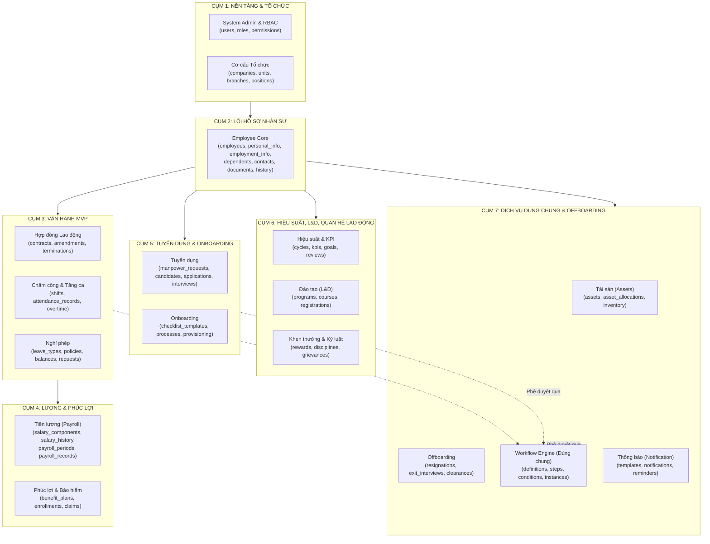
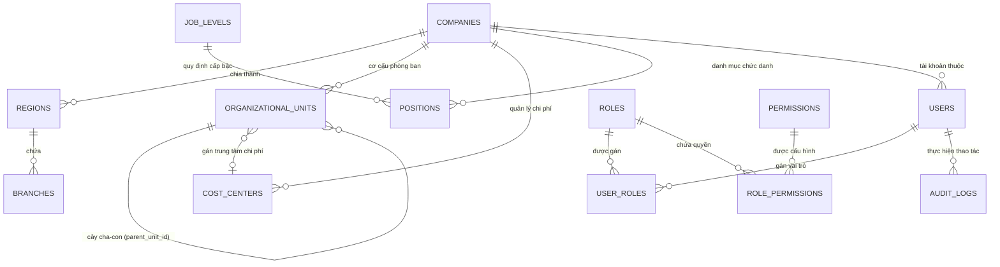
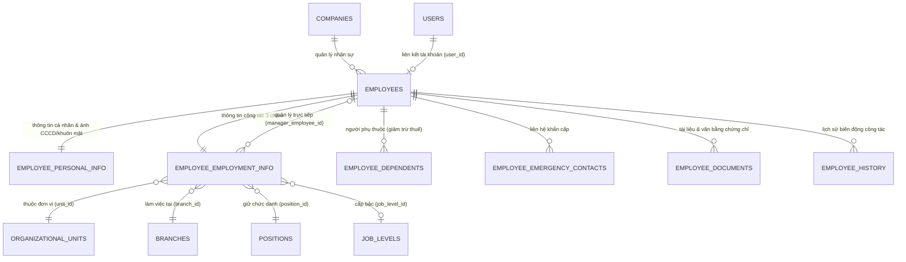
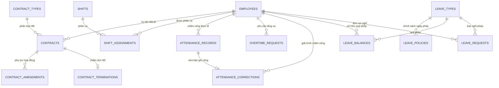
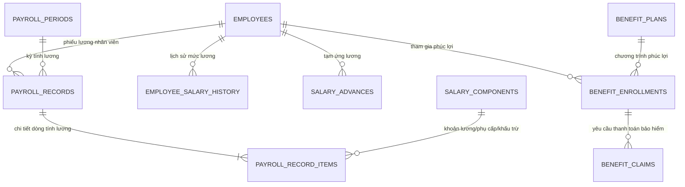
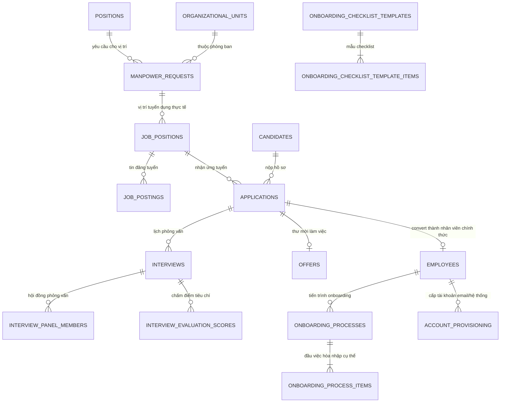
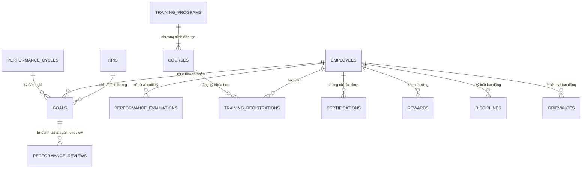
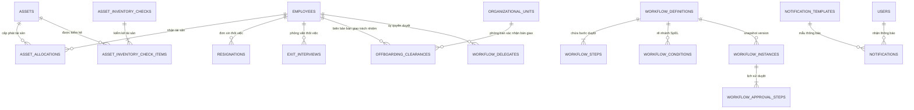

# Sơ Đồ Thực Thể Quan Hệ Toàn Hệ Thống (Master Database ERD) — CYCLOSA HRM

> **Vị trí tài liệu:** `cyclosa_be/docs/ba/so-do-thuc-the-quan-he-toan-he-thong.md`  
> **Áp dụng cho:** Toàn bộ hệ thống Quản trị Doanh nghiệp & Nhân sự CYCLOSA (Backend & Database)  
> **Căn cứ nghiệp vụ:** [ba/HRM-Database.md](file:///f:/Project/CYCLOSA/ba/HRM-Database.md) & [ba/HRM-Mo-Ta-Nghiep-Vu-Chi-Tiet.md](file:///f:/Project/CYCLOSA/ba/HRM-Mo-Ta-Nghiep-Vu-Chi-Tiet.md).

---

## 1. Kiến Trúc Dữ Liệu Tổng Quan (Architecture Overview)

Cơ sở dữ liệu của CYCLOSA HRM được thiết kế theo nguyên tắc:
1. **Module hóa cao (Modular Architecture):** Chia thành các cụm nghiệp vụ độc lập, giao tiếp thông qua khóa ngoại (`UUID`) hoặc liên kết động qua Event / Workflow.
2. **Mô hình 3 chiều độc lập của Nhân sự:** $\text{Nhân viên} = \text{Đơn vị tổ chức (Phòng ban)} + \text{Địa lý (Chi nhánh)} + \text{Vị trí công việc (Chức danh)}$.
3. **Động cơ Phê duyệt Đa cấp (Workflow Engine) dùng chung:** Bản ghi nghiệp vụ ở mọi module (Leave, OT, Contract, Advance, Resignation...) được định tuyến qua Workflow Engine mà không làm database bị phụ thuộc cứng vào từng bảng.

---

## 2. Chi Tiết Từng Cụm Thực Thể Liên Quan

---

### CỤM 1: Nền Tảng, Quản Trị Hệ Thống & Cơ Cấu Tổ Chức
*Bao gồm Module 21 (System Admin & RBAC) và Module 01 (Organization Management).*

#### Sơ đồ ERD Cụm 1

#### Vai trò các bảng Cụm 1
1. **`companies`**: Lưu trữ pháp nhân/công ty. Là gốc của kiến trúc multi-company.
2. **`regions` & `branches`**: Chiều địa lý (Vùng miền & Chi nhánh văn phòng).
3. **`organizational_units`**: Chiều đơn vị tổ chức (Khối $\to$ Ban $\to$ Phòng $\to$ Nhóm) theo mô hình cây tự tham chiếu (`parent_unit_id`).
4. **`job_levels` & `positions`**: Chiều vị trí việc làm (Cấp bậc chuyên môn & Chức danh phẳng).
5. **`cost_centers`**: Trung tâm chi phí phục vụ hạch toán lương và ngân sách.
6. **`users`**: Tài khoản đăng nhập hệ thống (email, username, password hash, status).
7. **`roles` & `permissions`**: Ma trận phân quyền RBAC đa cấp độ kèm DataScope (`OWN`, `TEAM`, `DEPARTMENT`, `COMPANY`, `ALL`).
8. **`audit_logs`**: Nhật ký kiểm toán vết hệ thống (IP, User-Agent, thao tác, dữ liệu cũ/mới).

---

### CỤM 2: Lõi Dữ Liệu Hồ Sơ Nhân Sự (Employee Core)
*Bao gồm Module 04 (Employee Management).*

#### Sơ đồ ERD Cụm 2

#### Vai trò các bảng Cụm 2
1. **`employees`**: Thực thể trung tâm của toàn bộ hệ thống HRM, lưu `employee_code`, `company_id`, `user_id`, `full_name`, `employment_status` (`PROBATION`, `ACTIVE`, `ON_LEAVE`, `TERMINATED`).
2. **`employee_personal_info`**: Thông tin nhân khẩu học (ngày sinh, giới tính, số CCCD/Hộ chiếu, MST cá nhân, tài khoản ngân hàng, `photo_url` dùng cho đối chiếu nhận diện khuôn mặt khi chấm công).
3. **`employee_employment_info`**: Lưu **3 khóa ngoại độc lập** (`organizational_unit_id`, `branch_id`, `position_id`) cùng `manager_employee_id`, `employment_type` (`FULL_TIME`, `PART_TIME`), email công vụ.
4. **`employee_dependents`**: Người phụ thuộc phục vụ khai trình giảm trừ gia cảnh thuế TNCN.
5. **`employee_emergency_contacts`**: Thông tin liên lạc thân nhân khi có sự cố.
6. **`employee_documents`**: Lưu trữ chứng từ, bằng cấp, hợp đồng scan, tích hợp OCR trích xuất thông tin.
7. **`employee_history`**: Lưu vết toàn bộ lịch sử bổ nhiệm, điều chuyển phòng ban, thăng chức, thay đổi lương.

---

### CỤM 3: Hợp Đồng, Chấm Công & Nghỉ Phép (Operations Core / MVP)
*Bao gồm Module 05 (Contract), Module 06 (Attendance & Shift), và Module 07 (Leave Management).*

#### Sơ đồ ERD Cụm 3

#### Vai trò các bảng Cụm 3
1. **`contract_types` & `contracts`**: Quản lý vòng đời hợp đồng (thử việc, xác định thời hạn, không xác định thời hạn), tiền lương cơ bản, ngày bắt đầu/kết thúc, cảnh báo hết hạn HĐ.
2. **`contract_amendments` & `contract_terminations`**: Phụ lục điều chỉnh lương/chức danh và biên bản thanh lý hợp đồng (tính trợ cấp thôi việc/mất việc).
3. **`shifts` & `shift_assignments`**: Định nghĩa ca làm việc (giờ vào/ra, nghỉ giữa ca, ca đêm) và phân lịch ca làm việc cho nhân viên theo ngày/tuần/tháng.
4. **`attendance_records`**: Nhật ký chấm công hàng ngày: giờ check-in/out, tọa độ GPS, ảnh check-in (`check_in_photo_url`), điểm nhận diện khuôn mặt AI (`check_in_face_match_score`), phút đi muộn/về sớm.
5. **`overtime_requests` & `attendance_corrections`**: Đơn đăng ký làm thêm giờ và giải trình quên chấm công (chạy qua Workflow duyệt).
6. **`leave_types` & `leave_policies`**: Danh mục loại phép (phép năm, nghỉ ốm, thai sản, việc riêng) và công thức thâm niên/chế độ BHXH.
7. **`leave_balances` & `leave_requests`**: Quỹ ngày phép còn lại của nhân viên trong năm và đơn xin nghỉ phép (tự động trừ số dư sau khi Workflow duyệt xong).

---

### CỤM 4: Tiền Lương & Phúc Lợi (Compensation, Payroll & Benefits)
*Bao gồm Module 08 (Payroll) và Module 11 (Benefits).*

#### Sơ đồ ERD Cụm 4

#### Vai trò các bảng Cụm 4
1. **`salary_components`**: Danh mục các thành phần lương (lương đóng BHXH, phụ cấp ăn trưa, phụ cấp xăng xe, thưởng KPI, giảm trừ BHXH, thuế TNCN).
2. **`employee_salary_history`**: Lưu vết biến động mức lương cơ bản và phụ cấp của nhân sự theo quyết định bổ nhiệm/tăng lương.
3. **`salary_advances`**: Đơn xin tạm ứng tiền lương trong kỳ (Workflow duyệt, đối trừ khi chạy bảng lương).
4. **`payroll_periods`**: Kỳ tính lương theo tháng (ngày chốt công, ngày trả lương, trạng thái `OPEN` $\to$ `PROCESSING` $\to$ `CLOSED`).
5. **`payroll_records`**: Phiếu lương tổng hợp của từng nhân viên: tổng thu nhập, tổng khấu trừ, thực lĩnh (`net_salary`), link phiếu lương PDF. Hỗ trợ cờ `is_final_settlement` khi thanh toán nghỉ việc.
6. **`payroll_record_items`**: Chi tiết giá trị từng dòng thành phần lương của phiếu lương.
7. **`benefit_plans` & `benefit_enrollments`**: Quản lý các gói phúc lợi nâng cao (bảo hiểm sức khỏe Bảo Việt/PVI, khám sức khỏe, du lịch, gói tập thể thao) và danh sách nhân sự tham gia.
8. **`benefit_claims`**: Đơn nhân viên yêu cầu thanh toán chi phí bảo hiểm/phúc lợi.

---

### CỤM 5: Tuyển Dụng & Onboarding (Talent Acquisition & Onboarding)
*Bao gồm Module 02 (Recruitment) và Module 03 (Onboarding).*

#### Sơ đồ ERD Cụm 5

#### Vai trò các bảng Cụm 5
1. **`manpower_requests`**: Phiếu đề xuất tuyển dụng nhân sự mới từ các phòng ban (duyệt qua Workflow).
2. **`job_positions` & `job_postings`**: Vị trí tuyển dụng được mở và các tin tuyển dụng đăng lên website, LinkedIn, TopCV...
3. **`candidates` & `applications`**: Hồ sơ ứng viên (CV scan, phân tích kỹ năng AI) và tiến trình ứng tuyển theo giai đoạn Kanban (`SCREENING` $\to$ `INTERVIEW` $\to$ `OFFER` $\to$ `HIRED`).
4. **`interviews`, `interview_panel_members`, `interview_evaluation_scores`**: Lịch phỏng vấn, hội đồng chấm điểm độc lập theo tiêu chí Scorecard (thang điểm 1-5, khuyến nghị tuyển).
5. **`offers`**: Thư mời nhận việc (mức lương đề xuất, ngày bắt đầu). Khi ứng viên chấp nhận offer $\to$ tự động sinh hồ sơ nhân viên mới (`employees`).
6. **`onboarding_checklist_templates` & `onboarding_processes`**: Quy trình hòa nhập nhân viên mới (nộp hồ sơ gốc, ký hợp đồng, đào tạo nội quy, nhận thiết bị làm việc, cấp tài khoản IT).

---

### CỤM 6: Hiệu Suất, Đào Tạo & Khen Thưởng - Kỷ Luật (Talent Development & Relations)
*Bao gồm Module 09 (Performance), Module 10 (Training & L&D), và Module 12 (Rewards & Discipline).*

#### Sơ đồ ERD Cụm 6

#### Vai trò các bảng Cụm 6
1. **`performance_cycles`, `goals`, `kpis`**: Chu kỳ đánh giá hiệu suất (quý/năm), thiết lập mục tiêu OKR/KPI liên kết phòng ban và nhân viên.
2. **`performance_reviews` & `performance_evaluations`**: Tự đánh giá (Self-review), Quản lý đánh giá (Manager-review), tính điểm trọng số và xếp loại (`EXCELLENT`, `GOOD`, `SATISFACTORY`, `POOR`).
3. **`training_programs`, `courses`, `training_registrations`**: Quản trị đào tạo nội bộ và đối tác bên ngoài, theo dõi tiến độ hoàn thành khóa học và chi phí đào tạo.
4. **`certifications`**: Văn bằng chứng chỉ nghiệp vụ nhân viên đạt được, theo dõi ngày hết hạn chứng chỉ.
5. **`rewards`**: Quyết định khen thưởng (bằng khen, tiền thưởng đẩy sang lương kỳ tới).
6. **`disciplines`**: Xử lý kỷ luật theo Bộ luật Lao động (khiển trách, kéo dài nâng lương, cách chức, sa thải).
7. **`grievances`**: Tiếp nhận và điều tra khiếu nại của người lao động tại nơi làm việc.

---

### CỤM 7: Tài Sản, Nghỉ Việc & Động Cơ Phê Duyệt Dùng Chung (Assets, Offboarding & Workflow Engine)
*Bao gồm Module 13 (Assets), Module 16 (Offboarding), Module 18 (Workflow Engine), và Module 19 (Notifications).*

#### Sơ đồ ERD Cụm 7

#### Vai trò các bảng Cụm 7
1. **`assets` & `asset_allocations`**: Quản lý danh mục tài sản công ty (laptop, điện thoại, thẻ từ, xe đưa đón, màn hình) và lịch sử bàn giao cho nhân viên sử dụng.
2. **`asset_inventory_checks`**: Đợt kiểm kê tài sản định kỳ kiểm tra thất thoát, hỏng hóc.
3. **`resignations` & `exit_interviews`**: Quy trình xin nghỉ việc của nhân viên (thời hạn báo trước 30-45 ngày) và khảo sát lý do nghỉ việc để cải thiện môi trường.
4. **`offboarding_clearances`**: Checklist bàn giao thủ tục nghỉ việc (bàn giao công việc cho Trưởng phòng, trả laptop cho IT, nộp thẻ cho Hành chính, chốt công nợ với Kế toán).
5. **`workflow_definitions`, `workflow_steps`, `workflow_conditions`**: Cấu hình quy trình phê duyệt đa cấp động, rẽ nhánh SpEL, thiết lập SLA.
6. **`workflow_instances`, `workflow_approval_steps`, `workflow_delegates`**: Thực thi vòng đời phê duyệt các đơn nghiệp vụ, kiểm tra thẩm quyền, ghi timeline lịch sử và xử lý ủy quyền duyệt thay khi vắng mặt.
7. **`notification_templates`, `notifications`, `reminders`**: Gửi thông báo tự động (in-app, email, websocket) cho nhân viên và người duyệt.

---

## 3. Bảng Tổng Hợp Chi Tiết Toàn Bộ 45 Bảng Lõi Hệ Thống

Dưới đây là từ điển dữ liệu tổng hợp các bảng cốt lõi nhất của toàn dự án CYCLOSA HRM:

| STT | Tên bảng | Module | Vai trò nghiệp vụ chính | Các trường khóa chính & khóa ngoại cốt lõi |
|:---:|---|:---:|---|---|
| 1 | `companies` | 01 | Pháp nhân doanh nghiệp gốc | `id`, `tax_code`, `legal_name`, `status` |
| 2 | `branches` | 01 | Chi nhánh văn phòng địa lý | `id`, `company_id` (FK), `region_id` (FK), `code` |
| 3 | `organizational_units` | 01 | Phòng ban/khối theo cây phân cấp | `id`, `company_id` (FK), `parent_unit_id` (FK tự trỏ), `manager_employee_id` (FK) |
| 4 | `positions` | 01 | Chức danh công việc | `id`, `company_id` (FK), `job_level_id` (FK), `code`, `title` |
| 5 | `job_levels` | 01 | Cấp bậc chuyên môn (Rank) | `id`, `company_id` (FK), `rank_order`, `code` |
| 6 | `cost_centers` | 01 | Trung tâm chi phí hạch toán | `id`, `company_id` (FK), `code`, `name` |
| 7 | `users` | 21 | Tài khoản đăng nhập hệ thống | `id`, `company_id` (FK), `username`, `email`, `password_hash`, `status` |
| 8 | `roles` | 21 | Vai trò người dùng (Admin, HR...) | `id`, `code`, `name`, `data_scope` (`OWN`, `TEAM`, `DEPT`...) |
| 9 | `user_roles` | 21 | Bảng ghép User - Role | `id`, `user_id` (FK), `role_id` (FK), `company_id` (FK) |
| 10 | `permissions` | 21 | Danh mục quyền chi tiết | `id`, `code` (VD: `employee.view`, `leave.approve`), `module` |
| 11 | `role_permissions` | 21 | Bảng ghép Role - Permission | `id`, `role_id` (FK), `permission_id` (FK) |
| 12 | `employees` | 04 | Thực thể hồ sơ nhân viên trung tâm | `id`, `company_id` (FK), `user_id` (FK), `employee_code`, `employment_status` |
| 13 | `employee_personal_info` | 04 | Nhân khẩu học & Ảnh khuôn mặt | `id`, `employee_id` (FK), `national_id`, `photo_url`, `bank_account` |
| 14 | `employee_employment_info`| 04 | Công tác 3 chiều độc lập | `id`, `employee_id` (FK), `organizational_unit_id` (FK), `branch_id` (FK), `position_id` (FK) |
| 15 | `employee_dependents` | 04 | Người phụ thuộc giảm trừ thuế | `id`, `employee_id` (FK), `full_name`, `relationship`, `tax_id` |
| 16 | `employee_documents` | 04 | Tài liệu số & bằng cấp scan | `id`, `employee_id` (FK), `document_type`, `file_url`, `ocr_status` |
| 17 | `employee_history` | 04 | Lịch sử luân chuyển, bổ nhiệm | `id`, `employee_id` (FK), `change_type`, `old_value`, `new_value`, `effective_date` |
| 18 | `contract_types` | 05 | Danh mục loại hợp đồng lao động | `id`, `company_id` (FK), `code`, `duration_months` |
| 19 | `contracts` | 05 | Hợp đồng lao động ký kết | `id`, `employee_id` (FK), `contract_type_id` (FK), `basic_salary`, `status` |
| 20 | `contract_amendments` | 05 | Phụ lục hợp đồng điều chỉnh | `id`, `contract_id` (FK), `amendment_date`, `effective_date` |
| 21 | `contract_terminations` | 05 | Quyết định thanh lý hợp đồng | `id`, `contract_id` (FK), `termination_date`, `severance_amount` |
| 22 | `shifts` | 06 | Ca làm việc chuẩn | `id`, `company_id` (FK), `start_time`, `end_time`, `work_hours` |
| 23 | `shift_assignments` | 06 | Bảng phân ca làm việc | `id`, `employee_id` (FK), `shift_id` (FK), `assigned_date` |
| 24 | `attendance_records` | 06 | Chấm công hàng ngày & Face AI | `id`, `employee_id` (FK), `check_in_time`, `check_in_photo_url`, `check_in_face_match_score` |
| 25 | `overtime_requests` | 06 | Đơn đăng ký làm thêm giờ | `id`, `employee_id` (FK), `ot_date`, `hours`, `status` |
| 26 | `attendance_corrections` | 06 | Đơn giải trình bổ sung công | `id`, `employee_id` (FK), `attendance_record_id` (FK), `correction_type`, `status` |
| 27 | `leave_types` | 07 | Loại ngày nghỉ phép | `id`, `company_id` (FK), `code`, `is_paid`, `default_entitlement` |
| 28 | `leave_balances` | 07 | Quỹ phép năm của nhân viên | `id`, `employee_id` (FK), `leave_type_id` (FK), `year`, `remaining_days` |
| 29 | `leave_requests` | 07 | Đơn xin nghỉ phép | `id`, `employee_id` (FK), `leave_type_id` (FK), `from_date`, `to_date`, `total_days`, `status` |
| 30 | `salary_components` | 08 | Khoản mục lương, thưởng, thuế | `id`, `company_id` (FK), `type` (`ALLOWANCE`, `BONUS`, `DEDUCTION`), `is_taxable` |
| 31 | `payroll_periods` | 08 | Kỳ lương hàng tháng | `id`, `company_id` (FK), `code`, `start_date`, `end_date`, `status` |
| 32 | `payroll_records` | 08 | Bảng lương từng nhân viên | `id`, `payroll_period_id` (FK), `employee_id` (FK), `gross_salary`, `net_salary`, `status` |
| 33 | `payroll_record_items` | 08 | Chi tiết từng dòng tính lương | `id`, `payroll_record_id` (FK), `salary_component_id` (FK), `amount` |
| 34 | `salary_advances` | 08 | Đơn xin ứng trước lương | `id`, `employee_id` (FK), `amount`, `request_date`, `status` |
| 35 | `manpower_requests` | 02 | Phiếu đề xuất tuyển dụng | `id`, `position_id` (FK), `department_id` (FK), `headcount`, `status` |
| 36 | `candidates` | 02 | Hồ sơ ứng viên | `id`, `full_name`, `email`, `phone`, `cv_file_url`, `status` |
| 37 | `applications` | 02 | Hồ sơ nộp vào vị trí cụ thể | `id`, `candidate_id` (FK), `job_position_id` (FK), `stage`, `rating` |
| 38 | `interviews` | 02 | Lịch phỏng vấn ứng viên | `id`, `application_id` (FK), `interview_date`, `format`, `status` |
| 39 | `assets` | 13 | Danh mục thiết bị tài sản | `id`, `company_id` (FK), `asset_code`, `name`, `serial_number`, `status` |
| 40 | `asset_allocations` | 13 | Bàn giao thiết bị cho nhân viên | `id`, `asset_id` (FK), `employee_id` (FK), `allocated_at`, `returned_at` |
| 41 | `workflow_definitions` | 18 | Định nghĩa quy trình phê duyệt | `id`, `company_id` (FK), `request_type`, `version`, `status` (`PUBLISHED`) |
| 42 | `workflow_steps` | 18 | Cấu hình từng bước duyệt | `id`, `workflow_definition_id` (FK), `step_order`, `approver_type`, `sla_hours` |
| 43 | `workflow_conditions` | 18 | Rẽ nhánh quy trình SpEL | `id`, `workflow_definition_id` (FK), `from_step_id` (FK), `to_step_id` (FK), `expression` |
| 44 | `workflow_instances` | 18 | Phiên phê duyệt thực tế | `id`, `workflow_definition_id` (FK), `request_type`, `request_id` (Loose FK), `status` |
| 45 | `workflow_delegates` | 18 | Thiết lập ủy quyền duyệt | `id`, `delegator_employee_id` (FK), `delegate_employee_id` (FK), `start_date`, `end_date` |

---

## 4. Các Quy Tắc Tham Chiếu Đặc Biệt (Architectural Design Patterns)

1. **Loose Foreign Key (Khóa ngoại lỏng đa hình):**  
   Bảng `workflow_instances` không tạo FK cứng tới 20+ bảng nghiệp vụ, mà sử dụng cặp `(request_type, request_id)` để trỏ linh hoạt tới bất kỳ bảng đơn nào cần duyệt.
2. **Snapshot Versioning (Cố định phiên bản lịch sử):**  
   - `workflow_instances` khóa cứng vào một `workflow_definition_id` tại thời điểm tạo.  
   - `payroll_records` lưu cứng số tiền `net_salary` tại thời điểm chốt sổ, không phụ thuộc vào công thức tương lai.
3. **Mô hình Soft Delete thống nhất:**  
   Mọi bảng nghiệp vụ cốt lõi đều kế thừa trường `deleted_at` từ `BaseEntity`, giúp dữ liệu có thể khôi phục và duy trì tính toàn vẹn lịch sử kiểm toán.
