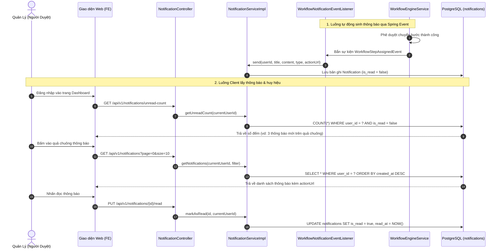

# CYCLOSA — Nghiệp Vụ Thông Báo (Notification Module)

Tài liệu này mô tả chi tiết yêu cầu nghiệp vụ, kiến trúc kỹ thuật và giải thích vai trò của từng thành phần trong module `com.cyclosa.notification` thuộc hệ thống CYCLOSA HRM.

---

## 1. Tổng Quan Nghiệp Vụ (Business Overview)

### 1.1. Mục đích & Vai trò
Module Thông báo đóng vai trò là **trung tâm tin tức nội bộ (In-app Notification Center)** của hệ thống CYCLOSA HRM. Module này giúp kết nối luồng công việc giữa nhân viên và các cấp quản lý bằng cách gửi các nhắc nhở, cảnh báo và cập nhật kịp thời ngay trên giao diện web:
* **Giao việc & Duyệt đơn:** Báo cho cấp quản lý khi có yêu cầu mới cần phê duyệt (nghỉ phép, tạm ứng lương, làm thêm giờ...).
* **Phản hồi kết quả:** Báo ngay cho nhân viên khi đơn từ của họ được duyệt hoặc bị từ chối kèm lý do.
* **Cảnh báo thời hạn:** Nhắc nhở hợp đồng lao động sắp hết hạn, đến hạn trả tài sản thiết bị, hạn giải trình chấm công...
* **Thông cáo hệ thống:** Nhận các thông báo quan trọng từ Ban Quản trị / HR Admin.

### 1.2. Các Nguyên Tắc Nghiệp Vụ Cốt Lõi (Core Business Rules)
1. **Mô hình hoạt động Non-Realtime (Pull-based REST API):**
   * Không duy trì kết nối WebSocket / Socket.IO treo liên tục nhằm tiết kiệm tài nguyên máy chủ.
   * Giao diện người dùng (Web Frontend) lấy danh sách thông báo và số lượng chưa đọc (`unread-count`) thông qua REST API chuẩn khi người dùng tải trang, mở hộp thư quả chuông hoặc theo chu kỳ polling nhẹ (30s - 60s).
2. **Quản lý trạng thái Đọc / Chưa đọc (Read Status Tracking):**
   * Mọi thông báo mới tạo mặc định có `is_read = false` và `read_at = null`.
   * Khi người dùng click xem hoặc nhấn "Đánh dấu đã đọc", hệ thống cập nhật `is_read = true` và ghi nhận thời điểm `read_at = NOW()`.
   * Cung cấp tính năng "Đánh dấu tất cả là đã đọc" (`read-all`) giúp người dùng dọn sạch hộp thư chỉ bằng một cú click.
3. **Bảo mật & Quyền riêng tư tuyệt đối:**
   * Thông báo gắn liền với từng `user_id`.
   * **Một người dùng tuyệt đối không thể đọc, xem hoặc xóa thông báo của người khác** (kiểm tra chặt chẽ `notification.userId == currentUserId`).
4. **Hỗ trợ Deep Link (Action URL):**
   * Mỗi thông báo có thể mang theo một đường dẫn điều hướng (`actionUrl`, ví dụ: `/workflows/pending`, `/leaves/123`, `/contracts/456`). Khi người dùng nhấn vào thông báo trên quả chuông, ứng dụng tự động mở đúng trang chi tiết của nghiệp vụ đó.

---

## 2. Kiến Trúc Kỹ Thuật & Luồng Hoạt Động



---

## 3. Danh Sách & Giải Thích Chi Tiết Các File Trong Module

Toàn bộ mã nguồn module nằm trong package `com.cyclosa.notification`:

```text
cyclosa_be/src/main/java/com/cyclosa/notification/
├── controller/
│   └── NotificationController.java
├── dto/
│   ├── request/
│   │   ├── CreateNotificationRequest.java
│   │   └── NotificationFilter.java
│   └── response/
│       ├── NotificationResponse.java
│       └── UnreadCountResponse.java
├── entity/
│   └── Notification.java
├── enums/
│   └── NotificationType.java
├── exception/
│   └── NotificationErrorCode.java
├── listener/
│   └── WorkflowNotificationEventListener.java
├── mapper/
│   └── NotificationMapper.java
├── repository/
│   └── NotificationRepository.java
└── service/
    ├── NotificationService.java
    └── impl/
        └── NotificationServiceImpl.java
```

### Bảng giải thích chi tiết từng file:

| STT | Tên File & Đường dẫn | Phân loại | Nhiệm vụ & Vai trò kỹ thuật |
| :---: | :--- | :--- | :--- |
| 1 | [`Notification.java`](file:///f:/Project/CYCLOSA/cyclosa_be/src/main/java/com/cyclosa/notification/entity/Notification.java) | **Entity** | Ánh xạ bảng cơ sở dữ liệu `notifications`. Kế thừa [`BaseEntity.java`](file:///f:/Project/CYCLOSA/cyclosa_be/src/main/java/com/cyclosa/common/entity/BaseEntity.java) để có sẵn `id`, `createdAt`, `updatedAt`, `deletedAt` (Soft Delete qua `@SQLDelete` và `@SQLRestriction`). Đánh index trên `(user_id, is_read)` và `(user_id, created_at)` để tối ưu hóa tối đa tốc độ truy vấn danh sách và đếm số lượng chưa đọc. |
| 2 | [`NotificationType.java`](file:///f:/Project/CYCLOSA/cyclosa_be/src/main/java/com/cyclosa/notification/enums/NotificationType.java) | **Enum** | Danh mục phân loại nguồn thông báo: `WORKFLOW` (phê duyệt quy trình), `LEAVE` (nghỉ phép), `ATTENDANCE` (chấm công), `CONTRACT` (hợp đồng), `PAYROLL` (lương), `ASSET` (tài sản), `SYSTEM` (hệ thống). Giúp Frontend hiển thị icon và màu sắc phù hợp cho từng loại tin. |
| 3 | [`NotificationErrorCode.java`](file:///f:/Project/CYCLOSA/cyclosa_be/src/main/java/com/cyclosa/notification/exception/NotificationErrorCode.java) | **ErrorCode** | Quản lý danh mục mã lỗi riêng của module theo kiến trúc đa hình (dải mã 4901 - 4929): `NOTIFICATION_NOT_FOUND (4901)`, `NOTIFICATION_ACCESS_DENIED (4902)`, `RECIPIENT_USER_NOT_FOUND (4903)`. |
| 4 | [`CreateNotificationRequest.java`](file:///f:/Project/CYCLOSA/cyclosa_be/src/main/java/com/cyclosa/notification/dto/request/CreateNotificationRequest.java) | **DTO Request** | DTO truyền dữ liệu gửi thông báo mới. Chứa validation đầy đủ: `@NotNull userId`, `@NotBlank title` (tối đa 200 ký tự), `@NotBlank content`, `type`, `actionUrl`, `relatedEntityType`, `relatedEntityId`. |
| 5 | [`NotificationFilter.java`](file:///f:/Project/CYCLOSA/cyclosa_be/src/main/java/com/cyclosa/notification/dto/request/NotificationFilter.java) | **DTO Request** | Kế thừa [`BaseFilterRequest.java`](file:///f:/Project/CYCLOSA/cyclosa_be/src/main/java/com/cyclosa/common/dto/request/BaseFilterRequest.java) theo đúng tiêu chuẩn Mục 7.1. Cung cấp tham số tìm kiếm từ khóa (`keyword`), lọc theo trạng thái đọc (`isRead`), lọc theo loại (`type`) và phân trang (`page`, `size`, `sortBy`, `direction`). |
| 6 | [`NotificationResponse.java`](file:///f:/Project/CYCLOSA/cyclosa_be/src/main/java/com/cyclosa/notification/dto/response/NotificationResponse.java) | **DTO Response** | DTO trả về thông tin chi tiết của thông báo cho Client hiển thị trên giao diện danh sách hộp thư. |
| 7 | [`UnreadCountResponse.java`](file:///f:/Project/CYCLOSA/cyclosa_be/src/main/java/com/cyclosa/notification/dto/response/UnreadCountResponse.java) | **DTO Response** | DTO gọn nhẹ chỉ chứa trường `unreadCount: long`, phục vụ riêng cho API lấy số lượng chưa đọc gắn lên huy hiệu quả chuông. |
| 8 | [`NotificationMapper.java`](file:///f:/Project/CYCLOSA/cyclosa_be/src/main/java/com/cyclosa/notification/mapper/NotificationMapper.java) | **Mapper** | MapStruct chuyển đổi giữa `CreateNotificationRequest` sang Entity `Notification` (mặc định gán `isRead = false`), và từ Entity sang `NotificationResponse`. Sử dụng chuẩn `MappingConstants.ComponentModel.SPRING`. |
| 9 | [`NotificationRepository.java`](file:///f:/Project/CYCLOSA/cyclosa_be/src/main/java/com/cyclosa/notification/repository/NotificationRepository.java) | **Repository** | Chứa các truy vấn JPA tối ưu: `search(...)` kết hợp lọc keyword và trạng thái; `countByUserIdAndIsReadFalse(userId)` đếm siêu nhanh; query `@Modifying` cập nhật `is_read = true, read_at = NOW()` hàng loạt cho user. |
| 10 | [`NotificationService.java`](file:///f:/Project/CYCLOSA/cyclosa_be/src/main/java/com/cyclosa/notification/service/NotificationService.java) | **Service Interface** | Hợp đồng nghiệp vụ công khai: các hàm `send(...)`, `getNotifications(userId, filter)`, `getUnreadCount(userId)`, `markAsRead(notificationId, userId)`, `markAllAsRead(userId)`, `deleteNotification(notificationId, userId)`. Thiết kế hoàn toàn độc lập, nhận `userId` trực tiếp (Stateless Pattern). |
| 11 | [`NotificationServiceImpl.java`](file:///f:/Project/CYCLOSA/cyclosa_be/src/main/java/com/cyclosa/notification/service/impl/NotificationServiceImpl.java) | **Service Impl** | Cài đặt logic nghiệp vụ. Nằm trong thư mục `service/impl/` theo Mục 2 của tiêu chuẩn dự án. Chỉ inject [`UserService`](file:///f:/Project/CYCLOSA/cyclosa_be/src/main/java/com/cyclosa/auth/service/UserService.java) công khai để kiểm tra tồn tại của User (không inject UserRepository trái phép). Kiểm tra quyền sở hữu bản ghi trước khi cho phép đọc hoặc xóa. |
| 12 | [`WorkflowNotificationEventListener.java`](file:///f:/Project/CYCLOSA/cyclosa_be/src/main/java/com/cyclosa/notification/listener/WorkflowNotificationEventListener.java) | **Event Listener** | Cầu nối tự động giữa Module Workflow và Notification. Lắng nghe [`WorkflowStepAssignedEvent`](file:///f:/Project/CYCLOSA/cyclosa_be/src/main/java/com/cyclosa/workflow/event/WorkflowStepAssignedEvent.java) (báo người duyệt khi có đơn mới) và [`WorkflowCompletedEvent`](file:///f:/Project/CYCLOSA/cyclosa_be/src/main/java/com/cyclosa/workflow/event/WorkflowCompletedEvent.java) (báo nhân viên kết quả duyệt đơn). Sử dụng `@TransactionalEventListener(phase = TransactionPhase.AFTER_COMMIT)` đảm bảo chỉ gửi thông báo khi giao dịch duyệt đơn đã commit thành công. |
| 13 | [`NotificationController.java`](file:///f:/Project/CYCLOSA/cyclosa_be/src/main/java/com/cyclosa/notification/controller/NotificationController.java) | **Controller** | Cung cấp toàn bộ REST API hộp thư thông báo. Được bảo vệ bởi `@PreAuthorize("@perm.has('notification.view')")` và `@RequirePermission("notification.view")`. Tự động lấy `currentUserId` từ `SecurityUtils` và truyền xuống Service, bọc phản hồi trong `ApiResponse<T>`. |

---

## 4. Hướng Dẫn Tích Hợp Cho Lập Trình Viên (Developer Guide)

Khi phát triển các module nghiệp vụ khác (như `Leave`, `Contract`, `Attendance`, `Asset`...), lập trình viên có thể tạo thông báo gửi đến người dùng theo các cách sau:

### Cách 1: Gọi trực tiếp `NotificationService` (Khuyên dùng)
Inject `NotificationService` vào Service của bạn và gọi hàm `send(...)`:

```java
@Service
@RequiredArgsConstructor
public class LeaveServiceImpl implements LeaveService {

    private final NotificationService notificationService;

    @Transactional
    public void approveLeaveRequest(UUID leaveId, UUID employeeUserId) {
        // 1. Cập nhật trạng thái duyệt đơn...

        // 2. Gửi thông báo cho nhân viên
        notificationService.send(
            employeeUserId,
            "Đơn nghỉ phép đã được phê duyệt",
            "Đơn xin nghỉ phép từ ngày 25/09 đến 27/09 của bạn đã được quản lý phê duyệt.",
            NotificationType.LEAVE,
            "/leaves/" + leaveId,
            "LEAVE_REQUEST",
            leaveId
        );
    }
}
```

### Cách 2: Tự động qua Spring Event (Khi nghiệp vụ đã có Event)
Nếu module của bạn đã phát ra Spring Event khi hoàn thành (ví dụ: `ContractExpiringEvent`, `AssetAssignedEvent`), bạn chỉ cần viết một Event Listener tương tự như [`WorkflowNotificationEventListener`](file:///f:/Project/CYCLOSA/cyclosa_be/src/main/java/com/cyclosa/notification/listener/WorkflowNotificationEventListener.java) để đón sự kiện và gọi `notificationService.send(...)`.

---

## 5. Danh Sách API Endpoints & Phân Quyền

| STT | HTTP Method | Endpoint URI | Mô tả Chức năng | Mã Quyền (Permission) |
| :---: | :---: | :--- | :--- | :---: |
| 1 | `GET` | `/api/v1/notifications` hoặc `/my` | Lấy danh sách thông báo của người dùng hiện tại (hỗ trợ tìm kiếm từ khóa, phân trang, lọc theo loại và trạng thái đã đọc) | `notification.view` |
| 2 | `GET` | `/api/v1/notifications/unread-count` | Lấy số lượng thông báo chưa đọc (dùng hiển thị số đỏ trên huy hiệu quả chuông) | `notification.view` |
| 3 | `PUT` | `/api/v1/notifications/{id}/read` | Đánh dấu 1 thông báo cụ thể là đã đọc | `notification.view` |
| 4 | `PUT` | `/api/v1/notifications/read-all` | Đánh dấu toàn bộ thông báo của người dùng là đã đọc | `notification.view` |
| 5 | `DELETE` | `/api/v1/notifications/{id}` | Xóa thông báo khỏi hộp thư | `notification.view` |
| 6 | `POST` | `/api/v1/notifications/send` | Gửi thông báo trực tiếp tới người dùng (dành cho Admin hoặc hệ thống nội bộ) | `notification.manage` |
