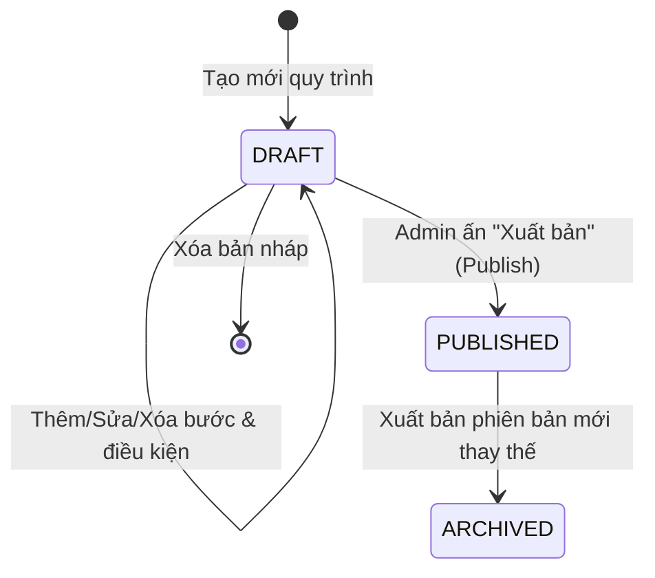
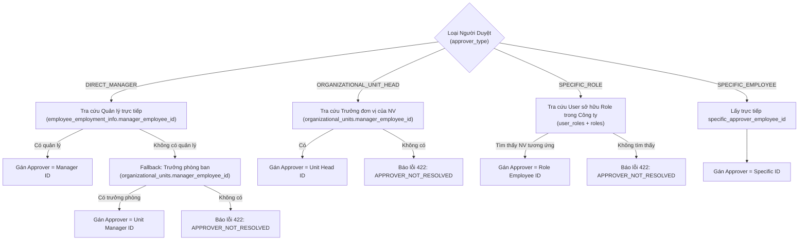
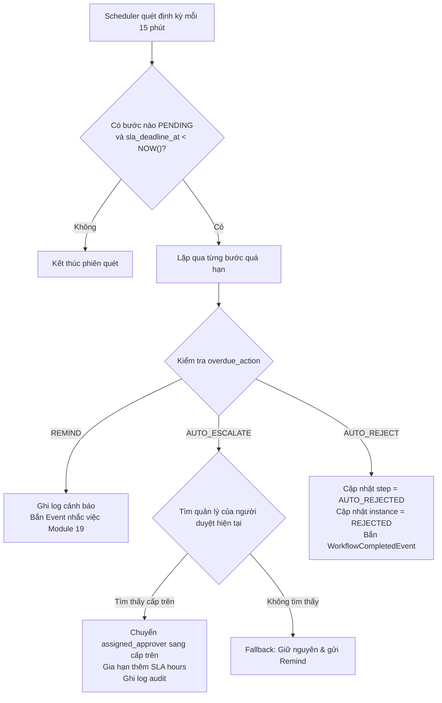
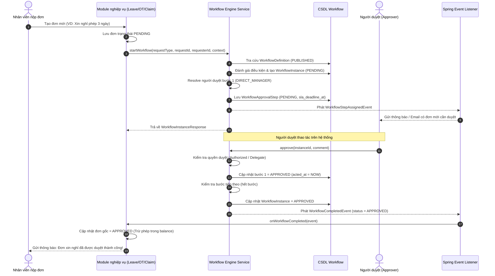
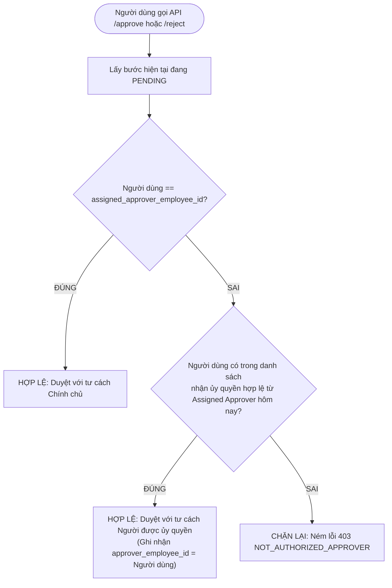

# Tài Liệu Đặc Tả Nghiệp Vụ Toàn Diện: Module 18 — Workflow & Approval Engine

> **Vị trí tài liệu:** `cyclosa_be/docs/ba/workflow-engine.md`  
> **Module Code:** `workflow` | **Package Backend:** `com.cyclosa.workflow`  
> **Phiên bản tài liệu:** 2.0 (Bản đặc tả nghiệp vụ chuyên sâu)  
> **Căn cứ thiết kế:** [ba/HRM-Database.md](file:///f:/Project/CYCLOSA/ba/HRM-Database.md) (Mục 18), [ba/HRM-Mo-Ta-Nghiep-Vu-Chi-Tiet.md](file:///f:/Project/CYCLOSA/ba/HRM-Mo-Ta-Nghiep-Vu-Chi-Tiet.md) (Mục 18), [ba/HRM-API-Validation-Rules.md](file:///f:/Project/CYCLOSA/ba/HRM-API-Validation-Rules.md) (Mục 18), [ba/HRM-Quy-Trinh.md](file:///f:/Project/CYCLOSA/ba/HRM-Quy-Trinh.md).

---

## 1. Bối Cảnh, Mục Tiêu & Triết Lý Nghiệp Vụ

### 1.1. Nỗi đau nghiệp vụ của hệ thống phê duyệt truyền thống
Trong các hệ thống quản trị nhân sự truyền thống:
- **Phê duyệt cứng (Hard-coded Approval):** Quy trình duyệt đơn xin nghỉ phép, tăng ca, ứng lương thường bị lập trình cứng vào code của từng module. Khi doanh nghiệp thay đổi quy chế (VD: từ 1 cấp duyệt lên 2 cấp, hoặc đổi người duyệt từ Trưởng phòng sang Giám đốc khối), lập trình viên phải sửa code và deploy lại hệ thống.
- **Thiếu tính linh hoạt theo điều kiện (Static Matrix):** Một nhân viên xin nghỉ 1 ngày có quy trình duyệt hoàn toàn khác với nhân viên xin nghỉ 10 ngày; tương tự, tạm ứng 2 triệu khác với tạm ứng 50 triệu. Ma trận phê duyệt tĩnh không thể đáp ứng được các điều kiện rẽ nhánh động này.
- **Tắc nghẽn khi người duyệt vắng mặt:** Khi sếp đi công tác hoặc nghỉ phép dài ngày, toàn bộ đơn từ của cấp dưới bị "treo", không có cơ chế ủy quyền chính thức hoặc người được ủy quyền phải dùng chung tài khoản đăng nhập (vi phạm nghiêm trọng bảo mật).
- **Trễ hạn không được xử lý (Thiếu SLA):** Đơn nằm chờ vô thời hạn mà không có cơ chế nhắc nhở, tự động leo cấp (escalate) lên cấp trên, hoặc tự động từ chối.
- **Phân mảnh hộp thư (Silo Approvals):** Người quản lý phải vào từng màn hình riêng lẻ (vào mục Nghỉ phép để duyệt phép, vào mục Chấm công để duyệt OT, vào mục Lương để duyệt ứng tiền) thay vì có một **Hộp thư phê duyệt tập trung**.

### 1.2. Triết lý thiết kế của Workflow Engine trong CYCLOSA
CYCLOSA xây dựng một **Động cơ Phê duyệt Đa cấp Động (Dynamic Multi-level Workflow Engine)** tập trung với 5 nguyên tắc cốt lõi:
1. **Centralized & Reusable (Dùng chung toàn diện):** Một engine duy nhất xử lý quy trình cho tất cả các loại yêu cầu trong hệ thống.
2. **Dynamic Designer (Tự cấu hình không cần code):** HR Admin tự thiết kế luồng, thêm bớt bước, gán loại người duyệt và cấu hình điều kiện rẽ nhánh trực quan.
3. **Snapshot Versioning (Cố định phiên bản lịch sử):** Khi quy trình được cập nhật và xuất bản phiên bản mới, các hồ sơ đang trong quá trình duyệt vẫn giữ nguyên quy trình cũ, đảm bảo tính pháp lý và không bị lỗi runtime.
4. **Decoupled Architecture (Hướng sự kiện độc lập):** Workflow Engine không phụ thuộc trực tiếp vào các thực thể nghiệp vụ (Leave, Overtime...). Mọi giao tiếp hoàn tất qua **Loose Foreign Key** `(request_type, request_id)` và **Spring Domain Events**.
5. **Time-Bound Governance (Kỷ luật thời gian SLA):** Mọi bước duyệt đều có thể gắn hạn mức thời gian (giờ) và hành vi tự động khi quá hạn (`REMIND`, `AUTO_ESCALATE`, `AUTO_REJECT`).

### 1.3. Danh sách ~24 Quy trình nghiệp vụ đi qua Workflow Engine
Dựa trên tài liệu quy trình tổng thể `ba/HRM-Quy-Trinh.md`, các quy trình sau đây bắt buộc định tuyến qua Workflow Engine:
- **Nhóm Hợp đồng & Nhân sự:** Chấm dứt HĐLĐ (Termination), Điều chuyển nội bộ (Transfer), Tái cơ cấu lao động (Restructuring).
- **Nhóm Vận hành hàng ngày:** Đăng ký làm thêm giờ (Overtime), Điều chỉnh/Giải trình chấm công (Attendance Correction), Đơn xin nghỉ phép (Leave Request).
- **Nhóm Tài chính & Lương:** Tạm ứng lương (Salary Advance), Phê duyệt kỳ lương (Payroll Review), Ứng lương linh hoạt vượt hạn mức (Earned Wage Access).
- **Nhóm Tuyển dụng & Onboarding:** Yêu cầu tuyển dụng (Manpower Request), Cấp phát tài sản đặc thù (Special Asset Allocation).
- **Nhóm Quan hệ lao động & Nghỉ việc:** Đơn xin thôi việc (Resignation), Biên bản bàn giao nghỉ việc (Offboarding Clearance), Khiếu nại lao động (Grievance Review).
- **Nhóm Lưu trữ:** Đề xuất lưu kho hồ sơ nhân sự (Archive Submission), Đề xuất tiêu hủy tài liệu (Disposal Proposal).

---

## 2. Đặc Tả Chi Tiết Các Chức Năng Nghiệp Vụ

---

### Chức năng 1: Thiết Kế & Quản Lý Định Nghĩa Quy Trình (Workflow Designer & Versioning)

#### Mục đích & Ý nghĩa nghiệp vụ:
Cho phép HR Admin tạo, cấu hình và quản lý vòng đời của các quy trình phê duyệt cho từng pháp nhân/công ty (`company_id`) và từng loại nghiệp vụ (`request_type`).

#### Vòng đời trạng thái của Quy trình (Workflow Status Lifecycle):


- **Trạng thái `DRAFT` (Bản nháp):**
  - Khi tạo mới, quy trình luôn ở trạng thái `DRAFT` với `version = 1`.
  - Trong trạng thái này, Admin được toàn quyền chỉnh sửa tên, mô tả, thêm/sửa/xóa các bước duyệt (`WorkflowStep`) và các điều kiện rẽ nhánh (`WorkflowCondition`).
  - Bản nháp **chưa thể** được các đơn nghiệp vụ gọi tới để chạy.
- **Trạng thái `PUBLISHED` (Đang kích hoạt chạy thật):**
  - Khi Admin ấn **Xuất bản (Publish)**:
    1. Hệ thống kiểm tra: Quy trình phải có **ít nhất 1 bước duyệt** (`steps.size() >= 1`), nếu không sẽ chặn với lỗi `422 NO_PUBLISHED_WORKFLOW`.
    2. Nếu công ty đã có một bản quy trình đang `PUBLISHED` cho cùng `request_type`, bản cũ sẽ tự động chuyển thành `ARCHIVED`.
    3. Phiên bản của bản mới được chốt: `version = max(version_hien_tai) + 1`.
    4. Trạng thái chuyển thành `PUBLISHED`, ghi nhận `published_at = NOW()`.
  - **Quy tắc bất biến (Immutability):** Quy trình đã `PUBLISHED` sẽ bị **khóa cứng, không thể sửa đổi trực tiếp** (chặn với lỗi `400 CANNOT_MODIFY_PUBLISHED_WORKFLOW`). Nếu muốn thay đổi chính sách, Admin phải nhân bản hoặc tạo một bản nháp mới rồi Publish đè lên.
- **Trạng thái `ARCHIVED` (Đã lưu trữ):**
  - Là các phiên bản cũ đã từng chạy trong quá khứ.
  - Không nhận các yêu cầu mới, nhưng vẫn được lưu vĩnh viễn trong CSDL để phục vụ đối soát kiểm toán cho các hồ sơ nộp trong thời gian phiên bản đó có hiệu lực.

---

### Chức năng 2: Cấu Hình Các Bước Phê Duyệt Đa Cấp (Multi-level Steps Configuration)

#### Mục đích & Ý nghĩa nghiệp vụ:
Một quy trình có thể gồm 1 cấp, 2 cấp hoặc nhiều cấp tuần tự. Mỗi bước duyệt (`WorkflowStep`) xác định thẩm quyền ai là người có trách nhiệm xem xét, trong bao lâu và hành động tự động nếu chậm trễ.

#### 4 Loại Người Phê Duyệt Động (`approver_type`):



1. **`DIRECT_MANAGER` (Quản lý trực tiếp):**
   - Áp dụng cho các bước cấp cơ sở (duyệt phép hàng ngày, duyệt tăng ca, giải trình công).
   - Hệ thống tự động tra cứu từ hồ sơ nhân sự: `EmployeeEmploymentInfo.managerEmployeeId`.
   - **Cơ chế Fallback thông minh:** Nếu nhân viên chưa được cấu hình quản lý trực tiếp (VD: nhân viên mới tuyển hoặc các chức danh đặc thù), hệ thống tự động tìm Trưởng phòng ban quản lý nhân viên đó (`OrganizationalUnit.managerEmployeeId`). Nếu vẫn không có, hệ thống mới báo lỗi để tránh làm nghẽn đơn.
2. **`ORGANIZATIONAL_UNIT_HEAD` (Trưởng đơn vị / Trưởng phòng ban):**
   - Áp dụng cho các quyết định cấp phòng (đề xuất tuyển dụng, điều chuyển, ký HĐ chính thức).
   - Hệ thống lấy `organizational_unit_id` của nhân viên, sau đó truy vấn `organizational_units.manager_employee_id`.
3. **`SPECIFIC_ROLE` (Vai trò chức năng):**
   - Áp dụng khi bước duyệt thuộc về một bộ phận chuyên trách (VD: `HR_MANAGER`, `FINANCE_DIRECTOR`, `LEGAL_HEAD`).
   - Hệ thống không chỉ định đích danh một cá nhân, mà trỏ tới `specific_role_id` trong bảng `roles`. Khi chạy, Engine tự động tìm nhân viên trong cùng công ty sở hữu Role này. Giúp quy trình không bị gãy khi nhân sự phụ trách thay đổi người.
4. **`SPECIFIC_EMPLOYEE` (Nhân sự đích danh):**
   - Áp dụng cho các phê duyệt tối cao (Tổng Giám đốc / CEO) hoặc chuyên viên được chỉ định cụ thể.

#### Quản lý thời hạn cam kết SLA (`sla_hours`) & Hành vi quá hạn (`overdue_action`):
- Mỗi bước cho phép cấu hình số giờ tối đa người duyệt được phép giữ đơn (ví dụ: 24 giờ, 48 giờ).
- Khi bước duyệt được tạo, hệ thống tính toán: `sla_deadline_at = NOW() + sla_hours`.
- Ba hành vi xử lý khi quá hạn:
  1. `REMIND`: Gửi thông báo cảnh báo khẩn cấp tới người duyệt qua email / chuông in-app.
  2. `AUTO_ESCALATE`: Tự động leo cấp lên Quản lý trực tiếp của người duyệt hiện tại và gia hạn thêm SLA tương ứng.
  3. `AUTO_REJECT`: Tự động từ chối đơn với lý do *"Quá hạn thời gian phê duyệt cam kết (SLA)"* và kết thúc quy trình.

---

### Chức năng 3: Rẽ Nhánh Điều Kiện Động Bằng Biểu Thức SpEL (Conditional Routing)

#### Mục đích & Ý nghĩa nghiệp vụ:
Loại bỏ hoàn toàn sự cứng nhắc. Cho phép một quy trình tự động phình to hoặc thu nhỏ số bước duyệt dựa trên dữ liệu thực tế của hồ sơ đang nộp.

#### Hai loại điều kiện rẽ nhánh:
1. **Điều kiện điểm vào (Entry Condition — `from_step_id IS NULL`):**
   - Đánh giá ngay khi nhân viên vừa bấm nộp đơn để quyết định bước đầu tiên là bước nào.
   - *Ví dụ:* Đơn xin nghỉ của Trưởng phòng thì bỏ qua bước Quản lý trực tiếp, nhảy thẳng vào bước Giám đốc Khối.
2. **Điều kiện giữa các bước (Inter-step Condition — `from_step_id` có giá trị):**
   - Đánh giá sau khi bước hiện tại vừa được Duyệt thành công (`APPROVED`) để quyết định bước tiếp theo.
   - *Ví dụ:* Nếu `totalDays > 5`, rẽ nhánh sang bước duyệt của HR Director; nếu không, kết thúc quy trình.

#### Cơ chế đánh giá biểu thức Spring SpEL (Spring Expression Language):
Biến ngữ cảnh được truyền từ module nghiệp vụ vào Engine dưới dạng `Map<String, Object> contextVariables`:
- So sánh số học: `#totalDays > 5`, `#amount >= 10000000`, `#headcount > 2`
- So sánh chuỗi/ký tự: `#leaveTypeCode == 'ANNUAL'`, `#departmentCode == 'SALES'`
- Phép toán logic kết hợp: `#totalDays > 3 and #departmentCode == 'IT'`

#### Ma trận độ ưu tiên (`priority`):
Nếu có nhiều điều kiện rẽ nhánh cùng xuất phát từ một bước, hệ thống sẽ đánh giá tuần tự theo `priority ASC` (ưu tiên số nhỏ trước). Điều kiện nào trả về `true` đầu tiên sẽ được chọn để chuyển bước. Nếu không có điều kiện nào thỏa mãn, hệ thống tự động fallback chuyển sang bước có `step_order` kế tiếp.

---

### Chức năng 4: Vận Hành Thực Thi Phê Duyệt (Workflow Runtime Engine)

#### 1. Luồng Khởi tạo Yêu cầu (`startWorkflow`):
- Module gọi API / Service nội bộ truyền: `requestType`, `requestId`, `requesterEmployeeId`, `companyId`, `contextVariables`.
- Engine kiểm tra quy trình `PUBLISHED` của công ty $\to$ Khởi tạo `WorkflowInstance` (`status = PENDING`).
- Đánh giá Entry Condition hoặc lấy bước có `step_order = 1`.
- Resolve người duyệt được phân công (`assignedApproverId`) $\to$ Tạo `WorkflowApprovalStep` (`action = PENDING`).
- Bắn sự kiện `WorkflowStepAssignedEvent`.

#### 2. Luồng Phê duyệt Bước (`approve`):
- Người dùng gửi yêu cầu duyệt kèm nhận xét (`comment`) và các biến ngữ cảnh bổ sung.
- **Kiểm tra an ninh:** Kiểm tra nhân viên thao tác có đúng là `assignedApproverId` hoặc là **người nhận ủy quyền hợp lệ** tại ngày hiện tại hay không. Nếu không $\to$ Chặn với lỗi `403 NOT_AUTHORIZED_APPROVER`.
- Cập nhật bước hiện tại: `action = APPROVED`, `approver_employee_id = currentEmployeeId`, `acted_at = NOW()`.
- Xác định bước tiếp theo (qua điều kiện rẽ nhánh hoặc thứ tự `step_order`).
  - **Nếu còn bước tiếp theo:** Sinh `WorkflowApprovalStep` mới cho bước sau, cập nhật `instance.current_step_id`, bắn `WorkflowStepAssignedEvent`.
  - **Nếu là bước cuối cùng:** Chuyển `instance.status = APPROVED`, `current_step_id = NULL`, bắn sự kiện `WorkflowCompletedEvent(status = APPROVED)`.

#### 3. Luồng Từ chối Bước (`reject`):
- Người duyệt gửi yêu cầu từ chối kèm lý do bắt buộc.
- Cập nhật bước hiện tại: `action = REJECTED`, `approver_employee_id = currentEmployeeId`, `acted_at = NOW()`.
- Chuyển toàn bộ phiên duyệt: `instance.status = REJECTED`, `current_step_id = NULL`.
- Bắn sự kiện `WorkflowCompletedEvent(status = REJECTED, reason = comment)` $\to$ Module gốc tự động mở khóa hoặc hủy đơn.

#### 4. Luồng Người nộp đơn tự hủy (`cancel`):
- Chỉ người tạo đơn (`requesterEmployeeId`) mới có quyền hủy đơn của chính mình khi đơn chưa được duyệt xong.
- Cập nhật bước đang pending sang đã hủy, chuyển `instance.status = CANCELLED`.
- Bắn sự kiện `WorkflowCompletedEvent(status = CANCELLED)`.

---

### Chức năng 5: Hộp Thư Phê Duyệt Tập Trung ("My Approvals" Unified Inbox)

#### Mục đích nghiệp vụ:
Một người quản lý có thể đồng thời nhận được: đơn nghỉ phép của nhân viên A, đơn xin tăng ca của nhân viên B, đề xuất tạm ứng lương của nhân viên C. Hộp thư tập trung giúp họ xử lý tất cả trong một màn hình duy nhất.

#### Logic truy vấn hộp thư:
1. Xác định `currentEmployeeId` của người đăng nhập.
2. Tra cứu danh sách những người đang ủy quyền cho người này tại ngày hiện tại: `delegatorIds = findDelegatorIdsForDelegate(currentEmployeeId, TODAY)`.
3. Tập hợp danh sách ID cần truy vấn: `approverIds = {currentEmployeeId} + delegatorIds`.
4. Tìm kiếm các bản ghi `WorkflowApprovalStep` thỏa mãn:
   - `assignedApproverEmployeeId IN approverIds`
   - `action = 'PENDING'`
   - Sắp xếp theo `createdAt DESC` hoặc ưu tiên các đơn **sắp hết hạn SLA lên đầu**.
5. Đánh dấu cờ trực quan cho người dùng:
   - Nếu `assignedApproverEmployeeId == currentEmployeeId`: Đơn trực tiếp của tôi.
   - Nếu `assignedApproverEmployeeId != currentEmployeeId`: Đơn được ủy quyền từ đồng nghiệp `[Tên người ủy quyền]`.

---

### Chức năng 6: Ủy Quyền Phê Duyệt Khi Vắng Mặt (Delegation Management)

#### Nghiệp vụ ủy quyền chuẩn doanh nghiệp:
- Khi một Trưởng phòng hoặc Quản lý đi công tác, nghỉ thai sản, nghỉ phép:
  - Thiết lập ủy quyền cho một nhân viên khác cùng công ty (`delegateEmployeeId`).
  - Chọn khoảng ngày hiệu lực: `startDate` đến `endDate`.
  - Nhập lý do bàn giao công việc.
- **Ràng buộc kiểm tra tính hợp lệ (Validation Rules):**
  1. `CANNOT_DELEGATE_TO_SELF` (422): Không thể tự ủy quyền cho chính mình.
  2. `INVALID_DELEGATION_DATE` (400): Ngày bắt đầu không được ở quá khứ; ngày kết thúc phải $\ge$ ngày bắt đầu.
  3. `OVERLAPPING_DELEGATION` (409): Một người không thể tạo 2 bản ủy quyền có khoảng ngày chồng lấn nhau khi bản trước vẫn đang kích hoạt (`isActive = true`).
- **Ghi nhận kiểm toán kép (Dual-Audit Trail):**
  - Trong bảng `WorkflowApprovalStep`:
    - `assigned_approver_employee_id`: Vẫn lưu ID của sếp (người chịu trách nhiệm theo phân công ban đầu).
    - `approver_employee_id`: Lưu ID của nhân viên được ủy quyền (người thực tế đã click nút duyệt).
  - Đảm bảo tính minh bạch tuyệt đối khi thanh tra hoặc đối soát sau này.

---

### Chức năng 7: Giám Sát & Tự Động Xử Lý Quá Hạn SLA (SLA Background Processing)

#### Cơ chế hoạt động:
- Một tiến trình chạy ngầm (`WorkflowSlaScheduler`) được kích hoạt theo lịch trình (mỗi 15 phút một lần qua Spring `@Scheduled(cron = "0 */15 * * * *")`).
- Truy vấn tất cả các bước thỏa mãn:
  - `action = 'PENDING'`
  - `sla_deadline_at IS NOT NULL AND sla_deadline_at < NOW()`
- Duyệt qua từng bước quá hạn và thực thi hành động đã cấu hình trong `WorkflowStep.overdueAction`:



---

### Chức năng 8: Lịch Sử Phê Duyệt & Minh Bạch Tiến Trình (Audit Trail & Timeline)

#### Mục đích:
Cung cấp dữ liệu trực quan cho giao diện Frontend để nhân viên và người quản lý có thể theo dõi tiến trình đơn hàng ngày:
- Trạng thái hiện tại: Đang ở bước nào? Ai đang giữ đơn? Đơn đã nộp được bao lâu?
- Lịch sử các bước trước: Ai đã duyệt, duyệt vào ngày giờ nào, lời phê duyệt là gì?
- Hạn chót xử lý: Đơn còn bao nhiêu thời gian trước khi bị quá hạn SLA?

---

## 3. Các Sơ Đồ Luồng Hoạt Động Nghiệp Vụ (Business Sequence Diagrams)

---

### Sơ đồ Luồng 1: Vòng Đời Toàn Trình của Một Yêu Cầu Phê Duyệt
*Từ khi nhân viên nộp đơn $\to$ Engine điều phối $\to$ Quản lý duyệt $\to$ Cập nhật bản ghi gốc.*



---

### Sơ đồ Luồng 2: Luồng Phê Duyệt Theo Rẽ Nhánh Điều Kiện (Conditional Branching Flow)
*Ví dụ quy trình xin nghỉ phép: $\le 2$ ngày chỉ cần Quản lý; $> 2$ ngày thêm bước Giám đốc Khối.*

```mermaid
flowchart TD
    START(["Nhân viên nộp đơn xin nghỉ phép"]) --> CALL["Gọi startWorkflow() kèm biến 'totalDays'"]
    CALL --> B1["Bước 1: Quản lý trực tiếp duyệt"]
    B1 --> ACT1{"Quản lý xử lý?"}
    
    ACT1 -->|Từ chối (Reject)| REJ1["Instance = REJECTED<br/>Đơn nghỉ bị hủy"]
    ACT1 -->|Phê duyệt (Approve)| COND{"Kiểm tra điều kiện rẽ nhánh:<br/>#totalDays > 2"}
    
    COND -->|ĐÚNG (> 2 ngày)| B2["Rẽ sang Bước 2: Giám đốc Khối duyệt"]
    COND -->|SAI (<= 2 ngày)| DONE["Hoàn tất quy trình!<br/>Instance = APPROVED"]
    
    B2 --> ACT2{"Giám đốc Khối xử lý?"}
    ACT2 -->|Từ chối| REJ2["Instance = REJECTED<br/>Đơn nghỉ bị hủy"]
    ACT2 -->|Phê duyệt| DONE
```

---

### Sơ đồ Luồng 3: Luồng Kiểm Tra Quyền Duyệt & Ủy Quyền (Delegation Check)



---

## 4. Cấu Trúc Thực Thể Dữ Liệu Chi Tiết (Entities & Schema)

### 4.1. Bảng `workflow_definitions` (Định nghĩa quy trình)
- **Vai trò:** Quản lý metadata quy trình và phiên bản.
- **Trường dữ liệu:**
  - `id`: UUID (PK, BaseEntity).
  - `company_id`: UUID (FK công ty, Index).
  - `request_type`: ENUM (`ApprovalRequestType`, Index).
  - `version`: INT (Phiên bản, tăng dần, Unique ghép `company_id + request_type + version`).
  - `name`: VARCHAR(150) (Tên quy trình).
  - `status`: ENUM (`DRAFT`, `PUBLISHED`, `ARCHIVED`, Index).
  - `published_at`: DATETIME (Thời điểm kích hoạt).
  - `created_by_employee_id`: UUID (FK nhân viên tạo).
  - `description`: TEXT (Mô tả chi tiết).

### 4.2. Bảng `workflow_steps` (Cấu hình từng bước duyệt)
- **Vai trò:** Cấu hình thứ tự, thẩm quyền duyệt và SLA từng cấp.
- **Trường dữ liệu:**
  - `id`: UUID (PK).
  - `workflow_definition_id`: UUID (FK `workflow_definitions.id`, Index).
  - `step_order`: INT (Thứ tự bước: 1, 2, 3...).
  - `name`: VARCHAR(150) (Tên hiển thị của bước).
  - `approver_type`: ENUM (`DIRECT_MANAGER`, `ORGANIZATIONAL_UNIT_HEAD`, `SPECIFIC_ROLE`, `SPECIFIC_EMPLOYEE`).
  - `specific_approver_employee_id`: UUID (FK nhân sự nếu chọn `SPECIFIC_EMPLOYEE`).
  - `specific_role_id`: UUID (FK vai trò nếu chọn `SPECIFIC_ROLE`).
  - `sla_hours`: INT (Thời hạn xử lý tính theo giờ).
  - `overdue_action`: ENUM (`REMIND`, `AUTO_ESCALATE`, `AUTO_REJECT`).

### 4.3. Bảng `workflow_conditions` (Điều kiện rẽ nhánh)
- **Vai trò:** Định nghĩa quy tắc logic SpEL điều hướng giữa các bước.
- **Trường dữ liệu:**
  - `id`: UUID (PK).
  - `workflow_definition_id`: UUID (FK `workflow_definitions.id`, Index).
  - `from_step_id`: UUID (FK `workflow_steps.id`, Nullable — `null` = điều kiện đầu vào).
  - `to_step_id`: UUID (FK `workflow_steps.id`, bước đích đến).
  - `condition_expression`: TEXT (Biểu thức SpEL, VD: `#totalDays > 5`).
  - `priority`: INT (Thứ tự ưu tiên đánh giá, số nhỏ ưu tiên trước).

### 4.4. Bảng `workflow_instances` (Phiên phê duyệt thực tế)
- **Vai trò:** Thực thể chạy gắn với từng đơn nghiệp vụ cụ thể.
- **Trường dữ liệu:**
  - `id`: UUID (PK).
  - `workflow_definition_id`: UUID (Snapshot phiên bản cố định).
  - `company_id`: UUID (Công ty sở hữu).
  - `request_type`: ENUM (Loại yêu cầu nghiệp vụ, Index ghép).
  - `request_id`: UUID (ID bản ghi nghiệp vụ gốc, Index ghép).
  - `requester_employee_id`: UUID (FK nhân viên nộp đơn, Index).
  - `current_step_id`: UUID (FK bước hiện tại đang pending, `null` khi kết thúc).
  - `status`: ENUM (`PENDING`, `APPROVED`, `REJECTED`, `CANCELLED`, Index).

### 4.5. Bảng `workflow_approval_steps` (Lịch sử & thao tác các bước)
- **Vai trò:** Nhật ký kiểm toán audit trail chi tiết của từng bước duyệt trong instance.
- **Trường dữ liệu:**
  - `id`: UUID (PK).
  - `workflow_instance_id`: UUID (FK `workflow_instances.id`, Index).
  - `step_id`: UUID (FK `workflow_steps.id`).
  - `step_order`: INT.
  - `step_name`: VARCHAR(150).
  - `assigned_approver_employee_id`: UUID (FK nhân viên được giao trách nhiệm duyệt).
  - `approver_employee_id`: UUID (FK nhân viên thực tế bấm duyệt/từ chối).
  - `action`: ENUM (`PENDING`, `APPROVED`, `REJECTED`, `DELEGATED`, `AUTO_ESCALATED`, `AUTO_REJECTED`, Index).
  - `comment`: TEXT (Nhận xét / lý do).
  - `sla_deadline_at`: DATETIME (Hạn chót SLA, Index phục vụ scheduler).
  - `acted_at`: DATETIME (Thời điểm thao tác).

### 4.6. Bảng `workflow_delegates` (Ủy quyền phê duyệt)
- **Vai trò:** Quản lý ủy thác quyền duyệt giữa nhân sự khi vắng mặt.
- **Trường dữ liệu:**
  - `id`: UUID (PK).
  - `company_id`: UUID (Công ty).
  - `delegator_employee_id`: UUID (FK người ủy quyền, Index).
  - `delegate_employee_id`: UUID (FK người được nhận ủy quyền).
  - `start_date`: DATE (Ngày bắt đầu hiệu lực, Index ghép).
  - `end_date`: DATE (Ngày kết thúc hiệu lực, Index ghép).
  - `reason`: TEXT (Lý do vắng mặt/ủy quyền).
  - `is_active`: BOOLEAN (Trạng thái hiệu lực).

---

## 5. Ma Trận Phân Quyền & Vai Trò Người Dùng (RACI Matrix)

| Chức năng / Hành động | Super Admin | HR Admin | Trưởng Phòng (Unit Head) | Quản Lý (Direct Manager) | Nhân Viên (Employee) |
|---|:---:|:---:|:---:|:---:|:---:|
| Tạo / Sửa bản nháp quy trình | **A / R** | **R** | C | I | I |
| Xuất bản (Publish) quy trình | **A** | **R** | I | I | I |
| Xóa bản nháp quy trình | **A** | **R** | I | I | I |
| Xem cấu hình quy trình | **A** | **R** | **R** | **R** | I |
| Khởi tạo yêu cầu phê duyệt | A | R | R | R | **R** |
| Duyệt / Từ chối đơn được giao | I | I | **R** | **R** | I |
| Hủy đơn của chính mình | I | I | R (đơn mình) | R (đơn mình) | **R** (đơn mình) |
| Xem hộp thư chờ duyệt (/pending) | I | I | **R** | **R** | I |
| Thiết lập ủy quyền phê duyệt | I | I | **R** | **R** | **R** |
| Xem lịch sử / timeline đơn | A | R | R | R | **R** (đơn mình) |

*Ghi chú RACI:*  
- **R (Responsible):** Người trực tiếp thực hiện công việc.  
- **A (Accountable):** Người chịu trách nhiệm phê duyệt/chốt kết quả cao nhất.  
- **C (Consulted):** Người được tham vấn ý kiến.  
- **I (Informed):** Người được nhận thông báo thông tin.

---

## 6. Danh Mục Mã Lỗi Nghiệp Vụ & Quy Tắc Xử Lý (Error Codes & Validation)

| Mã lỗi | HTTP Status | Code định danh | Ý nghĩa nghiệp vụ | Hướng dẫn khắc phục cho Client |
|:---:|:---:|---|---|---|
| `4801` | `404 NOT_FOUND` | `WORKFLOW_DEFINITION_NOT_FOUND` | Không tìm thấy bản định nghĩa quy trình | Kiểm tra lại `id` của Workflow Definition. |
| `4802` | `404 NOT_FOUND` | `WORKFLOW_INSTANCE_NOT_FOUND` | Không tìm thấy phiên phê duyệt | Kiểm tra lại `instanceId` trên đường dẫn. |
| `4803` | `422 UNPROCESSABLE` | `NO_PUBLISHED_WORKFLOW` | Chưa có quy trình nào được xuất bản cho loại yêu cầu này | HR Admin cần tạo và Publish quy trình trước. |
| `4804` | `422 UNPROCESSABLE` | `WORKFLOW_ALREADY_CLOSED` | Phiên duyệt đã kết thúc (đã duyệt/từ chối/hủy) | Không thể tiếp tục thao tác trên đơn đã đóng. |
| `4805` | `403 FORBIDDEN` | `NOT_AUTHORIZED_APPROVER` | Người gọi API không có quyền duyệt bước này | Bạn không phải người được giao và không có ủy quyền hợp lệ. |
| `4806` | `409 CONFLICT` | `STEP_ALREADY_ACTED` | Bước này đã được xử lý hoặc đơn đang có tiến trình chờ | Tải lại trang để lấy trạng thái mới nhất. |
| `4807` | `422 UNPROCESSABLE` | `CANNOT_DELEGATE_TO_SELF` | Tự ủy quyền cho chính mình | Chọn một đồng nghiệp khác làm người nhận ủy quyền. |
| `4808` | `409 CONFLICT` | `OVERLAPPING_DELEGATION` | Khoảng ngày ủy quyền bị trùng lặp với ủy quyền khác | Điều chỉnh lại `start_date` hoặc `end_date`. |
| `4809` | `422 UNPROCESSABLE` | `APPROVER_NOT_RESOLVED` | Không tìm được người duyệt hợp lệ theo cơ cấu tổ chức | Bổ sung người quản lý trực tiếp hoặc trưởng đơn vị cho nhân viên. |
| `4810` | `400 BAD_REQUEST` | `INVALID_CONDITION_EXPRESSION` | Biểu thức điều kiện rẽ nhánh sai cú pháp SpEL | Kiểm tra lại cú pháp biểu thức (VD: `#totalDays > 5`). |
| `4811` | `400 BAD_REQUEST` | `CANNOT_MODIFY_PUBLISHED_WORKFLOW` | Không thể sửa trực tiếp quy trình đã xuất bản | Tạo bản nháp mới rồi Publish thay thế. |
| `4812` | `404 NOT_FOUND` | `WORKFLOW_STEP_NOT_FOUND` | Không tìm thấy bước quy trình | Kiểm tra lại `stepId`. |
| `4813` | `400 BAD_REQUEST` | `INVALID_DELEGATION_DATE` | Ngày kết thúc trước ngày bắt đầu ủy quyền | Chọn `end_date >= start_date`. |

---

## 7. Danh Sách REST APIs Chuẩn

### 7.1. Nhóm Quản Trị Quy Trình (`/api/v1/workflow-definitions`)
- `POST /api/v1/workflow-definitions`: Tạo bản nháp quy trình (`DRAFT`).
- `PUT /api/v1/workflow-definitions/{id}`: Sửa thông tin quy trình nháp.
- `GET /api/v1/workflow-definitions/{id}`: Chi tiết quy trình kèm steps và conditions.
- `GET /api/v1/workflow-definitions?companyId=&requestType=`: Danh sách phân trang theo công ty.
- `POST /api/v1/workflow-definitions/{id}/steps`: Thêm bước duyệt.
- `DELETE /api/v1/workflow-definitions/{id}/steps/{stepId}`: Xóa bước duyệt.
- `POST /api/v1/workflow-definitions/{id}/conditions`: Thêm điều kiện rẽ nhánh SpEL.
- `DELETE /api/v1/workflow-definitions/{id}/conditions/{conditionId}`: Xóa điều kiện rẽ nhánh.
- `POST /api/v1/workflow-definitions/{id}/publish`: Xuất bản quy trình để kích hoạt chạy thật.
- `DELETE /api/v1/workflow-definitions/{id}`: Xóa bản nháp quy trình.

### 7.2. Nhóm Vận Hành Phê Duyệt (`/api/v1/workflows`)
- `POST /api/v1/workflows/instances`: Khởi tạo phiên duyệt từ đơn nghiệp vụ.
- `PUT /api/v1/workflows/instances/{id}/approve`: Phê duyệt bước hiện tại.
- `PUT /api/v1/workflows/instances/{id}/reject`: Từ chối bước hiện tại.
- `PUT /api/v1/workflows/instances/{id}/cancel`: Người tạo đơn tự hủy đơn.
- `GET /api/v1/workflows/pending`: Hộp thư chờ duyệt tập trung của tôi.
- `GET /api/v1/workflows/instances/{id}/history`: Lịch sử timeline tiến trình đơn.
- `GET /api/v1/workflows/instances/by-request?requestType=&requestId=`: Tra cứu phiên duyệt theo ID đơn gốc.

### 7.3. Nhóm Quản Lý Ủy Quyền (`/api/v1/workflows/delegates`)
- `POST /api/v1/workflows/delegates`: Tạo ủy quyền phê duyệt.
- `PUT /api/v1/workflows/delegates/{id}/cancel`: Hủy sớm ủy quyền.
- `GET /api/v1/workflows/delegates/my-delegations`: Danh sách ủy quyền tôi đã tạo.
- `GET /api/v1/workflows/delegates/delegated-to-me`: Danh sách ủy quyền được giao cho tôi.

---

## 8. Hướng Dẫn Tích Hợp Chi Tiết Cho Lập Trình Viên Backend

Khi triển khai các module ở Phase 4 (Leave, Attendance, Contract, Payroll...), developer chỉ cần làm 2 bước đơn giản:

### Bước 1: Khởi động quy trình khi người dùng nộp đơn
```java
@Service
@RequiredArgsConstructor
public class OvertimeRequestServiceImpl implements OvertimeRequestService {

    private final WorkflowEngineService workflowEngineService;
    private final OvertimeRequestRepository overtimeRepository;

    @Transactional
    public OvertimeResponse submitOvertime(CreateOvertimeRequest request, UUID employeeId, UUID companyId) {
        // 1. Lưu bản ghi nghiệp vụ ở trạng thái PENDING
        OvertimeRequest ot = saveOtEntity(request, employeeId, companyId);

        // 2. Chuẩn bị biến ngữ cảnh phục vụ rẽ nhánh điều kiện (nếu có)
        Map<String, Object> context = Map.of(
            "hours", ot.getHours(),
            "isWeekend", ot.getIsWeekend()
        );

        // 3. Khởi chạy Workflow
        workflowEngineService.startWorkflow(StartWorkflowRequest.builder()
                .companyId(companyId)
                .requestType(ApprovalRequestType.OVERTIME_REQUEST)
                .requestId(ot.getId())
                .requesterEmployeeId(employeeId)
                .contextVariables(context)
                .build());

        return toResponse(ot);
    }
}
```

### Bước 2: Viết Event Listener để nhận kết quả khi quy trình kết thúc
```java
@Component
@RequiredArgsConstructor
@Slf4j
public class OvertimeWorkflowEventListener {

    private final OvertimeRequestRepository overtimeRepository;

    @TransactionalEventListener(phase = TransactionPhase.AFTER_COMMIT)
    public void onWorkflowCompleted(WorkflowCompletedEvent event) {
        // Chỉ xử lý event thuộc loại OVERTIME_REQUEST
        if (event.getRequestType() != ApprovalRequestType.OVERTIME_REQUEST) {
            return;
        }

        overtimeRepository.findById(event.getRequestId()).ifPresent(ot -> {
            if (event.getFinalStatus() == ApprovalStatus.APPROVED) {
                ot.setStatus(ApprovalStatus.APPROVED);
                log.info("Đơn OT {} đã được duyệt hoàn tất", ot.getId());
            } else if (event.getFinalStatus() == ApprovalStatus.REJECTED) {
                ot.setStatus(ApprovalStatus.REJECTED);
                ot.setRejectionReason(event.getReason());
                log.info("Đơn OT {} bị từ chối với lý do: {}", ot.getId(), event.getReason());
            } else if (event.getFinalStatus() == ApprovalStatus.CANCELLED) {
                ot.setStatus(ApprovalStatus.CANCELLED);
            }
            overtimeRepository.save(ot);
        });
    }
}
```

---

## 9. Tổng Kết

Tài liệu đặc tả này cung cấp bức tranh hoàn chỉnh và chi tiết về toàn bộ khía cạnh nghiệp vụ, quy tắc xử lý, kiến trúc dữ liệu và giao tiếp sự kiện của **Module 18: Workflow & Approval Engine**. Đây là căn cứ chuẩn mực cho cả đội ngũ **Business Analyst (BA)**, **Backend Developer**, **Frontend Developer** và **QA / Tester** trong suốt quá trình phát triển và kiểm thử hệ sinh thái CYCLOSA.
